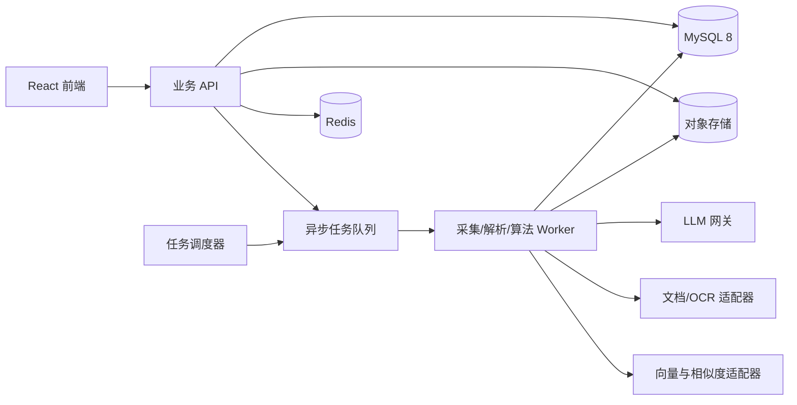
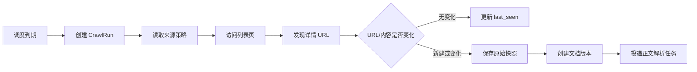
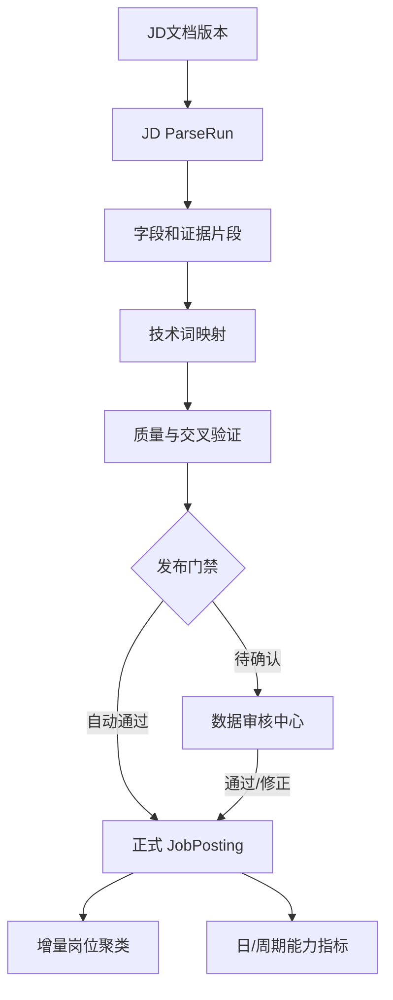
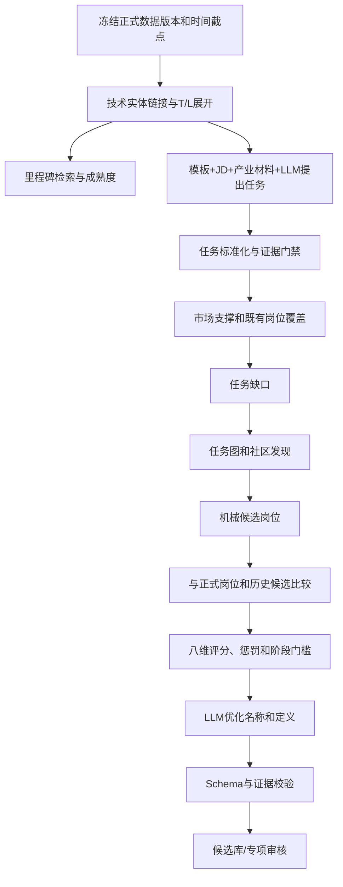

# 具身智能岗位与能力图谱系统——后端逻辑与数据流设计

> 文档状态：后端逻辑基线 v0.1
> 适用范围：纯前端 Mock 之后的首个可运行后端版本
> 关联文档：《项目开发需求文档》《项目总体设计方案》
> 数据库基线：`具身智能产业图谱_情景驱动数据库_MySQL8.sql`

## 1. 文档目标

本文档把产品页面和研究思路转换为可以实现、测试和复现的后端规则，重点回答：

1. 外部网页、文件和用户输入如何流入系统；
2. 原始数据如何经过清洗、抽取、验证、审核后进入正式数据库；
3. JD 如何归入岗位聚类，怎样驱动既有岗位能力更新；
4. 技术词、技术里程碑和 JD 覆盖缺口如何共同生成新岗位候选；
5. 三类图谱分别读取什么数据、如何计算和输出；
6. 简历如何生成版本化画像，并继续完成匹配、差距分析和发展路径；
7. 每一步如何保留版本、证据、置信度和审计信息。

本文档只冻结业务逻辑和数据契约。算法权重、模型名称和置信度阈值均作为可配置参数，通过标注集校准，不能硬编码在业务代码中。

## 2. 后端总体形态

### 2.1 首期部署形态

首期采用“模块化单体 API + 异步任务 Worker”，避免竞赛周期内过早拆分微服务。



建议逻辑模块：

- `source`：数据源、采集策略、合规信息；
- `ingestion`：采集运行、URL 发现、原始快照和文件资产；
- `extraction`：正文、JD、技术词、里程碑和简历抽取；
- `taxonomy`：L1–L4 主数据、T1–T7 领域、别名和候选词审核；
- `job`：JD、聚类、正式岗位及岗位版本；
- `discovery`：自动预测、技术词定向推演、岗位名称推演；
- `graph`：图谱投影、热力和演化查询；
- `profile`：简历、追问会话和求职者画像；
- `matching`：召回、评分、解释、差距和发展路径；
- `governance`：人工审核、审计、评测和模型版本。

### 2.2 存储职责

| 存储 | 职责 |
| --- | --- |
| MySQL | 主数据、业务事实、关系、版本、审核、算法运行和聚合指标 |
| 对象存储 | HTML、PDF、DOCX、图片、OCR 结果、模型大响应和导出文件 |
| Redis | 任务队列、短期锁、幂等键、限流和热点缓存 |
| 向量索引 | JD、岗位、职责和技术词的语义召回；首期可由独立适配器实现 |

关系库是唯一事实源。图谱渲染数据由关系库投影生成，前期不要求把正式数据复制到独立图数据库。

## 3. 数据分层与发布原则

### 3.1 六层数据区

| 层 | 内容 | 是否可直接用于正式算法 |
| --- | --- | --- |
| Source | 数据源、采集规则、合规和调度配置 | 否 |
| Raw | 原始网页、文件、内容版本和响应元数据 | 否，只用于追溯 |
| Staging | 清洗文本、候选字段、候选事实和映射结果 | 否 |
| Verified | 经过规则、交叉验证或人工确认的事实 | 是 |
| Domain | 正式 JD、技术词、里程碑、岗位和画像版本 | 是 |
| Derived | 聚类、周期指标、图谱投影、匹配和学习路径 | 是，但必须绑定输入版本 |

### 3.2 发布门禁

任何 LLM 输出都不能直接进入正式岗位图谱。正式发布至少经过：

1. JSON Schema 校验；
2. 枚举、主数据 ID 和数值范围校验；
3. 每个关键事实绑定一个或多个 `evidence_span_id`；
4. 来源质量、重复度、时效性和交叉来源验证；
5. 按实体类型执行置信度分流；
6. 达不到自动发布条件的结果进入相应审核队列。

### 3.3 事实、推断与生成内容分离

- **事实**：能回指真实网页、JD、简历或用户回答；
- **统计推断**：由明确算法根据事实计算，例如能力重要度、趋势和岗位匹配分；
- **生成表达**：LLM 对锁定事实进行归并和语言优化；
- **参考内容**：生成的标准 JD、发展建议等，不得反向作为真实市场证据。

每类记录必须包含 `data_origin_code` 或等价字段，至少区分 `source_fact`、`algorithm_inference`、`llm_generated`、`human_confirmed`。

## 4. 通用任务、状态和事务规则

### 4.1 长任务统一模型

采集、OCR、抽取、聚类、推演、匹配和评测均视为可重放长任务。统一状态：

```text
pending -> running -> success
                   -> partial_success
                   -> failed
pending/running -> cancelled
failed -> pending（人工或自动重试，创建新的 attempt）
```

每次任务保存：

- 任务类型、业务对象、输入快照和输入哈希；
- 代码版本、算法版本、模型版本、Prompt 版本和参数；
- 开始/结束时间、尝试次数、错误分类和错误详情；
- 输出对象 ID、输出摘要和运行指标；
- `trace_id` 与发起用户。

### 4.2 幂等

写入类接口必须接受 `Idempotency-Key`。建议业务幂等键：

| 操作 | 幂等键 |
| --- | --- |
| 数据源采集 | `source_id + scheduled_time` |
| 页面版本 | `document_id + content_hash` |
| JD 正式记录 | `source_id + source_job_id + document_version_id` |
| 技术词映射 | `mapping_run_id + entity + normalized_term` |
| 聚类分配 | `clustering_run_id + job_id` |
| 新岗位推演 | `mode + input_snapshot_hash + algorithm_version` |
| 简历版本 | `owner + content_hash` |
| 匹配 | `profile_version_id + target_version_id + algorithm_version` |

### 4.3 事务边界

以下操作必须在单一数据库事务中完成：

- 关闭旧文档当前版本并创建新当前版本；
- 关闭旧 JD 聚类/岗位分配并创建新分配；
- 发布岗位新版本、关闭旧版本、写入能力关系和演化事件；
- 新岗位审批通过后创建正式岗位、首个版本、能力、场景和证据；
- 发布求职者画像新版本并切换当前版本；
- 保存匹配结果、逐维度明细和逐能力差距。

数据库事务提交后，通过 Outbox 事件驱动后续图谱缓存刷新和搜索索引更新，避免“数据库已提交但消息发送失败”。

## 5. 多源数据采集与流入流程

### 5.1 数据源注册

数据源需要保存四组配置：

| 配置组 | 必要信息 |
| --- | --- |
| 基本信息 | 名称、来源类型、机构、入口 URL、预期内容类型 |
| 采集规则 | 列表选择器、详情链接规则、最大深度、分页规则、请求头策略 |
| 增量规则 | 游标、最后发布时间、内容哈希、已见 URL、连续消失次数 |
| 合规与运行 | robots/条款检查、允许范围、速率上限、启停、下次运行、责任人 |

招聘来源默认只允许：企业岗位列表页 → 岗位详情页，一次层级深入。系统不得绕过登录、验证码、访问控制或付费墙。

### 5.2 采集运行



采集运行必须记录每个请求的 URL、状态码、响应哈希、响应时间、重试次数和解析结果。原始 HTML 或文件存对象存储，数据库保存对象键和校验哈希。

### 5.3 增量和岗位下架判断

- 内容哈希未变化：只更新 `last_seen_at`，不创建新版本；
- 内容变化：关闭上一版本，创建新的当前版本；
- 列表中一次未出现：标记 `missing_once`，不能直接下架；
- 来源访问成功且列表解析成功，连续 N 次未出现：标记 `suspected_expired`；
- 再次确认或来源明确显示结束：标记 `expired`；
- 来源本次访问失败时，不增加岗位消失计数。

N 默认为 2–3 次，由来源频率配置。

## 6. 文档清洗、质量和置信度分流

### 6.1 处理顺序

```text
原始快照
→ 文件安全检查/正文提取
→ 编码、空白、模板噪声和联系方式规范化
→ 文档类型识别
→ 精确去重与近重复聚类
→ 时间、机构和来源解析
→ 结构化抽取
→ 技术词标准化
→ 事实验证与质量评分
→ 自动发布或人工审核
```

### 6.2 去重

1. `content_hash` 完全一致：同文档版本不重复创建；
2. SimHash/MinHash 识别模板化近重复；
3. 向量相似度识别改写转载；
4. 企业、岗位标题、城市、发布时间和职责片段共同辅助判定；
5. 重复簇中选择质量最高、发布时间最早或企业官方来源作为代表文档；
6. 重复成员保留，但统计市场需求时按重复簇降权，不能按页面数重复计数。

### 6.3 发布分数

初版统一发布分数：

```text
publish_score =
  0.22 × source_reliability
+ 0.18 × extraction_confidence
+ 0.16 × schema_completeness
+ 0.14 × evidence_coverage
+ 0.12 × cross_source_support
+ 0.10 × timeliness
+ 0.08 × consistency
- duplicate_penalty
- contradiction_penalty
- hallucination_penalty
```

所有分量归一化为 0–100。权重只是初始配置，必须通过标注集校准。

默认分流：

- `publish_score >= 85` 且无硬错误：自动进入正式库；
- `65 <= publish_score < 85`：进入人工审核；
- `< 65` 或存在硬错误：驳回或保留为不可用候选；
- 里程碑、新标准技术词和新岗位定义属于高影响对象，即使高分也可配置为必须人工审批。

硬错误包括：无原文证据、引用不存在的主数据 ID、关键时间矛盾、来源不允许使用、提示词注入污染输出、关键字段由模型编造。

## 7. JD 抽取、正式入库和聚类

### 7.1 JD 结构化契约

JD 抽取输出至少包含：

```text
source_document_version_id
source_job_id
job_title_raw / job_title_normalized
organization
location
published_at / collected_at
employment_type
job_level
education
experience_range
salary_range
responsibilities[]
requirements[] {
  raw_text, normalized_technology_id, capability_id,
  requirement_type, required_level, confidence, evidence_ids[]
}
application_scenarios[]
```

标题、职责、必需技能、加分技能、经验、学历、级别和场景必须分别保存证据片段。不能只保存一段完整 JD 文本和一段模型摘要。

### 7.2 JD 发布流程



正式 JD 只指真实招聘来源。模型生成的标准 JD 使用独立实体和 `generated_reference` 标识，不写入 `biz_job_posting`，也不参与招聘量、企业数和岗位热度计算。

### 7.3 聚类两阶段策略

#### 在线增量分配

新 JD 入库后，先与当前有效岗位簇比较。特征包括：

- 规范化标题嵌入；
- 职责/任务嵌入；
- 必需和加分能力集合；
- T1–T7 领域分布；
- 行业和应用场景；
- 岗位级别和经验范围。

```text
cluster_similarity =
  0.20 × title_similarity
+ 0.30 × responsibility_similarity
+ 0.25 × capability_similarity
+ 0.10 × domain_similarity
+ 0.08 × scenario_similarity
+ 0.07 × level_similarity
```

- 高于 `assign_threshold`：自动归入；
- 落在灰区：进入聚类审核；
- 低于 `new_cluster_threshold`：进入未归属池，等待周期重聚类或新岗位发现；
- 归属结果保存算法版本、分数、候选 Top-K 和证据，不能只覆盖 `job_cluster_id`。

#### 周期性全量校准

按月或达到新增量阈值后执行全量/局部重聚类，并记录：

- 聚类运行及参数；
- 每个聚类版本的中心、成员数、轮廓系数等质量指标；
- JD 成员关系历史；
- 上一周期到本周期的 `continued/split/merged/born/ended` 谱系；
- 岗位簇与统一正式岗位 `JobRole` 的映射。

聚类 ID 不等于正式岗位 ID。聚类是算法产物，可以拆分或合并；正式岗位是业务稳定实体，通过版本演化吸收聚类变化。

## 8. 技术词和技术里程碑治理

### 8.1 L 轴和 T 轴

- L1–L4 是技术知识层级；
- T1–T7 是独立的技术领域分类；
- 一个 L 节点可以属于一个主 T 域和多个次 T 域；
- 岗位簇的 T 域归属由成员 JD 的能力、职责和场景加权计算；
- 所有领域关系保存 `domain_score`、`is_primary`、证据数、算法版本和审核状态。

不能把“7个 L1”直接等同于“T1–T7”。

### 8.2 技术词、技能与能力的权威边界

数据库中的三类对象不能互相替代：

| 对象 | 权威职责 |
| --- | --- |
| TechnologyNode | L1–L4 技术标准体系；L3 是技术图谱默认技术点，L4 负责表面词识别 |
| Skill | 外部技能字典、旧标签或抽取兼容层，不作为最终图谱权威节点 |
| Capability | 技术能力、工程任务能力和通用能力组成的匹配本体 |

技术类 Capability 必须映射到一个或多个 L3 技术点，并指定主映射、映射版本、置信度和证据。岗位图谱按“标准技术点”展示时从 L3 投影；人岗匹配以 Capability 为主要计算单位。这样既满足技术词 T/L 分类，又不会把“团队协作、系统设计、现场调试”等能力强行塞进技术分类树。

### 8.3 技术词映射

```text
原始词
→ 规范化
→ 精确词/别名/正则命中
→ 未命中时向量 Top-K 召回
→ 规则和 LLM 语义重排
→ 高置信映射到现有节点
→ 低置信进入技术词候选池
```

候选词审核动作：映射已有词、设为别名、创建新 L 节点、合并、驳回、暂缓。审核通过前不能参加正式岗位匹配，但可以作为“未标准化前沿信号”进入新岗位发现的弱信号通道。

### 8.4 里程碑

里程碑抽取包括技术、事件类型、成熟度变化、时间、主体、应用场景和证据。状态至少为：

```text
candidate -> reviewing -> verified/rejected
verified -> superseded
```

只有 `verified` 里程碑进入正式新岗位评分。论文或宣传发布不自动视为技术成熟度推进；必须区分研究突破、产品发布、规模部署、标准发布和政策事件。

## 9. 既有岗位能力动态更新

### 9.1 输入

- 当前岗位对应的真实 JD 成员；
- 当前有效、去重后的 JD 版本；
- 每项能力的必需/加分/前沿标记；
- 来源质量、企业独立性、发布时间和证据；
- 上一个已批准岗位版本。

### 9.2 能力统计

单条 JD 权重：

```text
jd_weight = source_quality
          × document_quality
          × duplicate_discount
          × exp(-lambda × age_days)
```

岗位簇中某项能力的建议重要度：

```text
coverage       = 含该能力的加权JD数 / 岗位簇加权JD总数
required_ratio = 该能力作为必需项的加权JD占比
org_diversity  = 独立企业数归一值
source_diversity = 独立来源数归一值
trend          = 近期窗口覆盖率相对历史窗口变化
task_support   = 职责文本中存在工程任务证据的比例

importance = 100 × (
  0.32 × coverage
+ 0.20 × required_ratio
+ 0.14 × org_diversity
+ 0.08 × source_diversity
+ 0.14 × recency
+ 0.07 × trend
+ 0.05 × task_support
)
```

“长期重要度”和“近期活跃度”必须分别保存，不能压缩成同一个分数。

### 9.3 变化判定

与上一岗位版本比较：

- 新增：连续两个窗口达到最小覆盖率、最小企业数且重要度超过新增阈值；
- 删除：连续多个窗口低于删除阈值，并排除采集量骤降；
- 修改：必需/加分类型、级别或重要度变化超过阈值；
- 增强/减弱：作为 modified 的子类型用于展示；
- 技术“淘汰”必须由长期下降、替代技术增长和人工审核共同确认。

使用进入阈值和退出阈值不同的滞回机制，避免能力在阈值附近反复增删。

### 9.4 发布

系统先创建岗位版本草稿和 `added/removed/modified` 变更清单。审核通过后在一个事务中：

1. 关闭旧岗位版本；
2. 发布新岗位版本；
3. 写入版本能力、场景和证据；
4. 写入岗位演化事件及变更项；
5. 发送图谱投影刷新事件。

## 10. 新岗位发现与生成逻辑

本节给出后端摘要；成熟度、产业任务、任务社区、八维评分、消融和时间回测的完整算法以《新岗位发现算法设计 v1》为准。

### 10.1 三种运行模式

| 模式 | 输入 | 主要输出 |
| --- | --- | --- |
| 自动预测 | 时间窗、正式 JD、技术词、里程碑、既有岗位版本 | 全局候选列表 |
| 技术词定向推演 | 用户选择的标准词/候选词组合 | 可能形成的岗位及证据 |
| 岗位名称推演 | 用户输入名称，可附描述 | 已存在、已有候选或潜在新岗位判断 |

三种模式共用运行表和候选表，但保存不同的输入快照和 `run_mode_code`。

### 10.2 自动预测步骤



### 10.3 成熟度、岗位覆盖和任务缺口

技术成熟度分别保存原始值和探索值。探索下限只用于早期召回，候选阶段和发布门槛必须使用原始成熟度，避免旧版固定下限抬高证据不足的技术。

任务与当前正式岗位版本的覆盖不能只看岗位名称：

```text
role_task_fit =
  0.45 × responsibility_fit
+ 0.30 × capability_fit
+ 0.15 × scenario_fit
+ 0.10 × level_fit

existing_role_coverage = max(role_task_fit × role_evidence_strength)

task_gap = technology_relevance
         × maturity_factor
         × (1 - existing_role_coverage)
         × evidence_strength
         × (0.55 + 0.45 × cross_company)
         × market_support
```

`market_support` 与 `existing_role_coverage` 分开计算：前者说明市场上是否真实存在任务，后者说明正式岗位体系是否已经解释该任务。完全没有真实材料的任务不会因为覆盖率为零获得高分。

标准化任务构成任务图，边来自职责共现、技能共现、语义相似、共同技术和场景。数据充分时运行 Leiden 或同类社区发现，数据不足时回退到可解释规则；`data/model/evaluation/planning/deployment` 只作为任务标签和先验，不再直接等同于岗位社区。

### 10.4 候选特征

八个正向维度：技术相关度、发布任务缺口、任务社区凝聚度、市场支撑、技术成熟度、时间增长与稳定性、证据完整度和多维新颖性。

负向信号：

- 页面转载或批量抄袭；
- 单一企业内部命名；
- 与既有岗位高度相似；
- 纯营销材料；
- 无工程任务证据；
- 相互矛盾或来源不可追溯。

初版权重：

```text
positive =
  0.15 × technology_relevance
+ 0.22 × publish_task_gap
+ 0.12 × task_community_cohesion
+ 0.14 × market_support
+ 0.10 × technology_maturity
+ 0.10 × growth_and_stability
+ 0.10 × evidence_completeness
+ 0.07 × multidimensional_novelty

candidate_score = clamp(
  positive
  - duplicate_penalty
  - single_company_penalty
  - marketing_penalty
  - contradiction_penalty
  - hallucination_penalty,
  0, 100
)
```

每个维度、惩罚和硬门槛单独入库，所有权重与阈值由算法配置版本管理并通过专家标注、消融和时间回测校准。

### 10.5 阶段门槛

分数不能单独决定阶段，还需要硬门槛。建议初始配置：

| 阶段 | 默认条件 |
| --- | --- |
| 潜在岗位 | 有新任务/技术组合，但真实 JD 或跨企业证据不足 |
| 萌芽岗位 | 至少 3 条去重真实 JD、2 家独立企业、连续 2 个观察窗口 |
| 新兴岗位 | 候选分达到阈值，且企业、来源、持续性和应用证据均过门槛 |
| 已确认新岗位 | 专家审核通过并发布正式岗位首版本 |

门槛应通过验证集和领域专家调整，不能为了增加候选数量而降低。

### 10.6 技术词定向推演

1. 读取用户选择的技术词和 T/L 归属；
2. 查询共同出现的 JD、职责、场景、里程碑和企业；
3. 找出已有岗位覆盖充分的组合并解释，不强制生成新岗位；
4. 对覆盖不足的稳定任务组合执行候选评分；
5. 输出可能岗位、最邻近岗位、差异、证据和证据缺口。

### 10.7 岗位名称推演

检索顺序：

1. 正式岗位名称和别名；
2. 真实 JD 标题；
3. 岗位聚类标签；
4. 历史新岗位候选及别名；
5. 对用户附加描述执行职责和能力语义检索。

结果类型只能是：`existing_role`、`existing_candidate`、`potential_new_role`、`insufficient_evidence`。岗位名称新颖本身不能证明新岗位存在。

### 10.8 岗位定义与标准 JD

机械事实层锁定：候选阶段、证据 JD、独立企业数、职责簇、能力、T/L 分类、场景、里程碑、分数组成和最邻近岗位。

LLM 只能生成或优化：

- 岗位名称；
- 一句话定义；
- 核心职责归并表达；
- 必需/加分技能说明；
- 行业场景描述；
- 与邻近岗位的差异说明。

生成后逐项检查 `evidence_ids`。无证据的职责或能力从正式卡片删除，或明确标记为“参考建议”。

标准 JD 使用独立版本实体，保存目标企业类型、岗位级别、地点、学历、经验、团队目标、模型版本和人工修订。它永远不计入新岗位算法的真实 JD 支撑数。

### 10.9 审批入库事务

候选审批通过后：

1. 创建或关联稳定 `JobRole`；
2. 创建首个 `JobRoleVersion`；
3. 写入岗位能力、技术域、场景和证据关系；
4. 创建 `created` 演化事件；
5. 候选状态更新为 approved 并回指正式岗位；
6. 可选生成标准 JD；
7. 刷新记录库、数据库查询视图和图谱。

后续真实 JD 若被分配到该岗位，按既有岗位更新流程产生新版本，不能覆盖最初推演证据。

## 11. 图谱数据投影与绘制接口

### 11.1 统一原则

后端只输出节点、边、指标和视觉语义，不输出 G6/ECharts 私有配置。所有查询必须带数据版本或时间窗，并返回证据摘要。

统一节点基础字段：

```json
{
  "id": "role:123",
  "type": "job_role",
  "label": "机器人学习工程师",
  "domainCode": "T3",
  "levelCode": "senior",
  "metrics": {},
  "evidenceCount": 18
}
```

### 11.2 全局岗位—能力关联图

数据来源：

- 当前已批准岗位版本；
- 当前岗位版本能力关系；
- 能力到 L 技术节点、T 技术域的映射；
- 岗位热度、能力重要度和证据强度周期指标。

仅输出“重要能力”边。默认门槛可以是：必需能力，或重要度达到岗位内分位数阈值，或 Top-N。响应包含：

```text
role_nodes[]
capability_nodes[]
role_capability_edges[] {
  importance, requirement_type, required_level,
  recent_activity, evidence_count, evidence_endpoint
}
filters / legend / data_version
```

### 11.3 聚类岗位能力图

对选中岗位/岗位簇计算两套独立指标：

- `long_term_importance`：全部有效历史 JD 中的去重出现和覆盖情况；
- `recent_activity`：最近若干条或最近时间窗口 JD 中的频率与最近出现时间。

前端距离使用：

```text
radius = max_radius - normalize(long_term_importance) × radius_range
```

颜色色相取主 T 域，颜色深浅取 `recent_activity`。响应同时提供出现次数、覆盖率、最近出现时间、趋势和来源 JD 列表。

### 11.4 能力热力图

必须建立按日聚合事实：

```text
metric_date
technology_domain_id
technology_id（全域视图可空，单域L2视图必填）
trigger_document_count
trigger_mention_count
independent_org_count
independent_source_count
data_version
```

“触发”定义为：当天首次进入正式库、去重后且通过质量门禁的新材料，对某标准技术点产生至少一次有效证据。一个文档对同一技术点当天默认只计一次 `trigger_document_count`，原文多次出现计入 `trigger_mention_count`，前端默认展示前者，避免长文刷高热度。

全域 21×15 网格：

- 7 个 T 域，每个 T 域 3 行；
- 每行 15 天，合计最近 45 天；
- 同一 T 域的 45 个格子按时间从旧到新排列；
- 单格值为该 T 域当天所有所属技术点的去重触发文档数。

单域筛选后：每个 L2 技术词分别返回 45 天序列，前端将每条序列折成 3×15 网格。

### 11.5 演化比较

输入 `from_version_id`、`to_version_id`，输出：

- 新增、删除、修改、增强和减弱能力；
- 旧/新重要度、级别、类型和变化幅度；
- 触发变化的 JD 和证据；
- 两个版本的时间窗、样本量和数据质量差异。

如果两个时间窗采集规模差异过大，返回 `comparison_warning`，防止把数据缺失误判为能力衰退。

## 12. 简历解析、问答和求职者画像

### 12.1 文件流入

```text
上传/粘贴
→ MIME、大小、病毒和宏检查
→ 对象存储
→ 文本提取或OCR
→ 章节与时间线识别
→ 事实/能力/证据抽取
→ 技术词标准化
→ 画像草稿
→ 2–8轮追问
→ 用户确认
→ 发布画像版本
```

简历原文件、简历文本版本和求职者画像版本是三个对象，不能合并为一张表。

### 12.2 画像模型

画像版本至少包括：

- 基本信息和目标岗位；
- 教育、工作和项目经历；
- 技能、熟练度、使用时长、最近使用时间和证据；
- 行业和应用场景；
- 用户偏好、目标级别、地点和发展时间；
- 可迁移能力；
- 洞察和待确认项；
- 来源类型：简历事实、用户补充、系统推断、用户确认；
- 使用的简历版本、问答会话、模型和 Prompt 版本。

修改画像必须创建新版本。历史匹配继续绑定旧版本，不随当前画像修改而变化。

### 12.3 2–8轮自适应追问

每轮先计算信息缺口：

```text
question_value =
  impact_on_match
× uncertainty
× answerability
- privacy_risk
- repetition_penalty
```

优先追问目标岗位、代表项目个人贡献、能力深度证据、期望岗位级别、场景和时间限制。满足以下任一条件提前结束：

- 必需画像字段完整；
- 剩余问题价值低于阈值；
- 用户主动结束；
- 已达到 8 轮。

至少 2 轮只适用于确有信息缺口且用户愿意继续的正常流程；信息已经充分或用户拒绝回答时不能强制追问。

性格只允许记录为有行为证据的工作方式假设，必须由用户确认，不能进入核心匹配分。

## 13. 人岗匹配与差距分析

### 13.1 输入冻结

一次匹配必须绑定：

- `candidate_profile_version_id`；
- 目标真实 JD 版本或正式岗位版本；
- 能力本体版本和技术词版本；
- 算法、嵌入模型和参数版本；
- 用户选择的硬筛选条件。

### 13.2 两阶段匹配

#### 召回

从当前有效 JD/岗位版本中按技术域、目标名称、地区等硬条件过滤，再使用能力集合和职责语义召回 Top-K。

#### 精排

```text
match_score =
  0.34 × required_capability_fit
+ 0.10 × bonus_capability_fit
+ 0.12 × proficiency_fit
+ 0.12 × task_semantic_fit
+ 0.08 × project_evidence_fit
+ 0.07 × recency_fit
+ 0.06 × scenario_fit
+ 0.05 × level_fit
+ 0.04 × transferable_fit
+ 0.02 × confirmed_preference_fit
- hard_constraint_penalty
```

权重由匹配标注集校准。学历和经验只有在 JD 明确为硬要求时才形成约束。无证据不等于不会，必须标记为 `unknown` 或 `evidence_insufficient`。

### 13.3 结果结构

匹配结果保存：

- 总分、置信度和排名；
- 各维度原始分、权重和贡献；
- 每项岗位能力的目标级别、候选人级别、证据和差距；
- 差距类型：已确认缺失、证据不足、深度不足、可迁移、岗位要求低可信；
- 所有输入和算法版本；
- LLM 解释运行及引用的事实 ID。

LLM 只把确定性评分和证据组织成可读解释，不能修改机械总分。

## 14. 差距驱动的发展路径

生成顺序：

```text
关键差距
→ 查询能力前置关系和相邻能力
→ 排除用户已掌握且有证据的步骤
→ 按优先级和依赖进行拓扑排序
→ 匹配学习资源与实践任务
→ LLM结合用户时间进行表达
→ Schema/依赖/证据校验
→ 保存路径版本
```

每一步保存目标能力、当前/目标级别、前置步骤、资源、实践任务、可验证产出、预计工时、优先级和对匹配分的预期改善。系统必须检测循环依赖。

## 15. 审核队列设计

### 15.1 数据审核中心

处理从真实材料中抽取的低可信事实：JD、技术词、里程碑、技术映射、聚类归属。审核动作：通过、修正后通过、驳回、合并、要求重新处理。

### 15.2 新岗位专项审批

处理创新定义：候选阶段、岗位名称、定义、职责、能力、场景、邻近岗位差异和标准 JD。它不进入数据审核中心。

### 15.3 审核任务字段

每个队列任务应有：目标类型/ID、状态、优先级、风险原因、分配人、领取时间、到期时间、前后快照、审核结论、审核意见和审计日志。

审核状态建议：

```text
queued -> assigned -> reviewing -> approved/rejected/needs_revision/merged
needs_revision -> queued
```

## 16. 核心 API 和异步任务

### 16.1 API 分组

```text
/api/sources
/api/crawl-runs
/api/documents
/api/reviews/data
/api/taxonomies
/api/technology-domains
/api/jobs
/api/job-clusters
/api/job-roles
/api/discovery-runs
/api/emerging-job-candidates
/api/reviews/emerging-jobs
/api/graphs/overview
/api/graphs/heatmap
/api/graphs/job-clusters/{id}
/api/graphs/evolution/{roleId}
/api/profiles
/api/profile-conversations
/api/matches
/api/learning-paths
/api/evaluations
```

所有列表采用游标分页；所有长任务创建接口返回 `202 Accepted + task_id`；所有图谱和匹配响应返回 `data_version`、`generated_at` 和证据链接。

### 16.2 主要任务及触发关系

```text
CrawlSource
  -> ParseSourceDocument
  -> ClassifyDocument
  -> ExtractJobPosting | ExtractMilestoneEvent | ExtractTechnologyTerms
  -> ValidateExtractedFacts
  -> PublishOrQueueReview

PublishJobPosting
  -> NormalizeTechnologyTerms
  -> AssignJobCluster
  -> UpdateDailyTriggerMetrics
  -> RecalculateRoleMetrics

CloseAnalysisPeriod
  -> RebuildClusterLineage
  -> ProposeRoleVersionUpdates
  -> DiscoverEmergingRoles
  -> RefreshGraphProjection

ParseResume
  -> BuildCandidateProfileDraft
  -> RunAdaptiveQuestions
  -> PublishCandidateProfileVersion
  -> RunJobMatch
  -> GenerateLearningPath
```

## 17. 监控、错误恢复与安全

### 17.1 监控指标

- 每个来源采集成功率、页面变化率、连续失败数；
- 文档解析失败率、重复率和质量分布；
- JD 自动发布率、人工修改率；
- 技术词映射命中率和候选积压；
- 聚类灰区比例、未归属 JD 比例和聚类漂移；
- 新岗位候选接受率、误报原因和无依据陈述率；
- 简历解析耗时、问答完成率、匹配稳定性；
- 图谱接口 P95 延迟和节点/边数量；
- 队列积压、重试次数、死信任务数量。

### 17.2 安全

- 网页、JD 和简历全部视为不可信数据，文档内提示不得改变系统指令；
- 上传文件执行 MIME 嗅探、病毒扫描、大小限制和旧 DOC 隔离转换；
- 简历原文件和解析数据最小权限访问，导出和日志默认脱敏；
- LLM 只接收任务需要的片段；
- 数据访问、下载、推荐、导出和删除全部审计；
- 用户撤回授权后停止新的处理，并按策略删除或匿名化历史个人数据。

## 18. P0 纵向闭环实现顺序

1. 数据源配置、一次真实采集运行、原始文档版本；
2. JD 抽取、证据、技术词映射和高低置信分流；
3. 聚类运行、JD 成员历史和一个既有岗位版本更新；
4. 一个自动新岗位候选、机械事实卡、LLM 优化和审批入库；
5. 三类图谱数据接口，尤其是45天热力日聚合和版本对比；
6. 简历解析、画像版本、2–8轮问答；
7. 画像到岗位版本的确定性匹配、差距和学习路径；
8. 固定100条以上 JD 的评测、Docker Compose 和完整演示脚本。

完成上述顺序后，系统才形成可以被挑战杯指标验证的真实闭环。
