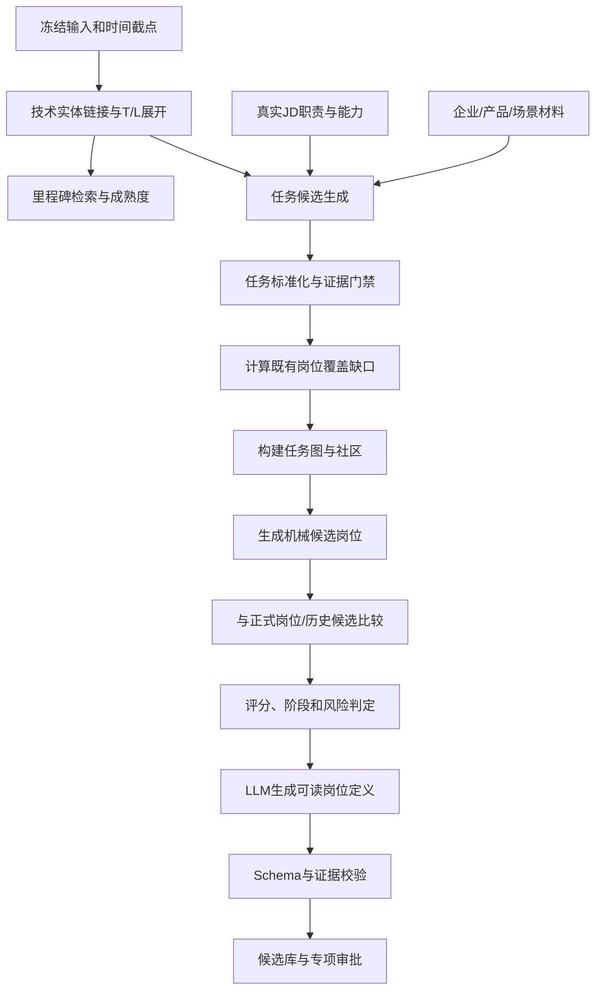

# 新岗位发现算法设计 v1

> 算法代号：TETG-EJD v1
> 参考来源：旧版“Technology Evolution and Task Gap based Emerging Job Discovery”研究
> 设计定位：在旧版可解释确定性算法基础上，升级为支持自动预测、技术词定向推演和岗位名称推演的混合算法

## 1. 对旧版算法的判断

旧版算法已经形成一条有效的研究链：

```text
技术 → 里程碑 → 成熟度 → 能力 → 产业任务
→ 既有岗位覆盖 → 任务缺口 → 任务社区
→ 候选岗位 → 新兴性评分 → 证据输出
```

它最值得保留的不是某一组具体阈值，而是以下原则：

1. 新岗位必须由产业任务缺口产生，不能由 LLM 凭岗位名称自由生成；
2. 技术成熟度决定某个技术是否已具备形成产业分工的条件；
3. 完全没有真实招聘或应用证据的任务不能因为“覆盖率为零”得到高分；
4. 跨公司证据用于排除单一企业内部命名；
5. 所有候选岗位都输出技术、能力、任务、岗位和原文证据链；
6. 预测截点以后发生的事件不得参与计算；
7. 算法必须支持基线、消融和时间回测。

旧版主要局限：

- 能力、任务和岗位名依赖少量人工模板；
- `data/model/evaluation/planning/deployment` 是固定分组，不是真实任务社区；
- 已有岗位比较主要使用岗位名称字符串相似度；
- 招聘证据通过关键词匹配，职责语义和标准能力覆盖不足；
- 成熟度下限同时影响后续评分，可能放大证据不足的早期技术；
- 不能处理尚未进入正式技术库的新词；
- 没有与统一岗位版本、聚类谱系和真实 JD 回流连接。

因此 v1 采用“LLM/语义模型负责提出候选，确定性算法负责验证和评分，人工负责发布”的组合方式。

## 2. 算法边界

算法输出的是“值得观察或审核的新岗位候选”，不是无条件预测未来必然出现的岗位。

算法只读取已经发布的正式事实：

- 已审核的 L1–L4 技术主数据和 T1–T7 领域关系；
- 已验证技术里程碑；
- 去重、质量合格且有证据的真实 JD；
- 当前和历史正式岗位版本；
- 岗位聚类、能力趋势和应用场景；
- 经允许参与弱信号分析的技术词候选。

生成标准 JD、LLM 岗位定义和历史候选不能作为真实招聘证据回灌算法。

## 3. 三种运行模式

| 模式 | 输入 | 用途 |
| --- | --- | --- |
| `auto` | 时间截点、观察窗口和正式数据版本 | 周期性扫描全局新岗位候选 |
| `technology_directed` | 一个或多个技术词，可附目标领域 | 查看技术组合可能形成的岗位 |
| `name_directed` | 用户输入岗位名，可附职责描述 | 判断已有岗位、已有候选或潜在新岗位 |

三种模式共用候选评分与发布流程，但召回入口不同。

## 4. 输入冻结

每次运行必须冻结：

```text
run_mode
target_date
observation_window
technology_taxonomy_version
technology_domain_version
job_role_snapshot_version
job_cluster_run_id
jd_document_versions[]
milestone_versions[]
algorithm_config_version
embedding_model_version
llm_model / prompt_version
```

晚于 `target_date` 的 JD、里程碑和主数据版本不参与计算，保证时间回测可复现。

## 5. 总体流程



## 6. 技术实体链接

优先级：

1. 标准名称完全一致；
2. 已审核别名或规则命中；
3. 规范化包含关系；
4. 向量 Top-K 召回；
5. LLM 在候选集合内重排，不允许生成不存在的正式 ID；
6. 低于阈值时进入临时技术候选。

对临时技术候选可以运行探索性推演，但必须标记 `unverified_technology`，不能自动进入“新兴岗位”阶段，更不能发布正式岗位。

技术展开同时取得：

- L1–L4 上下级；
- T1–T7 主域和次域；
- 别名和表面词；
- 前置、演化、应用和相关技术；
- 历史出现趋势。

## 7. 技术里程碑与成熟度

### 7.1 里程碑相关度

优先使用已经审核的技术—里程碑关系。文本桥接只用于召回候选，未经验证不得直接形成高权重证据。

```text
relevance_event = max(
  reviewed_relation_score,
  structured_rule_score,
  lexical_semantic_score × unreviewed_discount
)
```

### 7.2 事件类型初始权重

保留旧版启发式值作为待校准默认配置：

| 事件类型 | 初始权重 |
| --- | ---: |
| 技术演示 | 0.45 |
| 论文发表 | 0.55 |
| 技术突破 | 0.68 |
| 开源发布 | 0.76 |
| 产品发布 | 0.84 |
| 平台/工具发布 | 0.88 |
| 规模部署/企业应用 | 0.92 |
| 标准/政策 | 0.72 |
| 其他 | 0.35 |

必须把“企业新闻”进一步区分为普通宣传、试点、产品化和规模部署，不能统一给予高权重。

### 7.3 时间衰减和成熟度

保留旧版形式并配置化：

```text
recency_event = exp(-lambda_m × age_years)
contribution_event = type_weight × relevance × recency × source_quality
maturity_raw = min(0.98, 1 - exp(-alpha × sum(contribution_event)))
```

探索召回时可以使用：

```text
maturity_explore = max(exploration_floor, maturity_raw)
```

但最终阶段和发布门槛必须使用 `maturity_raw`。这样既不会完全错过早期技术，也不会让 0.35 下限把缺乏成熟度证据的技术抬高到可发布水平。

每次成熟度快照保存全部里程碑贡献，页面默认展示贡献最高的 3–12 条。

## 8. 产业任务候选生成

任务候选来自四个通道：

1. 技术—能力—任务人工模板；
2. 真实 JD 职责、项目和交付物抽取；
3. 企业产品、技术里程碑和应用材料中的工程活动；
4. LLM 在检索证据范围内提出的新任务候选。

LLM 输出必须包含任务名称、动作、对象、产出、场景、依赖技术和 `evidence_ids`。例如：

```text
动词：构建
对象：机器人时序交互与环境状态数据集
产出：可用于世界模型训练的数据资产
场景：机器人操作与规划
技术：世界模型、状态表征、数据工程
```

任务标准化先做动词/对象归一，再结合语义相似度、共同证据和技术映射去重。只有模板任务可以在没有新材料时存在，但此时只能作为待验证假设，证据强度为低。

## 9. 招聘与产业证据

每条任务证据必须同时满足：

- 原文职责、要求或场景明确支持该任务；
- 材料与目标技术的相关度达到阈值；
- 文档质量门禁通过；
- 能定位到证据片段；
- 转载簇按代表材料计数或降权。

单条证据置信度可以沿用旧版思想，但增加来源质量和语义匹配：

```text
evidence_confidence =
  0.30 × technology_relevance
+ 0.35 × task_semantic_match
+ 0.20 × source_quality
+ 0.15 × extraction_confidence
```

## 10. 任务覆盖与任务缺口

旧版“岗位证据出现次数”只能反映市场中有人做这项任务，不能直接反映既有岗位体系是否已经覆盖。v1 分开计算：

```text
market_support       # 真实材料对任务的支撑
existing_role_coverage # 正式岗位版本对任务的解释程度
```

### 10.1 市场支撑

综合去重 JD 数、独立企业数、独立来源数、持续窗口和应用材料：

```text
market_support =
  0.35 × jd_support
+ 0.25 × cross_company
+ 0.10 × cross_source
+ 0.15 × temporal_stability
+ 0.15 × application_support
```

### 10.2 既有岗位覆盖

任务与每个当前岗位版本比较：

```text
role_task_fit =
  0.45 × responsibility_fit
+ 0.30 × capability_fit
+ 0.15 × scenario_fit
+ 0.10 × level_fit

existing_role_coverage = max(role_task_fit × role_evidence_strength)
```

### 10.3 任务缺口

沿用旧版乘法门禁思想：

```text
task_gap =
  technology_relevance
× maturity_explore
× (1 - existing_role_coverage)
× evidence_strength
× (0.55 + 0.45 × cross_company)
× market_support
```

乘法形式保证任一关键条件过低时任务缺口不会虚高。最终发布阶段重新使用 `maturity_raw` 计算发布缺口。

## 11. 任务社区

构建任务图：

- 节点：标准化产业任务；
- 边：职责共现、技能共现、语义相似、共同场景、共同技术依赖；
- 边权：上述信号的配置化组合。

当节点和证据量充足时使用 Leiden 或相近社区发现算法；数据不足时回退为可解释规则分组。旧版 `data/model/evaluation/planning/deployment` 可以作为任务角色标签或先验，不再直接等同于最终社区。

社区形成候选岗位需要：

- 至少一个核心任务和若干配套任务；
- 社区内凝聚度达到阈值；
- 任务集合能够形成独立交付物或责任边界；
- 与其他社区差异足够；
- 有真实企业或应用证据。

## 12. 候选岗位与已有岗位比较

不能只比较名称。候选与正式岗位版本的重合度：

```text
overlap =
  0.15 × title_alias_similarity
+ 0.40 × responsibility_similarity
+ 0.30 × requirement_similarity
+ 0.10 × scenario_similarity
+ 0.05 × level_similarity
```

同时保存最邻近的 Top-K 岗位和各维度差异。类型初判：

- 高重合：已有岗位或已有岗位别名；
- 中重合且主要是能力/任务变化：岗位演化；
- 低重合且通过市场和成熟度门槛：新岗位候选；
- 证据不足：观察项，不强制分类为新兴岗位。

阈值通过专家标注集校准，旧版 0.76/0.56 仅作为名称相似度实验基线，不直接沿用到多维重合度。

## 13. 候选评分

保留旧版七维思想并扩展为八个正向维度：

| 维度 | 初始权重 | 含义 |
| --- | ---: | --- |
| 技术相关度 | 15% | 任务是否紧密依赖目标技术 |
| 发布任务缺口 | 22% | 真实需求是否未被正式岗位充分解释 |
| 任务社区凝聚度 | 12% | 是否构成独立、稳定的任务集合 |
| 市场支撑 | 14% | 去重 JD、企业、来源和应用证据 |
| 技术成熟度 | 10% | 技术是否具备工程化条件 |
| 时间增长与稳定性 | 10% | 是否持续而非短期爆点 |
| 证据完整度 | 10% | 职责、能力、场景是否均可追溯 |
| 新颖性 | 7% | 与现有岗位多维差异 |

```text
positive_score = weighted_sum(dimensions)
candidate_score = clamp(
  positive_score
  - duplicate_penalty
  - single_company_penalty
  - marketing_penalty
  - contradiction_penalty
  - hallucination_penalty,
  0, 100
)
```

每个维度和惩罚项都单独入库，不能只保存总分。

## 14. 候选阶段和硬门槛

工作流状态与岗位成熟阶段分离。

工作流：`pending/reviewing/needs_revision/approved/rejected/merged`。

成熟阶段：

| 阶段 | 含义 |
| --- | --- |
| `potential` | 技术和任务条件出现，市场证据不足 |
| `budding` | 出现跨企业真实需求，但规模和持续性有限 |
| `emerging` | 缺口、成熟度、市场和持续性均达到阈值 |
| `confirmed` | 专家审核发布并进入正式岗位体系 |

建议初始硬门槛：

- budding：至少3条去重 JD、2家独立企业、2个观察窗口；
- emerging：除分数阈值外，还需跨来源、应用证据和原始成熟度过门槛；
- confirmed：必须人工审批；
- 临时未审核技术只能进入 potential。

硬门槛均进入算法配置版本，允许在实验中调整。

## 15. 机械岗位卡和 LLM 表达

机械事实层：

- 候选编号、阶段、时间窗和分数；
- 任务社区及核心/配套任务；
- 必需、加分和前沿能力；
- 主/次 T 域和 L 技术点；
- 应用场景；
- 真实 JD、企业、来源和里程碑证据；
- 最近已有岗位和差异；
- 算法、数据和模型版本。

LLM 只生成岗位名称、定义、职责归并、能力说明、形成原因和差异解释。每个输出字段必须引用机械事实 ID；生成结果不能改变评分和证据数量。

## 16. 三种页面逻辑

### 16.1 自动预测首页

按固定周期运行，展示全局候选、阶段变化、分数变化、证据变化和待审批项。

### 16.2 技术词定向推演

以选定技术组合为起点，展示：

- 相关里程碑和成熟度；
- 能力和产业任务；
- 已有岗位覆盖；
- 可能形成的任务社区和岗位；
- 仍然缺少的证据。

### 16.3 岗位名称推演

依次检索正式岗位名/别名、真实 JD 标题、聚类标签和历史候选，再结合用户描述进行多维比较。输出：已有岗位、已有候选、潜在新岗位或证据不足。

## 17. 新岗位审批与真实 JD 回流

审批通过时创建统一正式岗位和首个岗位版本，候选变为 confirmed。标准 JD 作为独立参考实体生成，不计入市场支撑。

以后进入系统的真实 JD 可以分配到该正式岗位。新证据只通过既有岗位能力更新流程创建新版本，不覆盖最初候选、推演输入和审批证据。

## 18. 评测和消融

### 18.1 专家评测

- Precision@5、Precision@10、NDCG@K；
- 岗位名称合理性；
- 是否构成独立分工；
- 职责、能力和场景准确性；
- 证据充分性；
- 专家一致性系数。

### 18.2 时间回测

严格使用 T 时刻以前的数据生成候选，以 T 以后真实出现的岗位名称、职责和任务验证命中率、首次出现时间误差和排序质量。

### 18.3 基线

- 技术关键词频次；
- 仅名称相似度；
- LLM 直接生成；
- 无成熟度；
- 无跨公司证据；
- 无既有岗位覆盖；
- 固定任务模板；
- 无时间增长与稳定性。

严格成熟度消融需要同时从任务缺口和最终评分移除成熟度并重新归一权重，不能只把成熟度因子固定为1。

## 19. 算法所需核心数据

目标数据库至少要保存：

- 每次发现运行的时间截点、模式、输入版本和参数；
- 技术实体、T/L 分类和技术关系；
- 里程碑及每条事件的成熟度贡献；
- 标准化产业任务及原始证据；
- 任务的市场支撑、岗位覆盖、跨公司度、缺口和社区；
- 候选岗位、最近已有岗位、八维分数和惩罚项；
- 职责、能力、场景和证据链；
- 机械事实快照和 LLM 表达版本；
- 审批、正式岗位和后续真实 JD 回流关系；
- 基线、消融和时间回测结果。

这些对象已进入新的目标表结构设计，不依赖旧版项目数据库结构。
