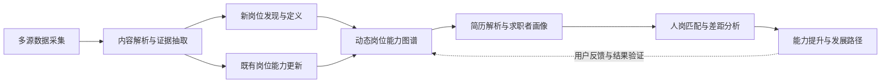
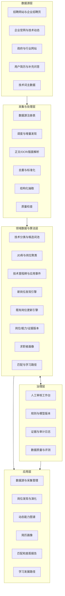
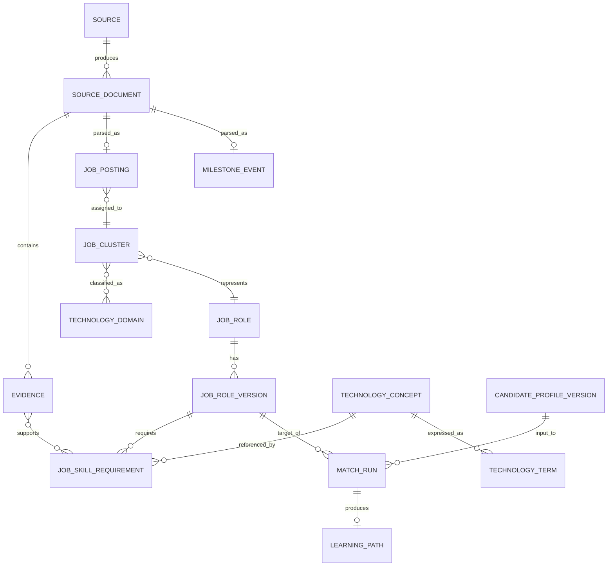
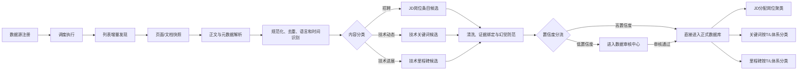
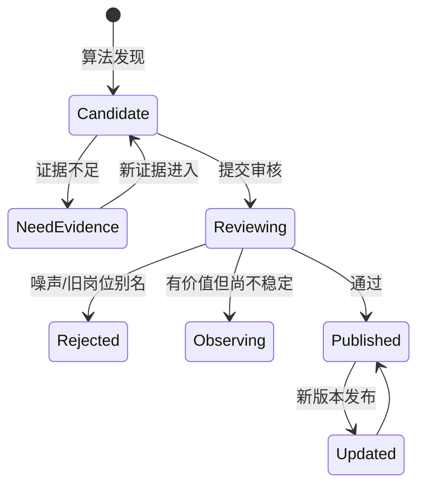

# 具身智能岗位与能力图谱动态演化系统——项目总体设计方案

> 文档版本：v0.1（讨论基线）
> 编制日期：2026-08-09
> 项目依据：挑战杯项目 XH-202621《多源异构数据驱动岗位和能力图谱构建与动态演化分析研究》
> 当前状态：核心业务方案已形成，部分产品与技术决策待确认

## 1. 文档目的

本文档将前期讨论形成的产品构想整理为一套可评审、可拆分任务、可实施和可验收的总体设计。文档重点回答以下问题：

- 系统要解决什么问题，完整闭环是什么；
- 五个核心模块如何协作；
- 数据、算法、LLM 和人工审核分别承担什么职责；
- 岗位、能力与证据如何动态演化并保持可追溯；
- 如何满足挑战文件中的功能、指标、测试和演示要求；
- 哪些事项已经确认，哪些仍需后续决策。

本文档只根据挑战文件、技术词主数据、技术标注规范和当前讨论编写。现阶段不回看 `main` 分支或参考项目代码；待方案冻结后，再单独进行可复用能力评估，避免旧实现反向限制新设计。

### 1.1 决策状态说明

| 标记 | 含义 |
| --- | --- |
| 已确认 | 已由当前讨论明确，可直接进入详细设计 |
| 建议 | 为保证闭环、可信度或可实施性而提出的推荐方案 |
| 待确认 | 会影响产品或技术实现，需要后续讨论确定 |

## 2. 项目定义

### 2.1 项目定位

本项目聚焦于**具身智能领域**，建设一套以真实、多源、持续变化的数据为基础的岗位与能力分析系统。系统不仅展示当前岗位需求，还要发现可能正在形成的新岗位，持续更新既有岗位的能力要求，并将岗位能力模型应用于个人画像、人岗匹配、差距解释和能力提升规划。

系统不是单纯的招聘信息爬虫、静态知识图谱或简历筛选工具，而是一条由数据证据驱动的完整业务闭环：



### 2.2 核心价值

- 对研究者：观察具身智能技术、岗位与能力需求之间的演化关系；
- 对求职者：理解目标岗位、识别真实能力差距并获得可执行的发展路径；
- 对学校和培养机构：发现产业能力需求变化，为课程和人才培养提供依据；
- 对企业或行业组织：获得岗位定义、能力结构和人才供需趋势的参考信息。

### 2.3 建设目标

1. 建立可维护、可调度、可增量更新的多源数据采集体系。
2. 建立具身智能技术词主数据及其版本化治理机制。
3. 用真实 JD、技术词、技术里程碑及应用事件共同识别岗位变化。
4. 形成“新岗位发现—机械定义—人工审核—LLM 表达优化”的可信流程。
5. 用图谱和时间视图展现岗位、能力、技术栈、级别和证据之间的关系。
6. 支持多种简历输入，形成事实层与洞察层分离的求职者画像。
7. 实现可解释、可复核、可重新计算的人岗匹配与差距分析。
8. 满足挑战文件规定的准确率、测试数据、单元测试、部署和演示要求。

## 3. 范围与边界

### 3.1 本期核心范围

本期系统包括五个核心业务模块和三个公共支撑能力。

| 类型 | 模块 | 核心职责 |
| --- | --- | --- |
| 核心模块 | 多源数据采集 | 维护采集对象、调度增量采集、标准化内容并抽取证据 |
| 核心模块 | 岗位发现与更新 | 发现新岗位候选、定义岗位、更新既有岗位能力模型 |
| 核心模块 | 动态能力图谱 | 展现岗位、能力、技术栈、级别、时间和证据关系 |
| 核心模块 | 简历解析与画像 | 解析多模态简历，形成事实画像和受约束的语义洞察 |
| 核心模块 | 匹配与差距分析 | 多维匹配、差距解释、发展和学习路径生成 |
| 公共支撑 | 主数据与版本 | 管理技术词、岗位、能力、数据版本及演化关系 |
| 公共支撑 | 证据与人工审核 | 为抽取、算法和生成结果保留证据并支持审核纠正 |
| 公共支撑 | AI 能力网关 | 管理模型调用、结构化输出、提示词、成本与质量监控 |

### 3.2 本期不作为核心目标

- 不建设通用招聘交易平台，不承接投递、面试排期和录用流程；
- 不将 LLM 生成内容直接作为无证据的事实写入正式图谱；
- 不尝试覆盖所有行业，首期只聚焦具身智能；
- 不以心理测评替代专业测评，也不从简历武断推断人格；
- 不把每个技术表面词都创建为独立图谱能力节点；
- 不在方案冻结前被既有代码结构绑定。

## 4. 总体设计原则

### 4.1 证据优先

岗位、能力、趋势、匹配结论都应能够追溯到来源、原文片段、时间窗口和处理版本。没有足够证据时，系统应显示“证据不足”或“候选”，而不是输出确定性结论。

### 4.2 事实层与表达层分离

- 机械算法负责统计事实、关联、评分、版本变化和证据集合；
- LLM 负责语义理解、同义映射、摘要、解释和自然语言表达；
- 人工审核负责处理高影响、低置信度和新概念结果；
- LLM 不得改写已锁定的机械事实，也不得补充无证据的岗位要求或个人能力。

### 4.3 全过程版本化

原始页面、结构化 JD、技术词表、岗位聚类、岗位定义、能力关系、候选人画像和匹配结果都应具有版本。任何结果均可回答“当时使用了什么数据、算法和规则”。

### 4.4 增量更新与周期校准结合

日常新增数据采用增量处理，及时影响统计和候选事件；周期性进行全量校准、重新聚类和质量检查，并通过谱系关系记录聚类的延续、拆分、合并或新生。

### 4.5 人机协同

系统自动处理高频、结构化和可验证任务，把新岗位发布、主数据变更、低置信度映射等关键决策交给审核人员。

### 4.6 可解释与可复核

用户不仅看到分数，还能查看分数构成、支持或反对证据、数据时间范围、置信度以及修改输入后重新计算的结果。

### 4.7 隐私、公平与最小使用

简历数据应最小化采集、隔离存储、可删除并限制访问。匹配不使用性别、年龄、民族、婚育等敏感或受保护属性，也不将缺失信息自动解释为负面信息。

## 5. 总体架构

### 5.1 逻辑架构



### 5.2 服务边界建议

首期建议采用“模块化单体 + 异步任务”的方式，降低竞赛周期内的部署和联调成本。逻辑上保持以下边界，未来可按负载拆分服务：

- 采集与文档处理；
- 主数据和领域知识；
- 岗位分析算法；
- 图谱查询与投影；
- 简历画像；
- 匹配与路径规划；
- LLM 网关；
- 审核、审计和评测。

耗时任务如爬取、OCR、嵌入计算、聚类和批量抽取通过任务队列异步执行；普通查询和交互采用同步 API。

### 5.3 存储建议

首期不强制引入独立图数据库。岗位能力图谱可先以关系型数据库作为事实源，通过图谱投影层输出节点和边，便于版本、证据和事务管理。

| 存储 | 用途 |
| --- | --- |
| PostgreSQL 或同类关系库 | 业务实体、版本、关系、审核状态、算法结果 |
| 对象存储 | 原始网页快照、文档、简历、OCR 中间产物和导出文件 |
| 搜索/向量能力 | 全文检索、语义召回、相似 JD 与技能映射；首期可使用数据库扩展 |
| 缓存与任务队列 | 调度、异步处理、状态和热点查询缓存 |

独立图数据库是否引入，应在真实查询复杂度和数据规模验证后决定，不应只是为了“有图谱”而增加系统复杂度。

## 6. 核心领域模型

### 6.1 技术词的 L1—L4 层级

现有技术词主数据共四层，建议在新系统中这样使用：

| 层级 | 角色 | 图谱处理 |
| --- | --- | --- |
| L1 一级分类 | 技术词层级体系的最高层 | 可作为聚合节点或全局过滤条件 |
| L2 二级分类 | 技术栈和主题分类 | 作为技术栈切换与聚合节点 |
| L3 标准技术点 | 标准化能力概念 | 作为岗位能力图谱的主要技能节点 |
| L4 技术表面词 | 别名、产品名、复合词、指标或原文表达 | 主要用于识别、映射和保存证据，不默认全部建图 |

根据当前主数据检查结果：L1 共 7 项、L2 共 43 项、L3 共 229 项、L4 共 1872 项。现有结构完整，可作为第一版标准词库。`跨域调整` 字段中存在值 `715`，其业务含义需要在导入前确认并规范化。

技术分类不完全等于岗位能力语义。对 L3 或抽取结果建议额外标注语义角色：

- 核心技术或方法；
- 工具、框架或平台；
- 硬件、传感器或设备；
- 工作任务或工程活动；
- 通用能力；
- 评价指标；
- 产品或模型名称；
- 行业与应用场景。

### 6.2 T1—T7 技术领域划分

除 L1—L4 技术词层级外，系统同时保留一条独立的 **T1—T7 七类技术领域轴**。两者承担不同职责：

- **L 轴**回答“一个技术词在技术知识体系中的上下级位置是什么”；
- **T 轴**回答“这个技术词或岗位聚类主要属于哪些具身智能技术领域”；
- L 轴用于逐级浏览、标准化和技能粒度控制；
- T 轴用于领域归属、跨领域比较、岗位聚类划分和全局筛选。

技术词、L3 标准技术点和岗位聚类均需保存 T1—T7 领域归属。岗位的 T 类领域不能只根据岗位名称决定，应综合聚类内 JD 的职责、核心技术词、技术栈和应用任务计算，并保留领域得分与证据。

建议岗位聚类保存以下领域结果：

```text
cluster_id
technology_domain_code       # T1—T7
domain_score
is_primary
evidence_count
calculation_version
review_status
```

若一个岗位聚类横跨多个领域，可保留一个主领域和若干次领域，并在前端显示领域占比。T1—T7 是否允许多标签以及七类领域的正式名称，以技术标注规范为准，并列入实现前确认事项。

### 6.3 图谱核心实体

| 实体 | 说明 |
| --- | --- |
| Source | 数据源及其采集策略、质量、合规和状态 |
| SourceDocument | 某次发现的网页或文档及其快照版本 |
| Evidence | 支撑结构化结论的原文片段、位置和来源 |
| TechnologyDomain | T1—T7 七类技术领域及其定义 |
| TechnologyConcept | L3 标准技术点 |
| TechnologyTerm | L4 表面词及其与标准技术点的映射 |
| TechnologyCandidate | 尚未进入主数据的新词或新概念候选 |
| MilestoneEvent | 技术里程碑、成熟度推进或应用事件 |
| JobPosting | 标准化后的单条 JD |
| JobCluster | 相似真实 JD 形成的聚类结果，用于识别和维护正式岗位实体 |
| JobClusterDomain | 岗位聚类与 T1—T7 技术领域的归属、得分和证据 |
| JobRole | 统一的正式岗位实体；既可由真实 JD 聚类形成，也可由新岗位推演并经审核发布，两类岗位处于同一层级 |
| JobRoleVersion | 某一时间窗口下的岗位定义和能力要求 |
| JobSkillRequirement | 岗位版本对技能的需求、强度、级别和证据 |
| CandidateProfileVersion | 求职者事实画像与经确认的偏好版本 |
| MatchRun | 指定画像版本与岗位版本之间的一次匹配 |
| LearningPath | 根据差距和目标生成的发展路径版本 |

### 6.4 关键关系



## 7. 模块一：多源数据采集、增量感知与证据抽取

### 7.1 模块目标

用户维护采集对象表，系统按策略定时抓取增量内容，经过正文提取、去重、分类和语义分析，输出能够被岗位发现与更新使用的结构化素材。

### 7.2 数据源类型

1. 招聘网站或企业招聘页面：获取真实、当前在聘岗位及完整 JD。
2. 企业官网：获取产品发布、研发进展、应用落地和组织招聘动态。
3. 政府或行业网站：获取政策、产业规划、标准、示范项目和行业进展。

招聘数据源可细化到某企业的在聘岗位列表链接，默认只深入一层到岗位详情页，避免无边界遍历。每种来源必须配置允许访问范围、频率、解析策略和合规备注。

### 7.3 数据源注册表

建议字段如下：

| 字段组 | 主要字段 |
| --- | --- |
| 基本信息 | 名称、来源类型、入口 URL、企业/机构、内容类型 |
| 采集策略 | 列表规则、详情规则、最大深度、计划周期、分页方式 |
| 增量策略 | 内容哈希、发布时间字段、最后发现时间、游标或页码 |
| 质量属性 | 权威度、时效性、稳定性、独立来源组、历史成功率 |
| 合规属性 | robots/条款检查记录、频率上限、允许内容范围、备注 |
| 运行状态 | 启停、最近运行、连续失败次数、下次计划、责任人 |

### 7.4 处理流程



### 7.5 增量与版本策略

每个页面或文档至少保留：

- `first_seen_at`、`last_seen_at` 和可获得的 `published_at`；
- `content_hash`、`source_url`、`source_type`；
- `crawl_run_id`、`previous_version_id`；
- 企业或机构、独立来源组；
- 解析器版本、抽取模型版本和处理状态。

岗位在某次采集中消失不能立即视为下架。只有在页面成功访问、列表解析正常且连续多个周期未出现后，才将其标为“疑似下架”或“已下架”。

### 7.6 三类核心输出

| 输出 | 内容 |
| --- | --- |
| 标准化 JD | 岗位名、企业、地点、职责、必需/加分能力、经验、学历、级别、场景、时间和证据 |
| 技术词材料 | 原词、标准 L3 映射、L2 技术栈、语义角色、置信度、上下文和证据 |
| 技术里程碑材料 | 技术、事件类型、成熟度变化、发生时间、主体、应用场景、来源和置信度 |

建议同时保留“应用落地/行业事件”，用于区分只有论文或宣传热度的技术与已经形成工程任务和人才需求的技术。

三类输出在完成结构校验、来源交叉验证和幻觉防范后按置信度分流。高置信度结构可直接进入正式数据库；低置信度结构进入数据审核中心，审核通过后再入库。数据审核中心只处理“从实际数据中提取出的事实是否可信”，不审核由后续算法创新定义的新岗位。

入库后的基础加工规则为：JD 条目进入岗位聚类并被分配到一个岗位簇；技术关键词和技术里程碑按照 T1–T7 技术领域与 L1–L4 层级体系完成分类。聚类或 T/L 分类本身置信度不足时，同样进入数据审核中心。

### 7.7 新技术词治理

未能可靠映射到现有主数据的技术表达进入候选池，不自动修改正式分类。候选池记录出现频率、独立企业数、上下文、相似标准词和证据。审核后可执行：映射为已有词、设为别名、创建新标准技术点、暂缓或驳回。

### 7.8 异常和质量控制

- 页面结构变化：解析失败率报警并保存原始快照；
- 重复转载：使用正文相似度、来源链和企业岗位标识去重；
- 夸大宣传：降低单一营销来源权重，要求跨来源验证；
- 时间滞后：按发布时间、发现时间和最后验证时间共同判断；
- 内容复制：统计独立企业和独立来源组，而非只统计页面条数；
- LLM 抽取失败：结构化校验、重试、降级规则和人工队列。

## 8. 模块二：新岗位发现与创新定义

### 8.1 模块目标

本模块建立在正式数据库之上，不参与网页采集、JD 抽取、关键词抽取或里程碑抽取。前一模块解决“实际数据中有什么”，本模块解决“基于这些事实可能形成什么新岗位”，两者必须使用不同的任务、状态和审核队列。

本模块回答两个问题：

1. 是否出现了无法被现有岗位体系充分解释、且具有真实需求的新任务组合或新岗位？
2. 用户提出的某个岗位名称是否已经存在，或是否具备形成新岗位的证据条件？

### 8.2 正式数据库输入边界

JD 标准化与岗位聚类属于数据中心的入库后基础加工，本模块只读取其正式结果。聚类特征不能只使用岗位名称，应综合：

- 标题及其规范化同义词；
- 核心职责和任务语义；
- 必需与加分技能组合；
- 行业及应用场景；
- 岗位级别和经验要求。

每个岗位聚类使用稳定 `cluster_id`。新增 JD 优先增量分配；周期性重新聚类时记录谱系：延续、拆分、合并、新生或终止，避免时间趋势因聚类编号变化而失真。

### 8.3 岗位事实底座

对每个岗位聚类，在固定时间窗口内计算能力需求强度，并作为新岗位发现的只读输入。建议综合以下信号：

- 去重后的 JD 覆盖率；
- 独立企业数和独立来源数；
- 技能属于必需还是加分项；
- 来源质量权重；
- 时间衰减；
- 最近窗口相对历史窗口的增长率；
- 技能在职责文本中是否存在可验证的工程任务证据。

概念性公式如下，实际权重通过验证集和专家评审校准：

```text
技能需求强度 = 覆盖率 × 企业多样性 × 来源质量 × 必需性权重
             × 时间权重 × 趋势修正 × 证据置信度
```

技能状态建议划分为：候选、萌芽、稳定、下降、历史。单纯“近期未出现”只能说明证据减少，不足以认定技术已被淘汰。淘汰或历史状态需结合较长时间窗口、替代技术增长和专家审核。

岗位热度可由有效 JD 数、独立企业数、新增率、持续时间和来源覆盖共同形成，不能用页面数量直接代替。

### 8.4 新岗位发现策略

新岗位发现以用户提出的三类核心信号为主：

1. 新技术词或稳定增长的技术组合；
2. 已出现且成熟度推进的技术里程碑；
3. 真实 JD 对既有岗位体系的覆盖缺口。

为增强可信度，建议补充任务组合、企业多样性和应用落地证据。候选评分由以下因素构成：

| 正向信号 | 说明 |
| --- | --- |
| 未归属 JD 规模 | 有多少真实 JD 难以稳定归入既有岗位 |
| 跨企业证据 | 是否由多家独立企业共同招聘，而非单一公司的命名习惯 |
| 时间增长 | 近窗口是否持续上升 |
| 新任务组合稳定性 | 新能力是否与新的职责和任务共同出现 |
| 与既有岗位差异 | 与最相近岗位在职责和能力结构上的差异程度 |
| 技术成熟度 | 里程碑是否说明技术已具备工程化或产业化条件 |
| 应用证据 | 是否已有真实产品、场景或项目落地 |

噪声、转载、短期爆点、单一来源和纯营销事件作为负向修正项。

新岗位发现采用“一级首页 + 三个缩进子页面”的结构。一级首页展示综合自动预测候选、全局运行状态、候选证据和专项审批入口；三个子页面分别承载：

1. **技术关键词定向推演**：用户从已完成 T/L 分类的技术词中选择一个或多个关键词，针对性查看可能形成的岗位及其组合证据；
2. **岗位名称推演**：用户输入岗位名称，依次检索正式岗位定义、JD 原始名称、岗位簇别名和候选库，输出“已有岗位、已有候选或潜在新岗位”；
3. **推演结果记录库**：统一保存综合自动预测、技术词定向推演和岗位名称推演的输入快照、结果、版本、执行人和后续处置；对审核发布的新岗位，继续保存其正式岗位定义、定义版本和生成的标准 JD，并跟踪后续归入该岗位的真实 JD。

其中综合自动预测不再作为页内模式切换，而是新岗位发现首页的核心内容。系统按数据库版本周期运行，扫描技术组合、里程碑推进和既有岗位覆盖缺口，自动形成全局新岗位候选。

系统不应只输出“是/否”，而应输出候选阶段：

- 潜在岗位：技术和任务组合已形成，但招聘证据较弱；
- 萌芽岗位：出现跨企业真实 JD，仍需持续观察；
- 新兴岗位：证据规模、持续性和差异性达到阈值；
- 已确认新岗位：经人工审核发布并纳入正式岗位体系。

### 8.5 岗位定义生成

岗位定义采用“机械事实层 + LLM 表达层”的双层结构。

#### 机械事实层

- 候选编号、候选阶段和发现时间；
- 对应任务聚类及最相近既有岗位；
- 核心职责证据集合；
- 必需技能、加分技能、技术栈和能力级别；
- 典型行业应用场景；
- 评分构成、时间窗口、独立企业数；
- 置信度、算法版本、数据版本和审核状态。

#### LLM 表达层

- 可读岗位名称；
- 一句话岗位定义；
- 核心职责的归并和规范化表达；
- 能力要求和行业场景说明；
- 与邻近岗位差异的自然语言解释。

LLM 只能基于锁定事实和证据生成，输出中的每项职责和能力均应能回指证据或统计结果。

### 8.6 岗位卡片和完整 JD

默认结果为岗位卡片，满足官方要求：岗位名称、核心职责、必需技能、加分技能、行业应用场景，并附发现依据、趋势和置信度。

用户需要时可进一步生成“参考岗位说明书”。完整 JD 需要用户补充或选择企业类型、岗位级别、工作地点、学历、经验、团队目标等组织上下文。该内容应明确标记为参考生成稿，不能与数据证据直接发现的岗位定义混淆。

### 8.7 人工审核流程

新岗位审核属于本模块内部的“新岗位定义专项审批”，不进入数据中心的低置信度抽取审核队列。审批对象是机械事实与 LLM 优化共同形成的新岗位定义及其证据快照；通过后写入正式岗位定义库。



审核人员可合并候选、调整名称、修正技能映射、标注旧岗位别名或要求补充证据；所有人工操作保留审计记录。

### 8.8 正式新岗位、标准 JD 与真实 JD 回流

推演结果记录库不仅是算法运行日志，也是新岗位从“推演结果”进入正式岗位体系后的持续观察入口。新岗位通过专项审批后，系统应为其分配稳定的 `role_id`，保存正式岗位定义及版本，并按需生成一份或多份标准 JD。标准 JD 是岗位职责、能力要求和组织条件的参考模板，应保存生成依据、模型版本、人工修订和审核记录，但不得计入真实招聘数量、企业覆盖率或市场热度。

正式发布的新岗位与由真实 JD 聚类识别出的岗位处于同一业务层级，统一作为 `JobRole` 管理。建议通过 `origin_type` 区分来源：

- `cluster_derived`：由真实 JD 聚类形成并确认的岗位；
- `inference_derived`：由技术词、里程碑和岗位覆盖缺口推演，经专项审批发布的新岗位。

岗位来源不同不影响其参与能力图谱、简历匹配、岗位检索和版本演化。`JobCluster` 保留为真实 JD 聚类与谱系计算对象，`JobRole` 是面向业务展示和后续关系维护的统一岗位实体，二者不应在前端形成“既有岗位高于新岗位”或“新岗位只是聚类附属项”的层级关系。

后续采集到新的真实 JD 时，岗位归属流程必须将已经发布的新岗位一并纳入候选集合。若 JD 与某个新岗位的职责、任务语义、技术词组合、场景和级别达到归属阈值，则建立该真实 JD 与正式岗位的关联；置信度不足时进入数据审核中心，不强制自动归属。

真实 JD 归入新岗位后，应同步更新以下三个展示面：

1. **推演结果记录库**：显示真实 JD 数量、独立企业数、首次和最近出现时间、岗位定义覆盖率、能力变化及对应证据；可从岗位定义下钻到生成的标准 JD 和真实 JD 列表；
2. **数据管理中心**：可查询和编辑岗位实体、岗位版本、标准 JD 模板、已归属真实 JD、聚类关系及证据关系；
3. **能力图谱**：将该新岗位作为与其他正式岗位同级的岗位节点，依据真实 JD 更新岗位—能力边、热度、趋势和置信度，并允许下钻查看来源 JD。

若后续真实 JD 与原推演定义发生明显偏差，系统不覆盖旧定义，而是触发岗位定义更新、拆分、合并或重新审核，并保留“推演定义 → 首批真实 JD → 岗位新版本”的完整演化链。

## 9. 模块三：动态岗位能力图谱

### 9.1 模块目标

图谱模块负责把数据库中的岗位、能力、技术栈、级别、场景、时间和证据投影为可探索、可比较的视图。它不是单纯“把表画成点线”，而是为岗位发现、趋势理解和匹配解释提供统一的关系查询能力。

### 9.2 节点与关系

建议核心节点：岗位聚类、统一岗位实体、岗位版本、标准 JD、真实 JD、T1—T7 技术领域、L1/L2 技术分类、L3 标准技能、应用场景、岗位级别、证据。由聚类确认的岗位与由推演确认的新岗位在图谱中使用同一种岗位节点类型和同一展示层级，仅通过来源属性区分。

建议核心关系：

- 真实 JD 聚类结果映射为统一岗位实体，岗位实体保留所关联的聚类及谱系版本；
- 真实 JD 归属于统一岗位实体；
- 标准 JD 描述统一岗位实体，但不作为真实招聘证据；
- 技术词、标准技能和岗位聚类属于一个或多个 T 类技术领域；
- 岗位版本必需/偏好某技能；
- 技能属于某技术分类；
- 岗位应用于某场景；
- 岗位版本由证据支持；
- 新岗位由某岗位演化或与某岗位相似；
- 技能之间存在前置、相邻或共现关系。

关系本身应保存需求强度、JD 覆盖率、企业数、首次/最近出现、趋势、置信度、有效时间、审核状态和证据数。

### 9.3 核心视图

产品结构采用“能力图谱一级主页 + 三个缩进子页面”。一级主页汇总图谱规模、最近更新、能力需求变化和三个分析入口；三个子页面分别承载能力热力图、岗位—能力关联图和聚类岗位能力图谱。岗位能力演化与单岗位详情作为三类图谱中的公共下钻能力，不再单独占用一级导航。

#### 能力热力图

能力热力图采用日历式网格，而不是气泡图或岗位—能力矩阵。默认展示 **21 行 × 15 个日格**：七个 T1—T7 技术领域各连续占三行，每行十五格；同一技术域的三行合并为四十五个按时间顺序排列的日格，对应过去 45 天。每个日格统计当天新采集材料对该技术域所属技术词产生的有效触发次数。

有效触发必须在材料去重和结构化解析后计算，避免重复转载或同一材料多次采集虚增热度。每个日格直接显示当天触发次数，并使用对应 T 技术域的统一色相；同域颜色越深表示当天触发次数越高，浅色表示触发较少，没有触发则明确显示 0。点击日格后显示技术域、具体日期、当天次数和 45 天累计值。

全局网格下方提供 T1—T7 技术域和技术栈等分类筛选。选择一个技术域后，下钻查看该域内每个 **L2 技术词**过去 45 天的逐日触发频次；每个 L2 技术词继续使用三行十五列日格，以保持相同的时间阅读方式，并显示技术词名称、每日次数和 45 天累计值。首版统计时间窗固定为最近 45 天。

#### 岗位—能力关联图

该图是一张全局网络图，展现当前正式数据库中的全部岗位聚类和技术能力关键词。岗位聚类与其所属的“重要能力技术”通过连线关联；重要能力由能力在该岗位聚类真实 JD 中的出现次数、覆盖率、必需性和证据置信度计算，并通过阈值或 Top-N 控制连线数量。图中不绘制无意义的全部共现关系，以避免形成不可读的“毛线团”。

用户选择岗位聚类时，高亮其重要能力邻域；选择能力关键词时，高亮使用该能力的岗位聚类。图谱应提供搜索、缩放、适应画布、节点详情、证据下钻以及表格替代视图。默认显示全局概览，筛选只缩小观察范围，不改变岗位—重要能力关系的计算口径。

#### 聚类岗位能力需求图谱

该图只聚焦用户选中的一个岗位聚类，呈现该聚类内部的能力重要性与新鲜度分布：

- **与岗位簇中心的距离**表示能力重要性，越靠近中心越重要；重要性首版以该能力在岗位簇全部有效 JD 中的去重出现次数为主，并可结合必需性权重与 JD 覆盖率校准；
- **同一技术域颜色的深浅**表示近期活跃度，颜色越深表示最近若干条或最近时间窗口的相关 JD 中高频出现，颜色越浅表示已经较长时间未从该岗位簇的新 JD 中观察到；
- 节点必须直接显示能力名称、出现次数或重要性值，并可查看最近出现时间，避免仅依靠距离和颜色解码；
- 图谱旁提供能力频次排序、近期活跃度、来源 JD 和时间证据，以支持精确比较。

需要注意，“长期重要”与“近期活跃”是两个独立指标：一个能力可能历史出现次数高但近期转淡，也可能历史总量较低但近期快速升温。系统不得用单一分数同时替代距离和颜色深浅。

#### 三类图谱统一视觉编码

三类图谱共享同一套视觉语义和 T1—T7 色板：

| 视觉通道 | 统一含义 |
| --- | --- |
| T1—T7 色相 | 节点、能力或热力网格行所属技术领域，三图保持完全一致 |
| 同域颜色深浅 | 时间窗口内的近期活跃度或高频程度；深色为近期高频，浅色为久未出现 |
| 热力格深浅/中心距离/明确数值 | 热力图当天触发次数、聚类图能力出现次数或重要性，根据图形任务选用最易读的通道 |
| 岗位—能力连线 | 岗位聚类与达到阈值的重要能力关系 |
| 深色外描边 | 当前选中或聚焦状态，不改变节点所属领域色 |

所有图谱均应同时提供领域文字代码、数值、直接标签、详情面板或表格替代视图，不能让颜色成为唯一信息通道。全局图使用稳定布局；筛选或时间切换时尽量保持节点位置，便于跨期比较。

#### 岗位能力演化视图

以季度或自定义时间窗生成图谱快照，支持时间滑块和两个版本的差异比较。新增、删除、增强、减弱和稳定关系使用不同视觉编码，并允许查看变化证据。

#### 单岗位详情图

围绕一个岗位显示核心职责、必需/加分技能、技术栈、场景、相似岗位、版本和证据，作为岗位卡片和匹配报告的公共能力。

### 9.4 两类级别切换

系统同时支持：

1. **岗位级别**：初级、中级、高级、专家、负责人等；
2. **技能掌握级别**：了解、熟悉、掌握、精通等，并附对应证据要求。

岗位级别由标题、经验年限、职责复杂度和组织责任综合识别；技能级别由 JD 中的要求表达和任务证据推断。无法可靠判断时显示“未明确”，不能强制填充。

### 9.5 渲染技术建议

- 使用 AntV G6 处理岗位能力关系图、聚类、组合和布局；
- 使用 ECharts 处理热力图、趋势图、排行和标准统计图；
- 后端输出与渲染器无关的节点、边、指标和样式语义，避免前后端被某一引擎绑定；
- 大规模只读网络若性能不足，再评估 Sigma.js；
- 若后续建设人工图谱编辑器，可单独使用 React Flow，不将其作为分析图的首选。

### 9.6 图谱查询接口建议

```text
GET /api/graph/overview
GET /api/graph/job-clusters/{cluster_id}
GET /api/graph/jobs/{job_id}
GET /api/graph/heatmap
GET /api/graph/evolution/{job_id}
GET /api/graph/compare?from={version}&to={version}
GET /api/graph/evidence/{edge_id}
```

时间范围、技术栈、岗位级别、技能级别、选中节点和布局等关键状态写入 URL，方便刷新、复现和分享同一分析视图。

### 9.7 可用性要求

- 图节点、关系和颜色应有直接标签与图例；
- 不能只依赖悬停，触屏设备可点击或展开；
- 为图谱提供列表/表格替代视图；
- 支持减少动画、键盘导航和足够颜色对比度；
- 支持将图谱、热力图和证据摘要导出用于报告。

## 10. 模块四：简历解析与求职者画像

### 10.1 模块目标

将多格式简历转换为可校正、可追溯的求职者画像。画像既包含适合数据库筛选和匹配的结构化事实，也包含基于证据的能力特点、方向偏好和发展假设，但不以无依据的“性格判断”包装不确定结论。

### 10.2 输入范围

首期优先支持：

- 文本型 PDF；
- 扫描 PDF 和图片 OCR；
- DOCX；
- TXT；
- 用户直接粘贴的文本。

旧版 DOC 可通过隔离的格式转换流程支持，避免在主解析服务直接执行高风险或不稳定的旧格式组件。

### 10.3 解析流程


系统应在匹配前让用户查看提取文本和关键事实，纠正 OCR、时间、岗位名和技能映射错误。

### 10.4 双层画像

#### 事实层

- 目标岗位和期望方向；
- 教育经历、专业、学历和时间；
- 工作经历和项目经历；
- 原始技术表达、L4 表面词、L3 标准技能和 L2 技术栈；
- 每项技能的使用时间、最近使用时间、熟练度证据和置信度；
- 行业、应用场景、项目角色、任务与可验证成果；
- 证书、竞赛、论文或开源贡献；
- 每项事实的原文证据、来源位置和用户修正状态。

#### 洞察层

- 有证据支持的优势能力组合；
- 研究、工程、部署、产品或现场应用等项目偏好假设；
- 可能的发展方向和可迁移路径；
- 当前职业阶段和目标岗位跨度；
- 待向用户确认的问题。

洞察层必须显示“系统推断”或“用户确认”，不直接取代事实层，也不直接控制核心匹配分数。

### 10.5 技能证据模型

建议为每项候选人技能保存：

```text
skill_id
raw_mentions[]
proficiency_level
evidence_level
months_of_use
last_used_at
confidence
evidence_fragments[]
user_confirmed
```

技能映射路径为：简历原始表达 → L4 表面词/别名 → L3 标准技能 → L2 技术栈。复合词可映射到多个 L3 技能，但必须保留原始表达，避免拆分后失去上下文。

### 10.6 对“性格”和灵活画像的处理

简历通常不足以可靠判断人格。系统应提取可观察的行为证据，例如“主导跨团队交付”“长期独立研究”“多次现场调试”，并据此形成低风险的工作方式假设，再通过补充问答由用户确认。

建议补充问题包括：

- 更偏向算法研究、工程部署、产品实现还是团队管理；
- 更感兴趣的具身智能方向和行业场景；
- 目标岗位级别和转型意愿；
- 期望的发展时间范围；
- 更偏研究验证、产品落地还是现场工程。

所有画像信息明确标注为：简历事实、系统推断、用户确认或证据不足。

### 10.7 对话式建档与页面流程

简历画像、匹配分析和发展路径统一归入“人岗匹配”主题，而不是三个彼此割裂的一级模块。主题主页采用纯净的 AI 对话入口，支持上传 PDF、DOCX、TXT、图片或粘贴文本。系统完成解析后，根据已知信息与缺失信息动态发起 2–8 轮追问；当信息已经足够时允许提前结束，不强制凑满轮次。

追问重点覆盖求职目标、代表性项目中的个人贡献、工作方式偏好、目标岗位级别、期望场景、发展时间范围和明确限制。每轮答案均记录来源为“用户补充”，不能与简历事实混淆。最终流程为：

```text
对话建档 → 画像解析并入库 → 在画像库选择/修改历史画像 → 生成岗位匹配结果 → 选择匹配结果 → 差距与发展路径分析
```

画像页既是对话建档的结果页，也是求职者画像管理页。每次解析结果必须入库形成独立画像记录；用户可以查看历史画像、切换当前画像并修改，修改时生成新版本而不覆盖原记录。每份画像应保留来源简历、补充对话轮次、事实与技能数量、创建时间、确认状态和历史匹配次数。

岗位匹配必须由用户主动选择某个画像版本后发起。匹配页先展示绑定该画像版本的匹配结果卡片，卡片包含 JD、匹配度、推荐依据和主要差距；用户选择某条匹配结果后，才展开该“画像版本—JD 版本”组合对应的能力对比、差距洞察和发展路径。发展路径必须绑定所选匹配结果及差距清单，保证历史结果可追溯且不同画像之间不会串用。

## 11. 模块五：人岗匹配、差距分析与发展路径

### 11.1 模块目标

以某个求职者画像版本和某个岗位能力版本为输入，进行多维匹配，解释优势、差距和不确定性，并生成能够执行和验证的能力提升路径。

### 11.2 匹配维度

| 维度 | 主要依据 |
| --- | --- |
| 必需能力覆盖 | 岗位必需 L3 技能与候选人已证实技能 |
| 能力深度 | 双方技能级别及项目任务复杂度 |
| 项目证据 | 是否在真实项目、产品或研究中使用过相关能力 |
| 时间新鲜度 | 技能最近使用时间和持续时间 |
| 行业与场景 | 应用领域、设备环境和业务场景相似度 |
| 岗位级别 | 经验证的责任范围、经验和目标级别 |
| 任务语义 | 过往职责与目标岗位核心任务的语义相似度 |
| 可迁移能力 | 相邻技能、共同前置能力和跨岗位迁移关系 |
| 职业意向 | 用户确认的发展方向、时间和偏好 |

学历和经验只在岗位明确要求时参与约束。性格、敏感属性和缺少证据的推断不进入核心匹配分数。

### 11.3 评分与解释

核心分数由可配置、可回放的确定性规则计算，LLM 负责语义映射和解释，不直接生成一个不可复核的总分。匹配报告至少包含：

- 综合匹配度及置信度；
- 各维度分数、权重和贡献；
- 已满足能力及其个人证据；
- 关键差距、差距类型和岗位证据；
- 优势迁移项；
- 数据缺失和需确认问题；
- 使用的画像版本、岗位版本和算法版本。

简历未写某项技能只代表“暂无证据”，不能直接认定候选人不会。差距分类建议为：

- 已确认缺失；
- 证据不足；
- 掌握深度不足；
- 具备可迁移的相邻能力；
- 岗位要求本身置信度不足。

用户补充证据或回答问题后，系统创建新的画像版本并重新计算，而不是直接覆盖旧报告。

### 11.4 LLM 在匹配中的职责

LLM 可以：

- 判断简历任务与岗位职责的语义对应；
- 对同义、跨域或间接技能证据进行候选映射；
- 解释分数构成和能力迁移路径；
- 生成需要用户确认的问题；
- 将机械差距和图谱前置关系组织为自然语言计划。

LLM 不可以：

- 编造候选人没有提供的技能、经历或成果；
- 使用敏感属性影响匹配；
- 以“文化适配”“稳定性”等模糊推断淘汰候选人；
- 绕过岗位和技能证据直接给出结论；
- 擅自修改算法权重或正式岗位要求。

### 11.5 能力提升路径

学习路径以“差距 → 前置技能 → 学习顺序 → 实践任务 → 验证标准 → 对目标岗位的贡献”为基本结构。技能依赖和相邻关系由图谱提供，LLM 根据个人背景、目标和时间进行个性化编排。

每个学习步骤建议包含：

- 目标技能和当前/目标级别；
- 前置能力；
- 推荐学习主题；
- 一个与具身智能场景相关的实践任务；
- 可检查的产出或评价标准；
- 预计时间和优先级；
- 完成后预计改善的匹配维度。

## 12. LLM 与算法协同设计

### 12.1 任务分工

| 任务 | 机械规则/统计 | 传统算法 | LLM | 人工 |
| --- | --- | --- | --- | --- |
| 页面版本和去重 | 主责 | 相似度辅助 | 不参与 | 异常处理 |
| JD 字段抽取 | 校验 | 分类辅助 | 主抽取 | 抽检/纠错 |
| 技术词归一 | 词典优先 | 向量召回 | 语义重排 | 新词审核 |
| 岗位聚类 | 统计 | 主责 | 标签和解释 | 聚类校准 |
| 新岗位评分 | 主责 | 特征计算 | 证据摘要 | 发布审核 |
| 岗位定义 | 锁定事实 | 相似岗位 | 表达优化 | 最终确认 |
| 简历事实抽取 | 校验 | 辅助 | 主抽取 | 用户确认 |
| 匹配分数 | 主责 | 相似度计算 | 语义映射/解释 | 用户补证 |
| 学习路径 | 约束和依赖 | 路径搜索 | 个性化表达 | 用户选择 |

### 12.2 结构化输出和校验

所有关键 LLM 任务必须使用明确 JSON Schema，经过字段类型、枚举、必填项、引用证据、技能 ID 合法性和置信度检查。输出不合格时进行有限次数重试，仍失败则转为降级规则或人工处理。

### 12.3 幻觉控制

- 提示词仅提供任务需要的上下文和证据片段；
- 要求每个关键结论返回 `evidence_ids`；
- 机械事实作为只读字段，LLM 仅生成指定展示字段；
- 生成后检查技能、企业、时间和数字是否存在于输入或主数据；
- 对无证据陈述自动标红、删除或进入审核；
- 保存模型、提示词、参数和响应版本，支持复现；
- 使用人工标注集持续评测“无依据陈述率”。

## 13. 数据版本、证据与审计

### 13.1 版本链

至少建立以下版本链：

- 原始文档版本 → 解析结果版本；
- 技术词标准数据版本 → 技术映射版本；
- 聚类运行版本 → 岗位聚类谱系；
- 岗位版本 → 岗位技能关系版本；
- 简历文档版本 → 候选人画像版本；
- 岗位版本 + 画像版本 + 算法版本 → 匹配结果版本；
- 匹配结果版本 → 学习路径版本。

### 13.2 证据对象

证据对象应包含来源文档、原文片段、字符或页码位置、发布时间、抓取时间、内容哈希、抽取方式和置信度。相同结论可关联多个独立证据，以支持跨来源验证。

### 13.3 审计对象

记录自动任务、人工修改、主数据变更、岗位发布、权重调整、模型切换、画像纠正和匹配重算。审计记录只追加，不覆盖历史。

## 14. 产品信息架构

建议首期产品页面如下：

| 一级区域 | 页面或能力 |
| --- | --- |
| 总览 | 数据量、采集状态、岗位变化、热门技能、待审核事项 |
| 数据中心 | 数据中心主页，以及缩进展示的数据采集中枢、数据管理中心、技术词标准管理、数据审核中心 |
| 数据采集中枢 | 数据源表、采集任务、原始文档、解析结果、质量告警 |
| 数据管理中心 | JD、技术词、里程碑、原始文档的查询、查看、编辑和版本管理 |
| └ 技术词标准管理 | L1-L4 浏览、T1-T7 领域映射、候选词池、映射审核、版本比较 |
| 新岗位发现 | 一级首页，展示综合自动预测候选、运行状态、新岗位定义与专项审批入库 |
| └ 技术词定向推演 | 按 T/L 技术词组合进行针对性岗位推演 |
| └ 岗位名称推演 | 检索名称存在性并分析岗位形成可能性 |
| └ 推演结果记录库 | 保存三类推演记录、已发布新岗位定义及标准 JD，并持续展示后续归入该岗位的真实 JD 与能力演化 |
| 能力图谱 | 一级主页，汇总图谱规模、更新状态、能力变化和三个分析入口 |
| └ 能力热力图 | 以 21×15 日格展示七个技术域过去 45 天触发次数，筛选后查看域内各 L2 技术词的 45 天明细 |
| └ 岗位—能力关联图 | 全局展示全部岗位聚类、技术能力关键词及岗位簇—重要能力关系 |
| └ 聚类岗位能力图谱 | 选择岗位簇，以中心距离表示出现次数重要性、以同域颜色深浅表示近期活跃度 |
| 人岗匹配 | 一级主题主页，提供多模态上传、简历解析和 2–8 轮 AI 建档对话 |
| └ 求职者画像 | 解析结果入库、历史画像浏览、画像选择、修改留版、事实与推断分层 |
| └ 匹配分析 | 基于选中画像生成匹配结果，选择结果后查看多维证据、差距和重算 |
| └ 发展路径 | 绑定选中匹配结果，由其差距驱动学习路径、实践任务和证据回流 |
| 数据审核中心 | 低置信度 JD、关键词、里程碑、岗位聚类归属、T/L 分类和审计；不含新岗位审批 |
| 评测与测试 | 标注集、指标、回归测试、挑战文件演示数据 |

主流程首页应突出“新岗位发现”和“个人岗位匹配”两个入口。产品主定位仍需确认；当前建议以求职者职业发展为主要用户叙事，以行业研究与培养决策作为展示优势。

## 15. API 与任务接口原则

### 15.1 API 原则

- 所有影响结果的查询都接受明确时间窗和版本参数；
- 写操作采用幂等键，防止采集重试产生重复数据；
- 长任务返回任务 ID，通过状态接口或事件流查询进度；
- 图谱、匹配和生成结果都返回证据引用与置信度；
- 对外 DTO 与内部数据库结构分离；
- 错误响应区分输入错误、证据不足、处理失败和权限问题。

### 15.2 主要任务

```text
CrawlSource
ParseSourceDocument
ExtractJobPosting
ExtractMilestoneEvent
NormalizeTechnologyTerms
AssignJobCluster
RebuildClusterLineage
CalculateRoleSkillSnapshot
DiscoverEmergingRoles
GenerateRoleCard
ParseResume
BuildCandidateProfile
RunJobMatch
GenerateLearningPath
EvaluateModelVersion
```

## 16. 质量评测与测试方案

### 16.1 官方硬性要求

| 要求 | 项目落实方式 |
| --- | --- |
| JD 解析准确率不低于 90% | 建立字段级人工标注集，报告 Precision、Recall、F1 和关键字段准确率 |
| 简历信息提取准确率不低于 90% | 覆盖文本 PDF、扫描 PDF、DOCX、TXT 和粘贴文本 |
| 人岗匹配准确率不低于 90% | 先明确“准确率”的金标准和评价任务，再由专家标注岗位—简历样本 |
| 至少 100 条 JD 和测试用例 | 建立固定、可重复运行且去敏的基准数据集 |
| 单元测试覆盖率不低于 60% | 对抽取校验、标准化、评分、版本和权限等核心逻辑统计覆盖率 |
| 新岗位和既有岗位演示样例 | 各准备至少一组完整的来源、输入、处理、图谱和输出证据链 |
| 可部署 | 提供容器化配置或完整部署文档、初始化数据和健康检查 |
| 演示视频不超过 10 分钟 | 按闭环脚本演示数据采集、新岗位、既有岗位、图谱、简历和匹配 |

### 16.2 指标定义建议

#### 数据抽取

- JD 字段级 Precision、Recall、F1；
- 技术词标准化 Top-1/Top-k 准确率；
- 必需/加分技能分类准确率；
- OCR 字符错误率和关键字段恢复率；
- 证据定位准确率。

#### 岗位分析

- 聚类纯度、NMI/ARI 及专家可解释性评分；
- 增量分配与全量聚类一致性；
- 新岗位候选 Precision@K、专家接受率和误报原因；
- 岗位技能变化的专家一致率；
- 转载、过期和营销噪声的抑制率。

#### 匹配和生成

- 专家排序与系统排序的一致性；
- 关键差距识别 Precision、Recall；
- 解释中无依据陈述率；
- 学习路径的相关性、可执行性和前置关系正确率；
- 用户修正前后匹配稳定性。

“匹配准确率 90%”在挑战文件中没有天然唯一算法定义，必须尽快确定金标准。例如可采用专家对岗位—候选人是否适配的三分类标注，并报告分类准确率，同时补充排序一致性指标。

### 16.3 测试层次

- 单元测试：解析校验、去重、标准化、评分、权限和版本逻辑；
- 组件测试：采集适配器、OCR、LLM Schema、图谱投影；
- 集成测试：从原始页面到岗位卡片、从简历到匹配报告；
- 回归测试：固定数据和模型配置，比较版本差异；
- 性能测试：批量采集、图谱加载、简历解析和匹配响应；
- 安全测试：文件上传、越权、提示词注入、敏感数据泄漏；
- 可用性测试：关键流程完成率、解释理解率和图谱可读性。

## 17. 安全、隐私与合规

### 17.1 采集合规

- 数据源登记访问条款、robots 状态、频率和允许用途；
- 使用限速、重试退避和域名级并发控制；
- 优先使用公开 API、RSS、站点地图或允许访问的公开页面；
- 不绕过登录、验证码、访问控制或付费墙；
- 保存必要的事实和证据引用，避免无目的复制整站内容；
- 支持数据源停用和来源内容删除后的处置流程。

### 17.2 简历隐私

- 上传前告知用途、保存期限和删除方式；
- 原文件与分析数据分区存储，最小权限访问；
- 导出和日志默认脱敏；
- 用户可删除简历、画像和匹配记录；
- 模型调用只发送任务所需片段，并根据模型服务政策配置数据保留；
- 比赛测试数据使用授权或去标识化样本。

### 17.3 AI 安全

网页和简历均视为不可信输入，防止文档内提示词改变系统指令。外部内容只作为数据，不允许触发工具、修改规则或泄露系统上下文。

## 18. 推荐技术方案与待定项

以下为逻辑设计层面的建议，不作为已经冻结的技术选型：

| 层 | 建议方案 | 状态 |
| --- | --- | --- |
| 前端 | React + TypeScript；G6 + ECharts | 建议 |
| 后端 | Python + FastAPI 或同类异步 Web 框架 | 建议 |
| 业务数据 | PostgreSQL | 建议 |
| 向量检索 | PostgreSQL 向量扩展起步 | 建议 |
| 异步任务 | Redis 队列或同类任务系统 | 建议 |
| 调度 | 内置调度器起步，后续按规模升级 | 建议 |
| 文档/OCR | 可替换解析适配层 | 建议 |
| LLM | 模型无关网关，支持结构化输出和多模型评测 | 建议 |
| 部署 | Docker Compose 起步 | 建议 |
| 独立图数据库 | 经查询规模验证后决定 | 待确认 |

## 19. 实施优先级

### P0：形成可演示闭环

- 技术词标准数据导入、查询和候选词审核；
- T1—T7 技术领域维护及岗位聚类领域归属；
- 可配置数据源和至少三类来源的采集样例；
- JD 标准化、证据绑定、聚类和既有岗位技能更新；
- 新岗位候选评分、审核和岗位卡片；
- 核心能力热力图、岗位—能力图和演化比较；
- PDF/DOCX/TXT/文本简历解析与事实确认；
- 多维匹配、差距解释和基础学习路径；
- 官方指标评测、100 条 JD 测试、部署文档和演示样例。

### P1：增强可信度和使用体验

- 更完善的网页适配、OCR 和数据质量告警；
- 聚类谱系可视化与候选技术成熟度分析；
- 用户补充问答和画像版本比较；
- 匹配证据补充与实时重算；
- 图谱导出、分享、无障碍和移动端优化。

### P2：研究与扩展

- 跨行业迁移和多领域技术分类；
- 独立图数据库或大规模图分析；
- 学习资源自动推荐和进度闭环；
- 企业端批量人才分析；
- 更长时间跨度的预测模型和因果研究。

## 20. 建议实施阶段

考虑到挑战文件截止日期为 2026-09-05，建议以闭环优先，阶段之间允许并行但以统一数据模型为前置：

1. **数据底座阶段**：冻结核心实体、导入技术词标准数据、建立证据和版本机制，打通 JD 采集与抽取。
2. **新岗位发现阶段**：读取正式岗位簇、技术词和里程碑，完成定向推演、自动预测、名称检索、专项审批和岗位卡片。
3. **图谱表达阶段**：完成热力图、关系图、聚类图和时间差异视图。
4. **个人闭环阶段**：完成简历解析、画像确认、匹配、差距和学习路径。
5. **评测交付阶段**：固定测试集、校准指标、补齐测试、部署、样例和演示视频。

方案冻结后再回看参考项目和 `main` 分支，按照“领域模型、算法、数据处理、测试、UI”五类列出可复用、需改造和应舍弃的内容。

## 21. 官方需求追踪矩阵

| 官方需求 | 设计落点 |
| --- | --- |
| 多源异构数据驱动 | 第 7 章数据源注册、增量采集和结构化抽取 |
| 发现和定义新岗位 | 第 8.4—8.6 节候选评分、分阶段确认和岗位卡片 |
| 更新既有岗位能力 | 第 8.2—8.3 节聚类、需求强度和状态演化 |
| 岗位名称、职责、必需/加分技能、行业场景 | 第 8.5—8.6 节机械事实层和岗位卡片 |
| 细化到技能点粒度 | 第 6.1 节以 L3 标准技术点为主要能力节点 |
| 技术栈和级别切换 | 第 6.1—6.2、9.3—9.4 节 L1—L4 层级、T1—T7 技术领域、岗位级别和技能级别 |
| 动态能力图谱 | 第 9 章图谱快照、时间比较和证据关系 |
| 简历解析 | 第 10 章多格式输入、OCR、事实提取和用户纠正 |
| 人岗匹配与差距分析 | 第 11 章多维匹配、差距分类和可解释报告 |
| 改进建议和能力提升规划 | 第 11.5 节学习路径 |
| 人工优化 | 第 7.7、8.7 和 13 章审核、纠正和审计 |
| 动态更新 | 第 4.4、7.5、8.3 和 9.3 节增量、周期校准和版本比较 |
| 噪声、滞后、复制和夸大 | 第 7.8 节质量控制和第 8.4 节负向修正 |
| 减少大模型幻觉 | 第 12 章事实锁定、结构化输出和证据检查 |
| 准确率、测试和部署 | 第 16 章评测测试及第 18 章部署建议 |

## 22. 待确认决策清单

以下问题不阻碍总体方案成立，但需要在进入详细设计或实现前确认：

1. 第一批数据源的具体站点、企业名单、授权和合规边界是什么？
2. 技术词主数据中 `跨域调整=715` 的确切含义是什么，应如何归一？
3. T1—T7 对技术词和岗位聚类采用单标签，还是“一个主领域 + 多个次领域”的多标签方式？
4. 岗位级别和技能掌握级别是否已有现成标准；若无，是否采用本文建议的首版分级？
5. 产品叙事以求职者职业发展为主，还是以行业研究/企业人才分析为主？
6. 官方“匹配准确率 90%”采用什么金标准、样本规模和专家标注流程？
7. 新岗位被正式确认的阈值由多少独立企业、多少 JD、多少时间窗口和何种专家审核组成？
8. 技术里程碑的成熟度分级是否已有现成定义，还是需要共同建立？
9. 简历和个人画像的默认保存期限、部署环境和模型数据政策是什么？
10. 最终技术栈、模型供应方式和算力/预算约束是什么？
11. 完整 JD 生成所需的组织上下文由用户逐项填写，还是由岗位模板提供默认值？

## 23. 方案结论

当前构想整体合理且可行，最有价值的特点是把技术演化、真实招聘需求、岗位能力图谱和个人发展连接成了闭环。实现成败主要取决于三点：

1. 是否把所有重要结论建立在可追溯、多来源、带时间的证据上；
2. 是否严格区分机械事实、算法判断、LLM 表达和人工确认；
3. 是否在有限周期内优先完成一条可评测、可演示的 P0 闭环，而不是同时追求过多图表和泛化能力。

在完成待确认事项后，本总体设计可以继续拆分为数据字典与数据库设计、算法详细设计、API 设计、页面交互原型、测试方案和迭代任务清单。
