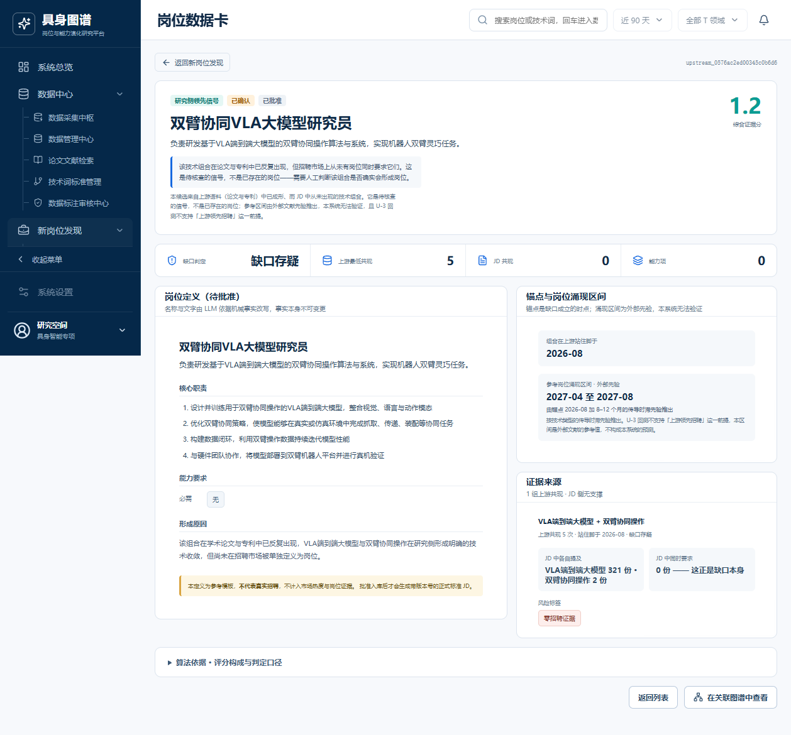
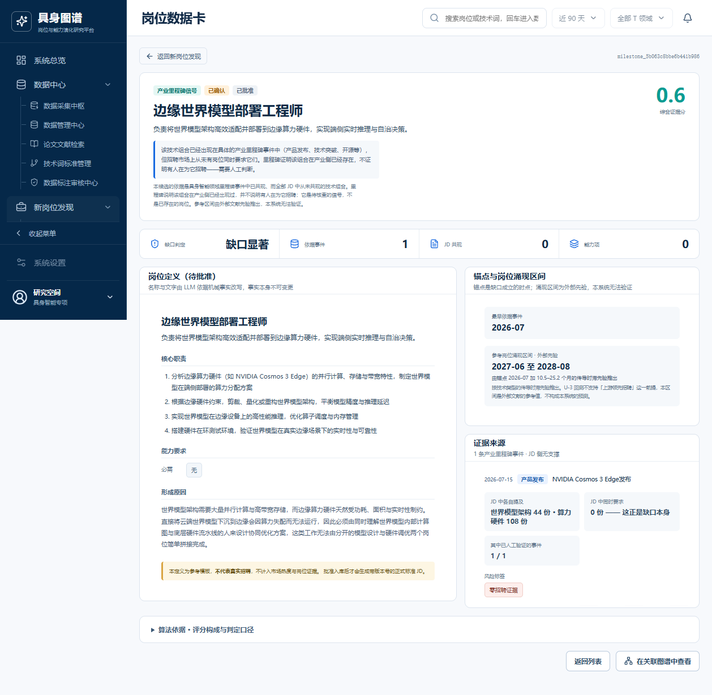
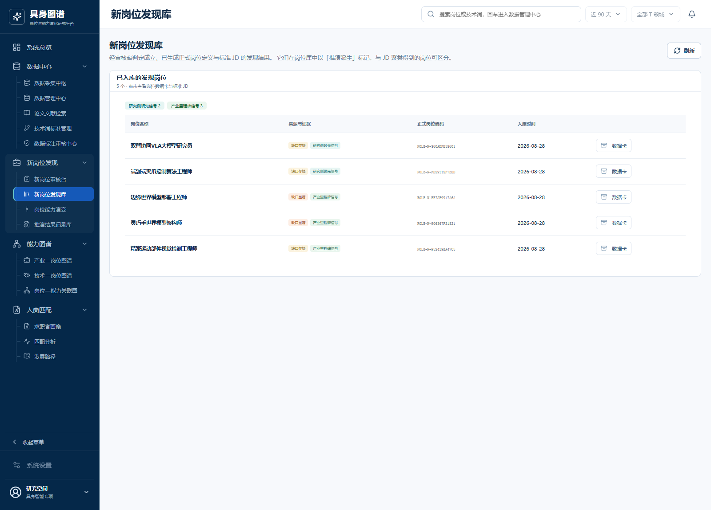
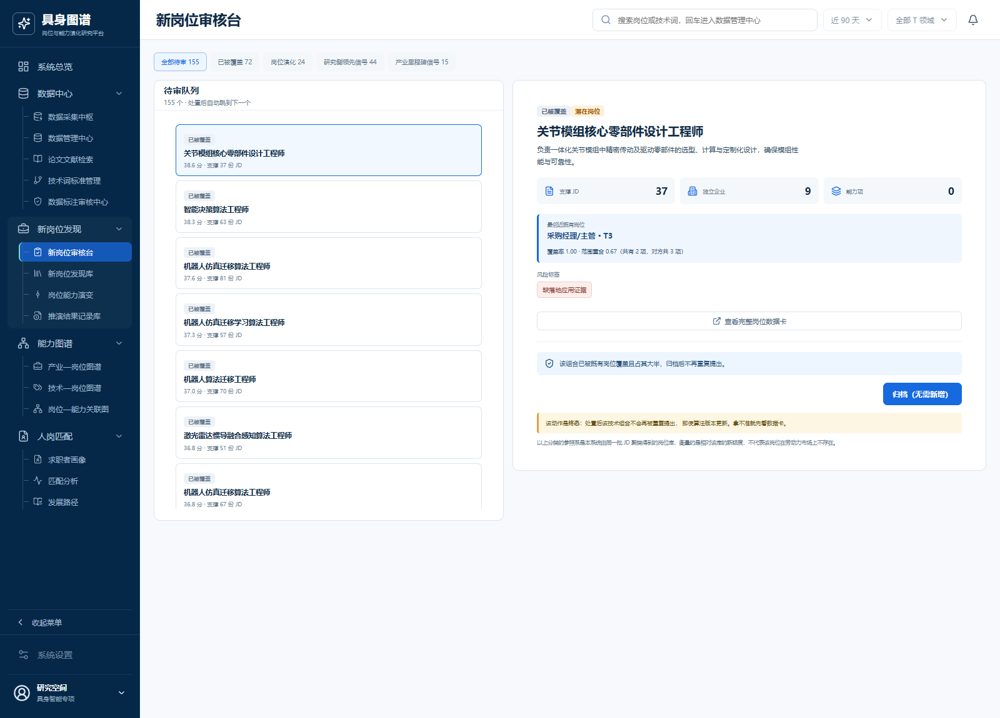
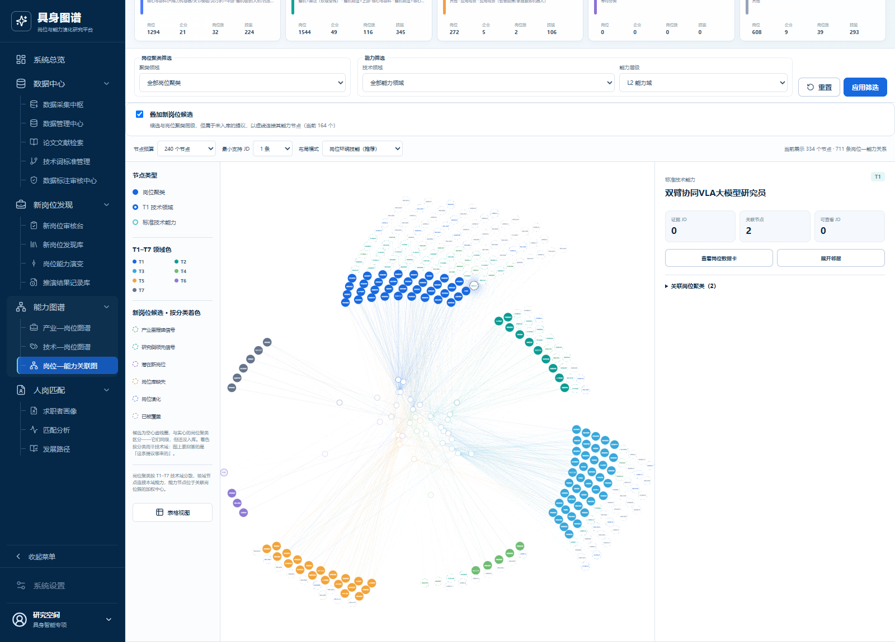
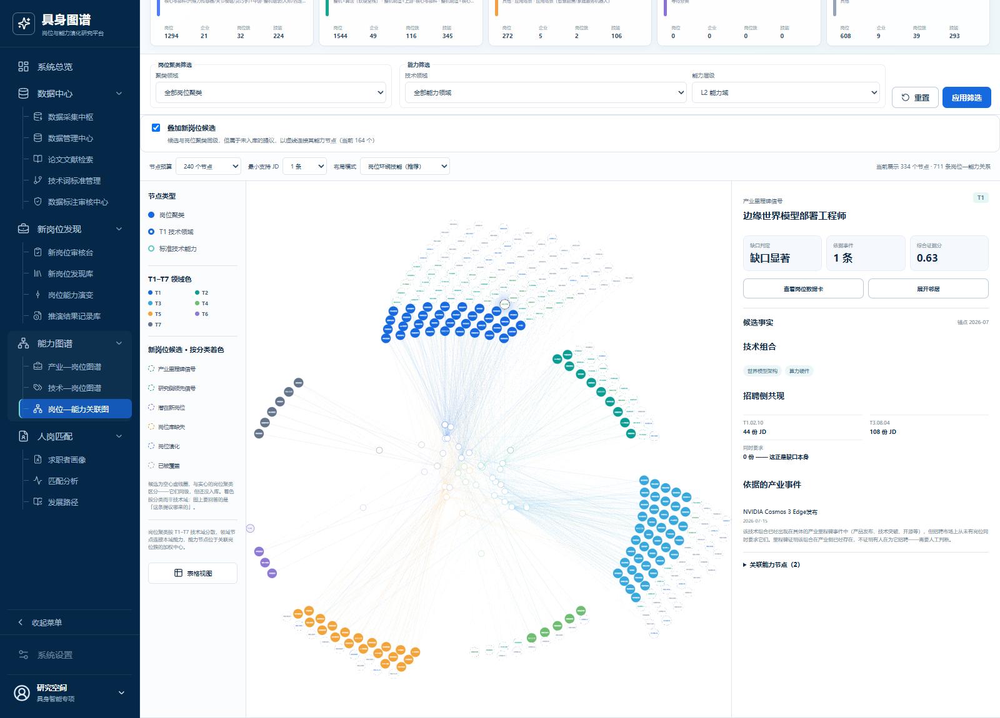
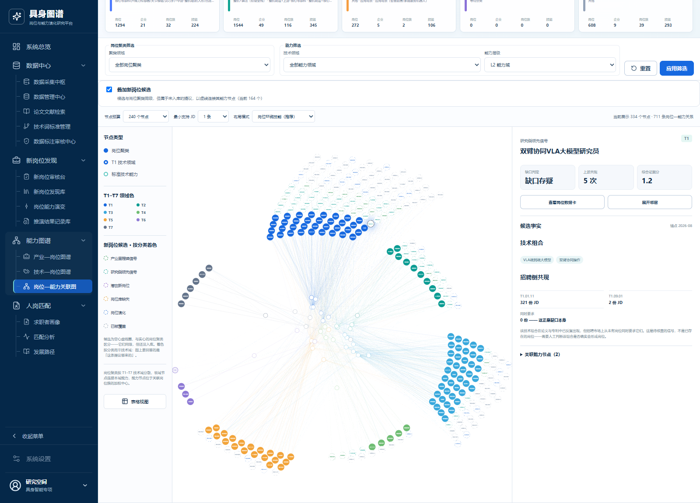

# 新岗位发现模块测试链路报告（研究侧 / 产业侧）

> 生成日期：2026-09-02
> 被测模块：新岗位发现 · 外部证据两条路径（`upstream_gap` 研究侧 / `milestone_gap` 产业侧）
> 数据来源：运行库 `job_capability_graph`（compose 项目 `job-capability-graph-latest`），平台 `http://localhost:8080`

## 0. 这份报告测什么、不测什么

**测**：两条链路从输入数据到落库候选、再到平台呈现的**端到端可追溯性**——每一个显示在数据卡上的数字，能不能用库里的原始数据现场复算出来。

**不测**：候选本身对不对。「这个岗位将来会不会出现」需要未来的招聘数据检验，本系统给不出，两条链路的事实卡里也都写明了这一点。U-3 回测已明确否定「上游领先招聘若干年」这一前提（提升度不随时点前移下降），因此本报告不对领先期做任何结论。

---

## 1. 测试环境

| 项 | 值 |
| --- | --- |
| 数据库 | `job_capability_graph`（MySQL 8.0，容器 `job-capability-graph-latest-mysql-1`） |
| 前端 | `http://localhost:8080` |
| JD 语料 | 3,718 条正式 JD / 84 家机构 |
| 论文语料 | 13,282 篇（`raw_source_document.document_type_code='paper'`） |
| 里程碑事件 | 474 条 |
| 候选总量 | 164 条 = `existing_role` 73 + `upstream_signal` 46 + `role_evolution` 27 + `milestone_signal` 18 |
| 词表版本 | 候选建于 **v1.3**（2,840 节点）；库内 v1.1–v1.5 五版的 `version_status_code` 均为 `active` |
| 招聘侧口径 | 聚类运行 `cluster_8c34456a914d4e53bac8afa3` 所属解析运行中 `assessment_status_code='accepted'` 的技术命中 |

---

## 2. 两条链路的结构

两条路走**同一套算法**——缺口对 → A/B/C 分级 → 在缺口图上找团（clique）→ LLM 命名 → 落库为候选 → 审核台处置 → 入库为正式岗位。判据只有一处实现（`tools/find_upstream_only_pairs.py`），产业侧直接复用，不存在两份走偏的判定逻辑。

差别只在证据能指到什么：

| | 研究侧 `upstream_gap` | 产业侧 `milestone_gap` |
| --- | --- | --- |
| 证据 | 两个技术在 N 篇论文/专利中同现 | 一次有日期、有主体的产业事件 |
| 锚点 | 共现累积到门槛的月份 | 事件发生当天 |
| 共现门槛 | ≥ 3 次 | ≥ 1 次（一次产品发布本身即完整事实） |
| 语料域偏离 | 严重（arXiv cs.RO 含大量无人机研究） | 无（里程碑经人工筛选） |
| 落库分类 | `upstream_signal` | `milestone_signal` |
| 本次运行产出 | 25 条候选（83 个缺口对 → 25 个团） | 18 条候选（116 个里程碑对 → 18 个缺口对 → 18 个团） |

两类候选的 JD 支撑恒为 0——**这是它们的立论前提，不是数据缺失**。因此它们不走库内四类那套评分（输入是企业数/来源数/观测窗，全零会把分数一律压到 0），改用「上游证据强度 × 时近性 × 等级系数」，分值量纲与库内候选不可比。

---

## 3. 文件夹内容

```
新岗位发现测试链路/
├── 测试报告.md                        ← 本文件
├── export_test_chain.py               ← 导出脚本（可复跑，口径与判定工具一致）
├── input/
│   ├── research/                      研究侧输入样例
│   │   ├── 01_技术词主数据.json         词表版本 + 两个技术节点 + 别名
│   │   ├── 02_招聘侧共现基线.json       各技术命中 JD 数、同现数（反证查询）、12 条命中 JD 样例
│   │   └── 03_论文语料证据.json         论文语料中同时命中两个技术的文档（重建样例，见 §7）
│   └── industry/                      产业侧输入样例
│       ├── 01_技术词主数据.json
│       ├── 02_招聘侧共现基线.json
│       └── 03_里程碑事件证据.json       事件本体 + 技术链接 + 原文证据片段
├── output/
│   ├── research_候选完整记录.json       候选 + 推演运行 + 标准 JD + 审核任务 + 入库岗位
│   └── industry_候选完整记录.json
├── db/
│   ├── 测试数据样例.sql                 两次推演运行全部 43 条候选及其证据/审核/入库记录（含建表语句）
│   └── dump_chain.sh                   上述 SQL 的生成脚本与筛选条件
└── screenshots/                        平台呈现截图（8 张）
```

数据库样例按行筛选导出，不含整库数据；载入空库即可复核，无需连生产库。

---

## 4. 链路 A · 研究侧：双臂协同VLA大模型研究员

### 4.1 输入

**技术词主数据**（词表 v1.3）

| 技术编码 | 名称 | 层级 | 技术域 |
| --- | --- | --- | --- |
| T1.01.11 | VLA端到端大模型 | L3 | T1 智能算法与模型 |
| T1.09.01 | 双臂协同操作 | L3 | T1 智能算法与模型 |

**招聘侧共现基线**（现场复算，口径同 `find_upstream_only_pairs.load_jd`）

| 量 | 值 |
| --- | --- |
| 提及 T1.01.11 的 JD | **321** 份 |
| 提及 T1.09.01 的 JD | **2** 份 |
| **同时提及两者的 JD** | **0** 份 ← 缺口成立的前提 |

两侧技术在招聘市场上都出现过，但从未被同一个岗位同时要求。因期望共现数不足阈值，分级为 **B（缺口存疑）**——缺口存在，但样本量不足以排除「碰巧没撞上」。

**论文语料证据**：13,282 篇论文中，同时命中两个技术的样例（完整 5 条见 `input/research/03_论文语料证据.json`）

- `doc_5a88816578f275d493d45e35` — *Robust Bimanual Vision-Language-Action Models via Embarrassingly Simple Modality…*（2026-08-23）
- `doc_57d26b88307f52e4d9012699` — *HAF: Adapting Generalist VLAs to Humanoid Whole-Body Loco-manipulation…*（2026-08-17）
- `doc_05694ac7b7f5248b0623719a` — *Policy-Induced Hand Priors in Humanoid Dual-Arm Manipulation…*（2026-08-12）

### 4.2 处理

推演运行 `upstream_9be390dbc3d24c49940931`，模式 `upstream_gap`，算法版本 `upstream_gap_candidate_v1`，目标日 2026-08-26，输入快照 `{"pair_count": 83, "clique_count": 25}`，产出 25 条候选。本条候选的去重键为 `upstream_gap|T1.01.11-T1.09.01`。

### 4.3 输出原文

```json
{
  "candidate_code": "upstream_0576ac2ed00345c0b6d6",
  "proposed_name": "双臂协同VLA大模型研究员",
  "classification_code": "upstream_signal",
  "maturity_stage_code": "confirmed",
  "workflow_status_code": "approved",
  "candidate_score": 1.2,
  "support_job_count": 0,
  "candidate_key": "upstream_gap|T1.01.11-T1.09.01",
  "risk_flags_json": ["no_hiring_evidence"],
  "mechanical_card_json": {
    "source": "upstream_corpus",
    "fact_schema_version": "upstream_gap_card_v1",
    "gap_grade": "B",
    "technology_codes": ["T1.01.11", "T1.09.01"],
    "technology_names": ["VLA端到端大模型", "双臂协同操作"],
    "evidence_pairs": [
      {
        "pair": ["T1.01.11", "T1.09.01"],
        "grade": "B",
        "established_month": "2026-08",
        "upstream_cooccurrence": 5
      }
    ],
    "min_upstream_cooccurrence": 5,
    "established_month": "2026-08",
    "jd_mentions": { "T1.01.11": 321, "T1.09.01": 2 },
    "jd_cooccurrence": 0,
    "expected_transmission_lag": {
      "status": "reference_prior",
      "technology_classes": ["algorithm"],
      "low_months": 8.0,
      "high_months": 12.0,
      "coefficient": 0.8
    },
    "llm_boundary": "expression_only_no_fact_mutation",
    "caveat": "本候选来自上游语料（论文与专利）中已成形、而 JD 中从未出现的技术组合。它是待核查的信号，不是已存在的岗位；参考区间由外部文献先验推出，本系统无法验证，且 U-3 回测不支持「上游领先招聘」这一前提。"
  },
  "expression_json": {
    "name": "双臂协同VLA大模型研究员",
    "one_line_definition": "负责研发基于VLA端到端大模型的双臂协同操作算法与系统，实现机器人双臂灵巧任务。",
    "core_responsibilities": [
      "设计并训练用于双臂协同操作的VLA端到端大模型，整合视觉、语言与动作模态",
      "优化双臂协同策略，使模型能够在真实或仿真环境中完成抓取、传递、装配等协同任务",
      "构建数据闭环，利用双臂操作数据持续迭代模型性能",
      "与硬件团队协作，将模型部署到双臂机器人平台并进行真机验证"
    ],
    "formation_reason": "该组合在学术论文与专利中已反复出现，VLA端到端大模型与双臂协同操作在研究侧形成明确的技术收敛，但尚未在招聘市场被单独定义为岗位。",
    "generation_method": "llm_expression"
  },
  "expression_model_version": "llm:upstream_gap_naming_v1",
  "created_at": "2026-08-26T07:56:27",
  "updated_at": "2026-08-28T15:07:45"
}
```

标准 JD（`SJD-6BAF2CAB95924824` v1，`is_market_evidence = 0`，不计入市场热度）：

```json
{
  "title": "双臂协同VLA大模型研究员",
  "definition": "负责研发基于VLA端到端大模型的双臂协同操作算法与系统，实现机器人双臂灵巧任务。",
  "responsibilities": [
    "设计并训练用于双臂协同操作的VLA端到端大模型，整合视觉、语言与动作模态",
    "优化双臂协同策略，使模型能够在真实或仿真环境中完成抓取、传递、装配等协同任务",
    "构建数据闭环，利用双臂操作数据持续迭代模型性能",
    "与硬件团队协作，将模型部署到双臂机器人平台并进行真机验证"
  ],
  "technology_node_ids": [4577, 4644],
  "disclaimer": "参考模板，不代表真实招聘，不计入市场热度与岗位证据。"
}
```

审核与入库：审核任务 `review_discovery_upstream_0576ac2ed00345c0b6d6`（`approved`，优先级 1.2，`reason_json.source = "backfill"`——上游候选首版落库时未建审核任务，由 `tools/backfill_upstream_review_tasks.py` 补建）→ 正式岗位 `ROLE-N-360ADFB58601`，`origin_type_code = inference_derived`，批准于 2026-08-28。

### 4.4 平台呈现



卡面四个统计位与上文数据逐项对应：缺口判定「缺口存疑」= `gap_grade: B`；上游最低共现 5 = `min_upstream_cooccurrence`；JD 共现 0 = `jd_cooccurrence`；证据来源区显示「VLA端到端大模型 321 份 · 双臂协同操作 2 份」「JD 中同时要求 0 份 —— 这正是缺口本身」；风险标签「零招聘证据」。

---

## 5. 链路 B · 产业侧：边缘世界模型部署工程师

### 5.1 输入

**技术词主数据**（词表 v1.3）

| 技术编码 | 名称 | 层级 | 技术域 |
| --- | --- | --- | --- |
| T1.02.10 | 世界模型架构 | L3 | T1 智能算法与模型 |
| T3.08.04 | 算力硬件 | L3 | T3 本体与核心零部件 |

**招聘侧共现基线**

| 量 | 值 |
| --- | --- |
| 提及 T1.02.10 的 JD | **44** 份 |
| 提及 T3.08.04 的 JD | **108** 份 |
| **同时提及两者的 JD** | **0** 份 |

两侧技术在招聘市场上都很常见（44 / 108 份），独立性假设下期望共现数已过阈值而实测为 0——分级为 **A（缺口显著）**，可排除偶然。这是本条候选证据强于链路 A 的地方。

**里程碑事件证据**

```json
{
  "milestone_code": "MS-917aad10d0da45789999",
  "milestone_name": "NVIDIA Cosmos 3 Edge发布",
  "milestone_type_code": "product_release",
  "event_date": "2026-07-15",
  "description_text": "4B世界模型参数量，Jetson T2000/T3000上以~1秒延迟更新环境。",
  "verification_status_code": "verified",
  "data_origin_code": "source_fact"
}
```

原文证据片段挂在文档 `DOC-96cb1f9d702c4ce9a3e7` 上，`span_type_code = milestone_claim`，人工已确认。

### 5.2 处理

推演运行 `milestone_efd1667e2c0f4fa3afb7d`，模式 `milestone_gap`，算法版本 `milestone_gap_v1`，目标日 2026-08-26，输入快照 `{"milestone_pair_count": 116, "pair_count": 18, "clique_count": 18}`，产出 18 条候选。去重键 `milestone_gap|T1.02.10-T3.08.04`。

### 5.3 输出原文

```json
{
  "candidate_code": "milestone_5b063c8bbe6b441b986",
  "proposed_name": "边缘世界模型部署工程师",
  "classification_code": "milestone_signal",
  "maturity_stage_code": "confirmed",
  "workflow_status_code": "approved",
  "candidate_score": 0.63,
  "support_job_count": 0,
  "candidate_key": "milestone_gap|T1.02.10-T3.08.04",
  "risk_flags_json": ["no_hiring_evidence"],
  "mechanical_card_json": {
    "source": "milestone_events",
    "fact_schema_version": "milestone_gap_card_v1",
    "gap_grade": "A",
    "technology_codes": ["T1.02.10", "T3.08.04"],
    "technology_names": ["世界模型架构", "算力硬件"],
    "milestones": [
      {
        "milestone_code": "MS-917aad10d0da45789999",
        "milestone_name": "NVIDIA Cosmos 3 Edge发布",
        "milestone_type_code": "product_release",
        "event_date": "2026-07-15"
      }
    ],
    "milestone_count": 1,
    "verified_milestone_count": 1,
    "established_month": "2026-07",
    "jd_mentions": { "T1.02.10": 44, "T3.08.04": 108 },
    "jd_cooccurrence": 0,
    "expected_transmission_lag": {
      "status": "reference_prior",
      "technology_classes": ["algorithm", "hardware"],
      "low_months": 10.5,
      "high_months": 25.2,
      "coefficient": 1.05
    },
    "llm_boundary": "expression_only_no_fact_mutation",
    "caveat": "本候选的依据是具身智能领域里程碑事件中已共现、而全部 JD 中从未共现的技术组合。里程碑说明该组合在产业侧已经出现过，并不说明有人在为它招聘；它是待核查的信号，不是已存在的岗位。参考区间由外部文献先验推出，本系统无法验证。"
  },
  "expression_json": {
    "name": "边缘世界模型部署工程师",
    "one_line_definition": "负责将世界模型架构高效适配并部署到边缘算力硬件，实现端侧实时推理与自治决策。",
    "core_responsibilities": [
      "分析边缘算力硬件（如 NVIDIA Cosmos 3 Edge）的并行计算、存储与带宽特性，制定世界模型在端侧部署的算力分配方案",
      "根据边缘硬件约束，剪裁、量化或重构世界模型架构，平衡模型精度与推理延迟",
      "实现世界模型在边缘设备上的高性能推理，优化算子调度与内存管理",
      "搭建硬件在环测试环境，验证世界模型在真实边缘场景下的实时性与可靠性"
    ],
    "formation_reason": "世界模型架构需要大量并行计算与高带宽存储，而边缘算力硬件天然受功耗、面积与实时性制约。直接将云端世界模型下沉到边缘会因算力失配而无法运行，因此必须由同时理解世界模型内部计算图与底层硬件流水线的人来设计协同优化方案，这类工作无法由分开的模型设计与硬件调优两个岗位简单拼接完成。",
    "generation_method": "llm_expression"
  },
  "expression_model_version": "llm:milestone_combination_naming_v1",
  "created_at": "2026-08-26T11:45:28",
  "updated_at": "2026-08-28T15:07:49"
}
```

标准 JD（`SJD-1FAAF2A5AD144811` v1，`technology_node_ids: [4588, 4713]`）内容与 `expression_json` 一致，附同一条免责声明。

审核与入库：审核任务 `review_discovery_milestone_5b063c8bbe6b441b986`（`approved`，优先级 0.63，`reason_json = {"grade": "A", "source": "milestone_gap", "risk_flags": ["no_hiring_evidence"]}`）→ 正式岗位 `ROLE-N-EE73E9917A6A`，批准于 2026-08-28。

### 5.4 平台呈现



与链路 A 同构，但事实位换成了产业侧能指到的东西：缺口判定「缺口显著」，「依据事件 1」而非「上游最低共现」，证据来源区直接列出 `2026-07-15 · 产品发布 · NVIDIA Cosmos 3 Edge发布`，并多一格「其中已人工验证的事件 1 / 1」。形成原因一栏可见 LLM 写出的机理解释，且明确引用了里程碑主体名称——表达层受 `llm_boundary: expression_only_no_fact_mutation` 约束，只允许改写文字，不允许改动事实。

---

## 6. 平台其余呈现

### 6.1 新岗位发现库



两条链路的产出在同一张表里按来源分区计数（研究侧领先信号 2 / 产业里程碑信号 3），每行带缺口分级标签与正式岗位编码。本报告的两条候选分别是第 1 行（`ROLE-N-360ADFB58601`）与第 3 行（`ROLE-N-EE73E9917A6A`）。

### 6.2 新岗位审核台



待审队列按分类分栏：全部待审 155、已被覆盖 72、岗位演化 24、**研究侧领先信号 44**、**产业里程碑信号 15**。两条外部路径各自成栏，不与库内四类混排——两者的参照系不同（招聘市场 vs 自产岗位库），混在一个列表里读者无从判断某条的「新」是相对哪个基准。

### 6.3 图谱中的呈现

**首轮实测：图上一个候选节点都没有。** 「叠加新岗位候选」勾选后只渲染出图例，239 个节点全部是岗位聚类与能力节点；接口 `GET /graphs/relations?include_candidates=true` 返回 `filters.candidate_node_count = 0`，把 `candidate_limit` 提到上限 300、`node_budget` 提到 1000 仍为 0。从数据卡「在关联图谱中查看」跳转后右侧面板停在默认聚类，**不是聚焦失败，而是要聚焦的节点根本没被投影出来**。

原因定位到 `backend/app/modules/graph/service.py` 的 `_candidate_projection`：候选连哪些能力节点，取自 `rel_candidate_technology`（`membership_code = 'core'`），而该表**全库 0 行**（见 §8 第 3 条），于是每条候选的 `targets` 为空、被 `continue` 跳过。前两道过滤都是通过的——164 条候选的 `last_seen_discovery_run_id` 所属运行版本（`evidence_gap_discovery_v1_15` 100 条、`upstream_gap_candidate_v1` 46 条、`milestone_gap_v1` 18 条）全部落在 `CURRENT_ALGORITHM_VERSIONS` 内，名额也按外部/库内各半正常分配。

**已修复并复测。** 投影改以事实卡为准、关联表兜底（新增 `_candidate_core_codes`）。三条路径把技术写在事实卡的不同字段里：缺口分析两条给 `technology_codes`（编码），主路径给 `technology_node_ids`（节点 id）；后者先翻成技术编码再关联，与该函数原有的「按编码而非 id 关联」口径一致——节点 id 属于推演当次的词表版本，与图谱所用版本不同代时直接比会得到空交集。

修复后同一接口返回 `candidate_node_count = 80`（默认名额上限），四类候选均有呈现：`upstream_signal` 31、`existing_role` 27、`role_evolution` 13、`milestone_signal` 9；图上节点数由 170 增至 334。两条示例候选都能定位到，深链接聚焦也随之生效：




候选画成**空心虚线圈**，与实心的岗位聚类区分——两者同级，但候选还没入库；着色按分类而非技术域，图例中「产业里程碑信号 / 研究侧领先信号」独立成色，图上要回答的是「这条提议哪来的」。

**侧栏同步改用候选自己的证据口径。** 修复后候选虽然出现在图上，但右侧详情栏仍套用岗位聚类那套指标——「证据 JD 0 · 关联节点 2 · 可查看 JD 0」，三格里两格恒为 0，读者只能读成取数失败；栏头还把候选标成「标准技术能力」，把 L2 能力节点标成「关联岗位聚类」。现改为：指标行换成**缺口判定 / 该路径的证据强度 / 综合证据分**，其下补一块「候选事实」，给出技术组合、招聘侧各自提及量与同现数、依据的产业事件，以及该分类的处置说明；两处错标一并修正。证据强度的口径由后端按路径给定（研究侧「上游共现 5 次」、产业侧「依据事件 1 条」、主路径「支撑 JD N 份」），前端不再自行判断该显示哪一个。





「同时要求 0 份 —— 这正是缺口本身」这句是刻意保留的：**招聘侧支撑为 0 是这两类候选的立论前提**，把它和各技术自己的提及量（44 / 108、321 / 2）并排陈述，读者才能判断这个 0 是缺口而不是缺数据。

---

## 7. 核查结果

逐项用库内原始数据现场复算，与候选卡记录比对：

| 核查项 | 卡上记录 | 现场复算 | 结果 |
| --- | --- | --- | --- |
| 研究侧 · T1.01.11 命中 JD 数 | 321 | 321 | ✅ |
| 研究侧 · T1.09.01 命中 JD 数 | 2 | 2 | ✅ |
| 研究侧 · 两技术同现 JD 数 | 0 | 0 | ✅ 缺口前提成立 |
| 研究侧 · 上游共现次数 | 5 | 语料中可检出同现论文（重建，见下） | ⚠️ 部分可核 |
| 产业侧 · T1.02.10 命中 JD 数 | 44 | 44 | ✅ |
| 产业侧 · T3.08.04 命中 JD 数 | 108 | 108 | ✅ |
| 产业侧 · 两技术同现 JD 数 | 0 | 0 | ✅ 缺口前提成立 |
| 产业侧 · 依据事件 | MS-917aad10d0da45789999 | 事件本体、技术链接、原文片段均在库 | ✅ |
| 两侧 · 标准 JD 与入库岗位 | SJD/ROLE 编码 | 均存在且状态一致 | ✅ |

**招聘侧口径必须显式指定，否则会读出假矛盾。** 首轮复算直接统计 `biz_job_requirement`，得到 T1.01.11 = 329 且同现 JD = 1，看起来与卡片矛盾；实际是把历次解析运行与被驳回的命中一并算了进去。改用判定工具自身的口径（某一次解析运行 + `assessment_status_code='accepted'`）后逐项精确吻合。

**解析运行也不能沿用「最近一次」。** 候选建于 2026-08-26，当时最近的一次是 `cluster_8c34456a914d4e53bac8afa3`；此后又落了一次以 2026-08-10 为目标日的聚类，用它复算会得到 T3.08.04 = 10 而非 108，看上去像证据消失了，实际只是换了语料快照。导出脚本因此把聚类运行编码写死，而不是查「最新」。

---

## 8. 已知偏差与限制

1. **研究侧的上游共现次数无法逐篇复现。** 候选由离线抽取产物（JSONL）生成，那批语料文件已不在数据目录中；且这两个技术点在 v1.3 下没有登记别名，按中文技术名匹配英文摘要匹配不到任何东西。报告中的论文样例是用人工给定的英文检索词（`vision-language-action` / `dual-arm` 等）在库内 13,282 篇论文上重建的，**能证明两个技术确实在论文里同现，但不等同于当次运行抽取到的那 5 次**。要完全可复现，需把抽取产物随运行一起归档。
2. **词表版本状态失真。** 库内 v1.1–v1.5 五个版本的 `version_status_code` 全为 `active`，按状态筛版本会同时命中五版（一个技术点导出成五行，命中数跨版本累加）。本次导出改为从候选引用的节点 id 反查版本（v1.3）绕开，但这是数据本身的问题，建议单独修。
3. **`rel_candidate_technology` 与 `biz_candidate_score_component` 在本库中对全部 164 条候选均为空**，不只是外部证据类。因此数据卡「能力项」显示 0，技术组合实际只保存在 `mechanical_card_json.technology_codes` 里。
4. **候选曾在岗位—能力关联图上完全不可见——本次已修复**（见 §6.3）。这是第 3 条的下游影响：图谱投影靠 `rel_candidate_technology` 找候选连哪些能力节点，该表为空导致 164 条候选全部被跳过。修法是让投影改以事实卡为准、关联表兜底，不依赖回填历史数据；补齐 `rel_candidate_technology` 落库仍值得单独做，但已不是图谱可见性的前置条件。
5. **产业侧的技术链接粒度不一致**：`rel_milestone_technology` 里该事件只挂了 L2 的 T1.02「世界模型与预测推理」，而候选用的是 L3 的 T1.02.10 与 T3.08.04——后者来自里程碑抽取产物，不是这张关联表。核对事件与候选的技术对应关系时要走抽取产物，不能只看关联表。
6. **两条链路都不能证明岗位会出现。** 参考涌现区间（研究侧 2027-04 至 2027-08、产业侧 2027-06 至 2028-08）由外部文献先验推出，状态标为 `reference_prior`，本系统无法验证；U-3 回测不支持「上游领先招聘」这一前提。卡面与事实卡对此均有明写。

---

## 9. 复现步骤

```bash
# 1. 起库与平台（compose 项目 job-capability-graph-latest）
docker start job-capability-graph-latest-mysql-1 job-capability-graph-latest-backend-1 job-capability-graph-latest-frontend-1

# 2. 导出输入样例与输出原文
docker cp export_test_chain.py job-capability-graph-latest-backend-1:/tmp/
docker exec job-capability-graph-latest-backend-1 python /tmp/export_test_chain.py /tmp/testchain
docker cp job-capability-graph-latest-backend-1:/tmp/testchain/input ./input
docker cp job-capability-graph-latest-backend-1:/tmp/testchain/output ./output

# 3. 导出数据库样例
docker cp db/dump_chain.sh job-capability-graph-latest-mysql-1:/tmp/
docker exec job-capability-graph-latest-mysql-1 sh /tmp/dump_chain.sh > db/测试数据样例.sql

# 4. 平台核对
#    数据卡： http://localhost:8080/#/candidate/upstream_0576ac2ed00345c0b6d6
#             http://localhost:8080/#/candidate/milestone_5b063c8bbe6b441b986
#    发现库： http://localhost:8080/#/discovery-library
#    审核台： http://localhost:8080/#/candidate-review
#    图谱：   http://localhost:8080/#/graph-relations
```
