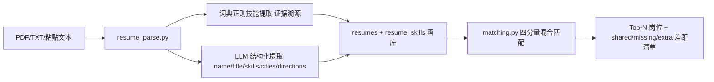
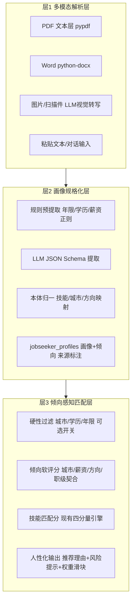

# 人岗匹配改进计划方案与报告：从关键词匹配到画像-倾向驱动的人性化匹配

> **项目**：多源异构数据驱动岗位和能力图谱构建与动态演化分析系统（XH-202621）
> **改进对象**：阶段 3 简历解析与人岗匹配链路（`pipeline/resume_parse.py` + `backend/matching.py` + `/matching` 页）
> **目标**：多模态简历输入 → 规格化求职者画像与求职倾向 → 倾向驱动的动态人性化岗位筛选与推荐

---

# 第一部分 现状报告

## 1. 当前链路



- **解析层**：pypdf 文本层 + 词典正则提取（置信度 0.95）+ LLM 结构化提取（置信度 0.85，无 Key 自动降级）
- **匹配层**：技能稀疏向量余弦（0.50）+ L1 域分布（0.20）+ 核心技能 Jaccard（0.20）+ 头衔相似度（0.10），按激活权重归一
- **输出层**：得分排序 + 差距三列（已具备/缺失/额外优势）+ 严重度分档

## 2. 问题诊断（五条）

| # | 问题 | 证据 | 影响 |
|---|---|---|---|
| P1 | **输入模态单一** | `parse_file` 仅支持 PDF 与纯文本；扫描件 PDF 直接报错"未提取到文本" | 真实求职者大量使用 Word、图片/拍照简历，入口即流失 |
| P2 | **画像扁平化** | 落库字段仅 name/title + 技能集合；无工作年限、学历、职业轨迹、项目亮点 | 无法判断"这个人适不适合"，只能判断"技能像不像" |
| P3 | **求职倾向已提取却未使用** | `RESUME_USER_TEMPLATE` 已提取 `cities`/`directions`，但只存在 `skills_json` 原始 JSON 里，`matching.py` 从不读取 | 已有投入被浪费；匹配结果与求职者真实意愿脱节 |
| P4 | **匹配纯技能向量驱动** | `MATCH_WEIGHTS` 四个分量全部基于技能与头衔；城市、薪资、经验年限、行业偏好完全不参与 | 推荐出的岗位可能在求职者不愿去的城市、薪资远低于预期 |
| P5 | **输出缺乏人性化** | 结果只有分数与差距清单，无推荐理由、无风险提示、无个性化表达 | 体验像"检索引擎"而非"职业顾问"，与赛题"针对性改进建议"要求有距离 |

**结论**：现有链路的提取质量（简历 F1 95.1%、匹配 Top10 命中 100%）已经很好，瓶颈不在"提取得准不准"，而在**"理解了什么、用了什么、怎么呈现"**。改进无需推翻现有引擎，而是在其上加三层：多模态入口、画像规格化、倾向感知匹配。

---

# 第二部分 改进计划方案

## 3. 总体架构：三层漏斗



设计原则：**现有技能匹配引擎保留为主分量**（回归指标不降），倾向分作为新增维度叠加；所有倾向字段带来源标注（explicit/derived/missing），延续项目"证据溯源、防幻觉"主线。

## 4. M1 多模态输入层

| 模态 | 技术方案 | 依赖 |
|---|---|---|
| PDF 文本型 | 现有 pypdf（不变） | 无新增 |
| Word .docx | python-docx 抽取段落与表格文本 | requirements.txt 新增 python-docx |
| 图片 / 扫描 PDF | **优先 LLM 视觉转写**：复用 `pipeline/llm.py` 走 OpenAI 兼容 vision 接口（如 DeepSeek/Qwen-VL 兼容端点），返回纯文本；pypdf 提取为空时自动触发 | 无新增依赖（urllib 已用）；无 Key/模型不支持时降级提示用户粘贴文本 |
| 粘贴文本/对话式 | 现有 text 通道（不变），后续可扩展为"对话补全画像"入口 | 无 |

**改造点**：
- `resume_parse.py` 新增 `docx_to_text()`、`vision_to_text()`；`parse_file` 按后缀与文本层空检测自动路由
- `resumes` 表新增 `modality`（pdf/docx/image/text）、`parse_quality`（文本层/视觉转写/降级标记）字段，解析方式对用户透明展示

## 5. M2 画像规格化层

### 5.1 画像数据模型（新表 `jobseeker_profiles`，与 resumes 一对一）

| 分组 | 字段 | 规格化规则 |
|---|---|---|
| 基础 | years_experience / highest_degree / current_city / current_title / employment_status | 年限由工作经历时间线推导；学历归一到枚举（大专/本科/硕士/博士） |
| 职业轨迹 | work_history JSON（公司/职位/起止）、job_change_count、promotion_signal | 跳槽频率、晋升信号供"职级契合"计算 |
| 亮点 | project_highlights JSON、strongest_skills（置信度 Top-K 技能） | 供推荐理由引用 |
| **求职倾向** | expected_cities、expected_salary_min/max、expected_industries（映射 l1_code）、expected_directions（映射 L2 类目）、company_type_pref、remote_pref | 城市归一到城市词表；方向映射到统一本体 L1/L2，天然接入现有 `l1_filter` 体系 |

**每个字段附带**：`source`（explicit=简历明文 / derived=推导 / missing）+ `confidence` + `evidence`（原文片段）。

### 5.2 提取管线（防幻觉约束）

1. **规则预提取**：正则锚点提取年限（"X 年经验"）、学历、期望薪资（"期望薪资 20-30K"）——确定性字段不依赖 LLM
2. **LLM JSON Schema 提取**：扩展现有 `RESUME_USER_TEMPLATE` 为完整画像 schema；**倾向类字段必须给出原文证据片段，无证据的倾向一律标 missing 而非编造**
3. **本体归一**：技能词沿用现有 `_map_term_to_skill`（匹配不上本体不入表）；城市/方向经词表映射，映射失败保留原文并标 derived
4. **用户修正确权**：前端画像卡支持手动修正倾向，修正值 source=explicit 且优先级最高（覆盖 LLM 结果）

## 6. M3 倾向感知匹配层

### 6.1 三阶段漏斗

```text
候选全库岗位
  │
  ├─ ① 硬性过滤（默认关闭，前端开关）：期望城市∩岗位城市、学历达标、年限≥岗位下限
  │      过滤原因逐条记录，供前端展示"为何被过滤"
  ├─ ② 倾向软评分 preference_score（0~1）：
  │      城市命中 0.30 + 薪资区间重叠率 0.30 + 方向/行业 L1-L2 命中 0.25 + 职级契合 0.15
  │      （薪资重叠率 = 期望区间与 salary_min/max 的交集/并集；职级契合 = 年限 vs derive_level）
  └─ ③ 技能匹配分 skill_score：现有四分量引擎原样保留
最终得分 = w1·skill_score + w2·preference_score + w3·career_fit
```

- 权重默认 `w1=0.6 / w2=0.3 / w3=0.1`，**前端滑块可调、即时重排**（画像与岗位画像均已缓存，重排为纯前端毫秒级计算）
- 画像倾向缺失时该分量不参与并按激活权重归一（沿用现有 `active_weight` 机制，保证无倾向简历的行为与现状完全一致——**回归安全**）

### 6.2 人性化输出

| 输出项 | 生成方式 |
|---|---|
| 推荐理由 | 规则模板引用真实分量："你在 强化学习/ROS 上的经验与该岗位核心要求吻合（技能匹配 0.82）；工作地上海符合你的期望城市；薪资区间与期望重叠 75%" |
| 风险提示 | 规则触发：薪资低于期望下限 / 年限低于岗位要求 / 缺失核心技能数≥阈值 |
| 个性化推荐语（可选增强） | LLM 生成 1-2 句，prompt 约束**只允许引用得分分量与画像字段**，失败降级为模板句 |
| 动态反馈 | "不感兴趣"/调整倾向 → 写入 preferences override → 实时重排，形成"越用越懂我"的交互闭环 |

## 7. 代码改动清单

| 位置 | 改动 | 规模 |
|---|---|---|
| `db/schema.sql` | 新增 `jobseeker_profiles` 表；将现有 `resumes`/`resume_skills` 建表语句纳入 schema.sql（当前游离于统一建表入口之外，顺带治理）；`resumes` 加 modality/parse_quality 列 | 小 |
| `pipeline/resume_parse.py` | docx/vision 分支；扩展提取 schema 为完整画像；返回 profile | 中 |
| `pipeline/profile_build.py`（新） | 规则预提取 + 本体归一 + 来源标注 + 落库 | 中 |
| `backend/matching.py` | `match()` 增加 preferences 参数与三阶段漏斗；新增 `_preference_score()`；权重参数化；现有四分量逻辑不动 | 中 |
| `backend/api.py` | `POST /api/resumes/upload` 返回 profile；新增 `GET /api/resumes/{id}/profile`、`PUT /api/resumes/{id}/preferences`；`GET /api/resumes/{id}/match` 增加 weights/hard_filter 参数 | 小 |
| `frontend/.../matching/page.tsx` | 画像卡（倾向可编辑）+ 权重滑块 + 推荐理由/风险提示卡片 + 硬过滤开关 | 中 |
| `tests/` | profile 提取、倾向评分、漏斗回归（无倾向时行为不变）用例 | 中 |
| `requirements.txt` | python-docx | 极小 |

## 8. 实施步骤（五阶段）

| 阶段 | 内容 | 验收 |
|---|---|---|
| S1 数据层 | schema 扩展 + resumes 表归位 + profile 表 | 迁移脚本幂等可重跑 |
| S2 画像提取 | profile_build.py + LLM schema 扩展 + 规则预提取 | 20 份样本简历画像字段提取准确率 ≥90%，倾向字段无证据编造数为 0 |
| S3 多模态入口 | docx/vision 分支 + modality 落库 | docx/图片简历各 5 份解析成功率 ≥80%，失败友好降级 |
| S4 倾向匹配 | matching.py 三阶段漏斗 + API 参数化 | 回归：原有 30 份简历 Top10 命中率不降；有倾向样本 Top10 硬偏好满足率 ≥90% |
| S5 人性化呈现 | 前端画像卡/滑块/推荐理由 + LLM 推荐语 | 推荐理由覆盖率 100%；滑块重排 <100ms |

## 9. 风险与对策

| 风险 | 对策 |
|---|---|
| 视觉转写依赖多模态模型端点 | 可选能力：不可用时明确提示改用文本粘贴，不阻断主流程（延续项目"透明降级"原则） |
| LLM 编造求职倾向 | 证据强制约束（无原文证据标 missing）+ 画像卡用户确认环节 + source 标注全程可查 |
| 硬过滤过严导致零结果 | 硬过滤默认关闭；开启时展示过滤原因与"放宽条件"一键操作 |
| 引入倾向分拉低技能匹配主导性 | w1 默认 0.6 保持技能为主；回归测试锁死原指标不降 |
| 简历隐私（多模态原件留存） | 仅存转写文本与画像，原始图片可选不落库；符合赛题合规叙事 |

---

# 附：与赛题要求的映射

- **D5 简历解析**：多模态入口补齐 Word/图片缺口，提取准确率口径不变（≥90%）
- **D6 人岗匹配**：从"技能相似度检索"升级为"画像-倾向-技能"三维诊断，多维度匹配分析的维度实质增加
- **D7 改进建议**：推荐理由 + 风险提示 + 差距清单构成针对性改进建议的完整载体
- **创新性**：倾向字段的证据约束与来源标注是"幻觉防控"主线在简历侧的自然延伸，可作为答辩叙事的新案例
