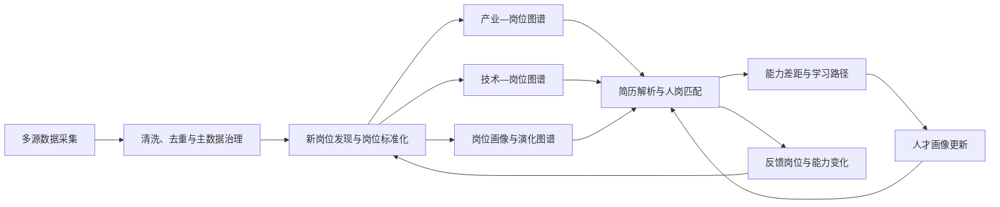
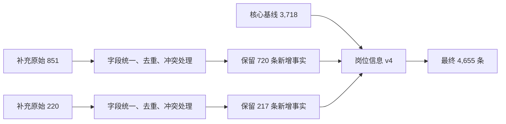
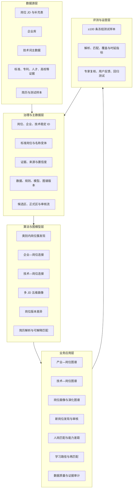
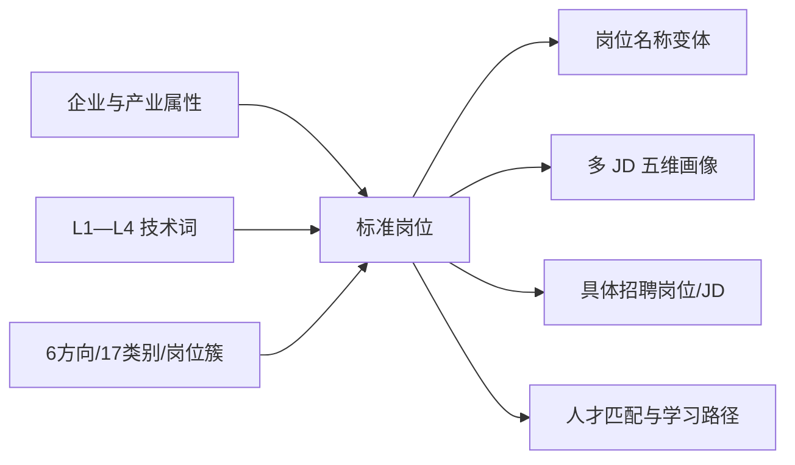
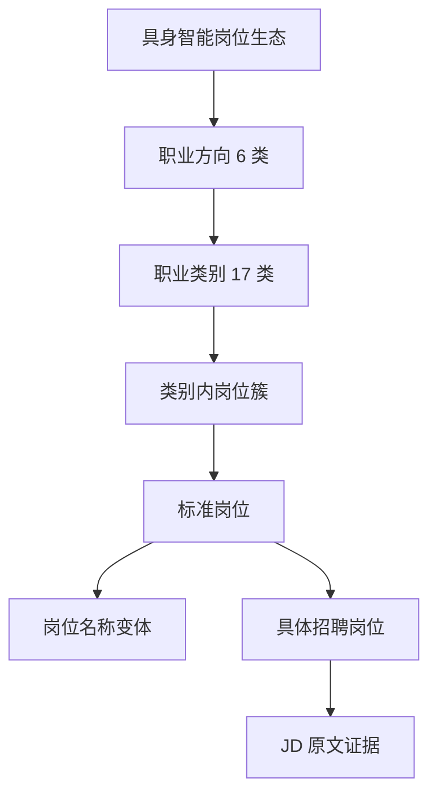
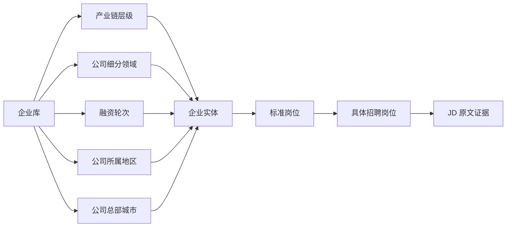
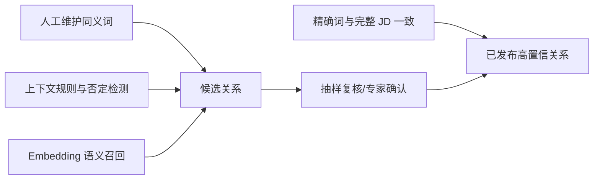
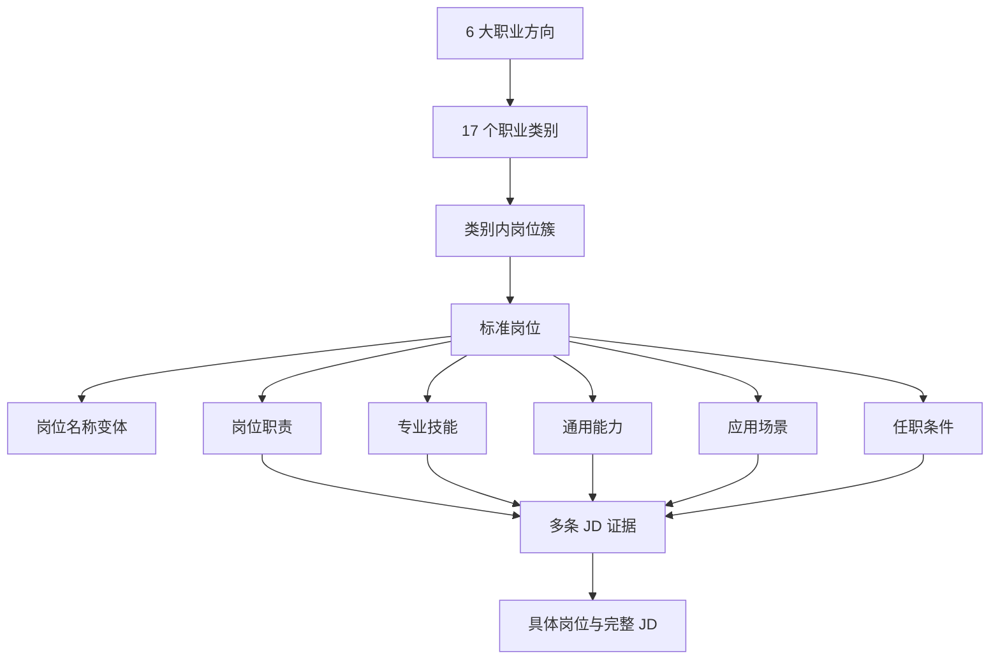
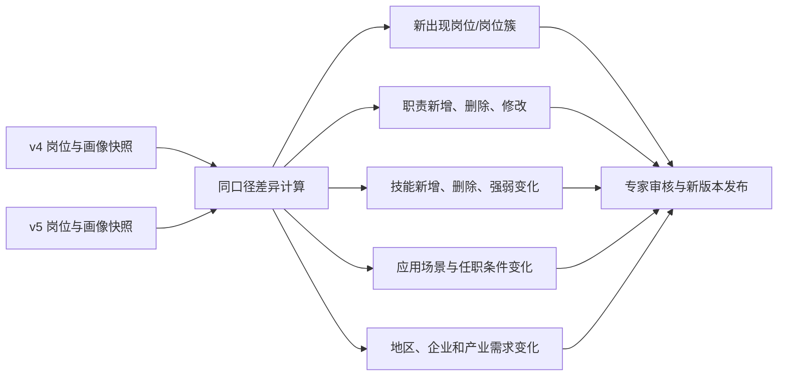

# 具身智能岗位与能力三图谱

## 赛题对齐、数据治理、图谱逻辑与人岗匹配闭环说明（详细评审版）

> **版本口径：v4 / 评审版**<br>
> **核对日期：2026 年 8 月 27 日**<br>
> **核心数据：4,655 条治理后岗位事实**<br>
> **总体主线：岗位是落点，企业是产业背景，技术词是能力坐标，JD 是可回查证据。**

---

## 0. 先用 10 秒看懂整个作品

本作品不是简单做三张“关系好看的图”，而是围绕赛题建立一条可验证的业务闭环：



三张图谱分别回答三个最直观的问题：

| 图谱 | 10 秒问题 | 起点 | 共同落点 | 证据出口 |
| --- | --- | --- | --- | --- |
| 产业—岗位图谱 | 谁在什么产业位置招聘什么岗位？ | 企业库及五类企业属性 | 标准岗位 | 具体招聘岗位与完整 JD |
| 技术—岗位图谱 | 某项技术最终对应哪些岗位？ | L1—L4 技术词主数据 | 标准岗位 | 技术命中的具体 JD 原文 |
| 岗位画像与演化图谱 | 一类岗位到底要求什么，发生了什么变化？ | 6 大方向、17 类别、岗位簇 | 标准岗位及五维画像 | 多条 JD 支持数、覆盖率和版本差异 |

> **一句话定位：**我们用企业库解释岗位“在哪里”，用技术词解释岗位“会什么”，用多条 JD 解释岗位“具体要求什么”，再把三者用于可解释的人岗匹配。

---

# 第一部分　先把赛题要求翻译成作品逻辑

## 1. 赛题真正要求的不是一张静态图，而是五段闭环

### 本页 10 秒结论

赛题的重点可以概括为：**发现岗位、更新岗位、刻画能力、完成匹配、证明有效。** 三张图谱是中间载体，不是最终目的。

| 赛题要求 | 作品必须回答的问题 | 本项目的承接模块 | 评审证据 |
| --- | --- | --- | --- |
| 新岗位发现与定义 | 新岗位如何发现？名称、职责、技能和场景如何确定？ | 6/17 规则边界 + 类别内语义发现 + 标准岗位校准 | 簇关键词、岗位变体、多 JD 证据、人工审核记录 |
| 已有岗位动态更新 | 哪些要求新增、删除或发生强弱变化？ | 岗位版本、证据快照、差异计算 | 新增/删除/修改项及来源 JD |
| 技能点级岗位全景 | 技术能力能否细到可搜索、可统计的技能点？ | L1—L4 技术词主数据 + 岗位映射 | 技术路径、岗位数量、命中 JD |
| 简历解析与人岗匹配 | 为什么推荐这个岗位？差距在哪里？ | 人才证据标准化 + 召回 + 精排 + 差距解释 | 分项得分、双方证据、未知项与真实差距的区分 |
| 学习路径与再匹配 | 推荐后如何真正帮助人才提升？ | 差距 → 学习任务 → 结果验证 → 画像新版本 | 任务完成证据与重新匹配结果 |
| 准确性与工程质量 | 结果是否可靠、能否复现？ | 数据版本、测试集、指标、人工复核、回归测试 | 冻结样本、规则版本、算法版本、评测报告 |

### 对赛题最有利的叙事顺序

1. 先讲 **4,655 条岗位事实如何形成且可追溯**；
2. 再讲 **岗位如何标准化，以及如何发现细粒度岗位簇**；
3. 展示 **产业、技术、岗位画像三张图如何共同落到岗位**；
4. 用一份简历演示 **匹配—差距—学习—再匹配**；
5. 最后主动说明 **当前已验证结果、候选结果和下一步验证项**。

这样既契合赛题，也能避免评委误以为项目只是“数据大屏”或“招聘推荐页面”。

---

## 2. 赛题文件、原方案文档与本次设计的关系

### 本页 10 秒结论

**赛题 PDF 决定目标和验收口径；原 DOCX、Markdown 和项目数据用于提供事实与已有设计；三者口径冲突时，以当前 v4 可复核数据为准。**

| 材料 | 正确用途 | 不能直接照搬的内容 |
| --- | --- | --- |
| 赛题 PDF | 确定任务目标、功能范围、准确性要求和评分方向 | 不能把目标值直接写成当前实测结果 |
| 原作品实现方案 DOCX | 复用已有研究背景、数据链路和系统设想 | 旧数据量、旧图谱名称、未复核指标需要更新 |
| 岗位核心版 Markdown | 复用“岗位是落点、技术词是坐标、证据可追溯”的主线 | 3,718 条、旧企业库和旧技术映射比例不是当前 v4 口径 |
| 当前项目数据及构建结果 | 作为本次文档中数量、覆盖率和发布边界的事实依据 | 候选层不能写成专家确认后的正式成果 |

### 统一口径后的关键修正

- 岗位主数据由旧版 **3,718 条**更新为 v4 **4,655 条**；
- 分类主轴统一为 **6 大职业方向 + 17 个职业类别**；
- 岗位簇不是第三张业务图谱，而是新岗位发现的**方法层和候选层**；
- 三张业务图谱统一调整为：**产业—岗位、技术—岗位、岗位画像与演化**；
- 标准岗位是三张图谱的共同语义桥梁，具体 JD 是右侧证据；
- 当前只有 v4 单一主快照，因此发布的是**演化基线和版本机制**，不虚构历史趋势；
- 赛题提出的“≥90%”属于目标验收线，未完成独立金标准评测前不写成项目实测值。

---

# 第二部分　数据来源、数据分析与治理过程

## 3. 数据来源：一套主数据、三类证据、多个辅助库

### 本页 10 秒结论

数据不是平铺堆叠，而是按“事实—主数据—证据”分层：**岗位 JD 是核心事实，企业库和技术词库是主数据，标准/专利/人才/高校等是辅助证据。**

| 数据层 | 当前项目口径 | 在系统中的作用 | 发布原则 |
| --- | ---: | --- | --- |
| 岗位 v4 主表 | 4,655 条岗位事实 | 图谱、画像、岗位发现和匹配的核心输入 | 每条保留来源和 JD 原文 |
| 职业分类 | 6 个方向、17 个类别 | 形成稳定分类边界 | 人工标准优先，不由 AI 自由改写 |
| 标准岗位搜索词包 | 107 个标准岗位、610 个名称变体 | 归并不同招聘标题，连接三张图谱 | 变体可扩展，标准岗位需审核 |
| 岗位簇候选层 | 当前 42 个可解释候选簇 | 类别内部发现细粒度岗位结构 | 明确标记“候选”，不冒充 HDBSCAN 实测成果 |
| 企业增强库 | 当前运行底册 633 条 | 提供产业链、细分领域、融资、地区和总部城市 | 确定性匹配；冲突和缺失进入待审 |
| 技术词主数据 | 7 个 L1、43 个 L2、229 个 L3、1,872 个 L4 | 形成跨岗位统一的技术坐标轴 | 主数据有稳定 ID、层级和版本 |
| JD 解析测试集 | 120 条冻结样本 | 验证解析过程与回归稳定性 | 单标注员两遍盲审，不能替代独立双人金标准 |
| 标准、专利、人才、高校等 | 辅助证据库 | 支撑技术词与产业背景，不直接替代岗位事实 | 结论必须回到具体来源和证据对象 |

### 为什么必须区分“事实”和“解释”

- **事实**：某企业在某次发布了某条 JD；原文是什么；当时的城市、薪资、学历和经验是什么。
- **主数据**：同一岗位名称的规范写法、同一企业的统一身份、同一技术词的稳定 ID。
- **解释**：该岗位属于哪个簇、某项能力是否是共性要求、某项技术是否在增长。

事实不能被模型改写；主数据可以版本化维护；解释必须附带规则、置信度和证据。

---

## 4. 为什么 3,718 条可以做第一版基线，而 851 条、220 条不能直接合并

### 本页 10 秒结论

3,718 条已有稳定字段、职业标签和可用 JD，可直接支撑第一版分析；另外两批数据在来源、字段、重复和标签上与基线不完全同构，必须先清洗后合并，否则会把“多采了几行”误当成“多了新岗位事实”。

### 4.1 3,718 条核心数据适合作为基线的原因

1. **结构稳定**：核心字段已形成统一列结构，可用于统计和建模；
2. **JD 可用**：具备岗位名称与岗位描述，能支持职责、技能和任职条件提取；
3. **分类可用**：已带 17 个职业类别，可作为类别内岗位发现的边界；
4. **结果可复现**：原始记录、清洗结果和分类结果可以建立稳定的第一版快照；
5. **风险可控**：先用稳定基线跑通链路，能够把新增数据造成的变化单独审计。

### 4.2 851 条和 220 条原始补充数据的主要风险

- 字段名称或字段语义与核心表不完全一致；
- 同一岗位可能在不同批次、不同页面或不同渠道重复出现；
- 公司名称存在简称、括号、集团/子公司等差异；
- JD 可能为空、截断或仅有摘要；
- 职业类别、技能标签和来源标识不完整；
- 直接追加会改变类别分布并放大重复岗位权重。

### 4.3 v4 的形成过程



**对账公式：**

> 3,718 + 720 + 217 = **4,655**

原始补充数据共 1,071 行，其中 937 行形成新增岗位事实，134 行因重复、归并或冲突处理没有作为新的独立事实进入 v4。

这段处理是项目可信度的重要组成部分：**我们追求的是可用事实增加，而不是表格行数增加。**

---

## 5. v4 数据分析：先认识数据，再决定图谱和算法

### 本页 10 秒结论

4,655 条岗位分布高度不均衡，因此不能把所有岗位一次性自由聚类，也不能要求每个类别都得到相同数量的岗位簇。

### 5.1 17 个职业类别分布

| 职业类别 | 岗位数 | 职业类别 | 岗位数 |
| --- | ---: | --- | ---: |
| 硬件开发 | 1,135 | 算法工程 | 849 |
| 软件/系统开发 | 825 | 视觉 | 255 |
| SLAM/控制 | 251 | 测试 | 228 |
| 部署 | 225 | 机械 | 185 |
| 研究 | 128 | 技术支持 | 120 |
| 供应链/制造 | 116 | 市场/销售 | 95 |
| 职能 | 88 | 系统集成 | 49 |
| 仿真 | 37 | 产品/设计 | 36 |
| 数据工程 | 33 |  |  |

### 5.2 分布对算法的直接影响

- 硬件、算法、软件/系统三个大类可以进行较细的类别内语义发现；
- 只有几十条的类别需要更保守的参数，必要时不拆簇；
- KMeans 会强迫每条数据进入预设簇，不适合簇数未知、规模不均的数据；
- HDBSCAN 更适合作为目标算法，因为它允许自动发现簇和识别噪声；
- 但 HDBSCAN 结果必须经过稳定性检验、关键词解释和专家校准，不能把算法编号直接作为岗位名称。

### 5.3 当前三个关键覆盖率

| 连接对象 | 已安全连接 | 待补全/待审 | 当前含义 |
| --- | ---: | ---: | --- |
| 企业库 | 4,472 / 4,655（96.07%） | 183 | 可以支撑第一版产业—岗位图谱 |
| 技术词主数据 | 3,005 / 4,655（64.55%） | 1,650 | 只发布确定性技术证据，未命中不猜 |
| 标准岗位 | 258 / 4,655 高置信映射 | 4,397 | 当前发布闸门偏严格，需继续专家映射 |

> **注意：**覆盖率不是准确率。覆盖率表示“多少条记录能在当前高置信规则下建立连接”；准确率必须通过独立标注集验证。

---

## 6. 数据处理与交叉验证：不是清洗一次，而是八道闸门

### 本页 10 秒结论

每一个进入正式图谱的结论，都要能回答四个问题：**来自哪里、如何得到、可信度多少、谁能复核。**


| 闸门 | 具体处理 | 验证方式 | 不通过时的处理 |
| --- | --- | --- | --- |
| 1. 原始留底 | 保存原始表、来源、采集时间和 JD 原文 | 文件哈希、行数对账 | 不覆盖原始文件 |
| 2. 字段统一 | 统一公司、岗位、城市、JD、学历、经验等字段 | 字段字典、类型和缺失率检查 | 异常进入清洗报告 |
| 3. 名称治理 | 企业简称/全称、岗位变体、技术别名映射到稳定 ID | 别名表与冲突列表 | 多候选不自动合并 |
| 4. 去重归并 | 使用标准化键、内容哈希和来源信息识别重复 | 合并前后行数对账 | 只保留一条事实并记录来源 |
| 5. 企业交叉验证 | 岗位公司名与企业库确定性匹配 | 唯一命中、字段一致性 | 183 条保留待审，不补猜测值 |
| 6. 技术交叉验证 | 通过完整 JD 精确复连、L4 技术词精确命中 | 技术 ID、命中片段、JD 原文 | 1,650 条留作同义词/语义复核 |
| 7. 岗位语义校准 | 6/17 边界内形成岗位簇和标准岗位候选 | 高频词、标题变体、多 JD 支持 | 低置信不进入正式画像 |
| 8. 版本与测试 | 冻结数据、词表、规则、模型和人工审核版本 | 120 条 JD 测试集、回归报告 | 新版本不覆盖旧结果，可回放 |

### 交叉验证的四种结果必须分开

1. **确认匹配**：唯一、确定、可追溯，可以发布；
2. **候选匹配**：语义相近但仍需人工确认，只在候选区展示；
3. **证据不足**：没有足够信息，显示“待补全”；
4. **冲突**：多个来源给出不同结论，保留冲突和来源，不能静默覆盖。

这能直接回应赛题中的多源异构数据治理、交叉验证和幻觉控制要求。

---

# 第三部分　整体架构：一套底座、三张图谱、一个闭环

## 7. 推荐的整体系统架构

### 本页 10 秒结论

最合理的结构不是“三套互不相干的图谱”，而是：**共享同一套企业、技术、岗位和证据主数据，在图模型层形成三种观察视角，最终共同服务人岗匹配。**



### 架构中最重要的共同桥梁：标准岗位



如果没有标准岗位，三张图只能各画各的；有了标准岗位，企业、技术、画像、JD 和人才才能落到同一个可比较对象上。

---

## 8. 先把四个容易混淆的概念分开

### 本页 10 秒结论

**职业类别不是岗位簇，岗位簇不是标准岗位，标准岗位不是一条具体 JD。**

| 层级 | 作用 | 示例 | 是否直接对外稳定发布 |
| --- | --- | --- | --- |
| 职业方向（6 类） | 形成宏观职业框架 | 感知决策与控制算法 | 是，人工标准 |
| 职业类别（17 类） | 形成岗位发现边界 | 算法工程 | 是，已有标签 |
| 岗位簇（目标 30—50 个） | 在类别内发现相近岗位群 | 机器人视觉感知岗位簇 | 候选需专家校准 |
| 标准岗位（107 个） | 作为检索、画像和图谱连接的语义锚点 | 具身智能业务总裁 | 审核后稳定发布 |
| 岗位名称变体（610 个） | 接住市场上不同写法 | 创始人/CEO、机器人业务 CEO 等 | 作为别名维护 |
| 具体岗位/JD（4,655 条） | 某企业某次招聘的事实证据 | 公司 A 的某次招聘信息 | 是，但放在详情证据层 |

### 正确的岗位主链



图谱主画布不应塞入 4,655 个岗位卡片。正确做法是：主图显示所有标准岗位、岗位簇及数量，用户点击后在右侧查看该标准岗位下的**全部已映射具体岗位与 JD**。这样既没有用“代表岗位”替代全量，也不会让图谱不可读。

---

# 第四部分　三张图谱逐一纠偏与定稿

## 9. 图谱一：产业—岗位图谱

### 本页 10 秒结论

产业图谱必须**从企业库出发**，经过企业的产业属性和企业实体，最终落到标准岗位与具体 JD；不能从岗位类别反推并猜测企业属性。

### 9.1 正确结构



### 9.2 这张图应该让用户看到什么

- 从某个产业链环节看：有哪些企业、在招哪些标准岗位；
- 从某个细分领域看：岗位需求集中在哪些职业方向和类别；
- 从融资轮次看：不同发展阶段的企业岗位结构有什么差异；
- 从地区和总部城市看：岗位与企业总部、招聘地之间有什么空间关系；
- 点击标准岗位后：右侧列出对应企业、岗位标题、城市、发布时间和完整 JD。

### 9.3 当前可以真实展示的结果

- v4 中 4,472 条岗位已经与企业库确定性连接，占 96.07%；
- 183 条因名称未命中或存在歧义进入待审；
- 当前企业连接涉及 102 个岗位侧企业实体；
- 企业库字段可以暂不完全补齐，缺失项显示“待补全”，不能由模型猜测。

### 9.4 原图可能被评委追问的问题

| 问题 | 原因 | 修正方式 |
| --- | --- | --- |
| 图上只有产业链，没有岗位落点 | 不符合岗位和能力图谱赛题主线 | 企业后继续连接标准岗位和具体 JD |
| 企业属性从 JD 推断 | 会产生事实错误 | 企业属性只取企业库，JD 只提供招聘事实 |
| 一个公司名直接当一个企业 | 简称、集团、子公司容易混淆 | 企业稳定 ID + 名称别名 + 多候选待审 |
| 缺失字段被补得很完整 | 容易形成模型幻觉 | 前端明确显示缺失和待补全状态 |

---

## 10. 图谱二：技术—岗位图谱

### 本页 10 秒结论

技术图谱不是一棵孤立的技术分类树。它必须从规范技术词出发，沿 L1—L4 展开，最后连接标准岗位和具体 JD，才能回答“学这项技术能做什么岗位”。

### 10.1 正确结构


### 10.2 为什么技术词要有四级主数据

- L1 适合看全局技术版图；
- L2 适合看某一技术方向的岗位需求；
- L3 适合做能力分析和学习路径；
- L4 适合在 JD 中精确检索、保留证据和做岗位匹配；
- 稳定 ID 和别名表可以处理“SLAM / 同步定位与建图”等不同表达。

### 10.3 技术词如何与岗位建立关系

当前采用“安全连接优先”的两种确定性证据：

1. 旧技术标注与 v4 岗位通过**完整 JD 标准化后一致**进行复连；
2. v4 的技能标签与 L4 技术词进行**精确匹配**。

二者合并后，可以为 3,005 条岗位建立安全技术连接，占 64.55%；其余 1,650 条不强行填充，进入同义词、规则扩展和语义复核流程。

### 10.4 下一步扩大覆盖的正确顺序



不能为了让图更满，直接把所有语义近似词写入正式图谱。技术图谱的价值不在“连线多”，而在每条连线都能回到 JD 原文。

---

## 11. 图谱三：岗位画像与演化图谱

### 本页 10 秒结论

岗位画像不是由一条 JD 生成，也不是只展示一个“代表岗位”。它以**标准岗位**为中心，归并其名称变体和多条同类 JD，再形成可被一类岗位共同支撑的五维画像。

### 11.1 正确结构



### 11.2 五维画像的含义

| 维度 | 表达粒度 | 示例写法 | 不应怎样写 |
| --- | --- | --- | --- |
| 岗位职责 | 一类岗位稳定承担的任务 | 高层关系维护、市场与客户洞察、重大项目推进 | 直接复制某一家公司的整段 JD |
| 专业技能 | 完成岗位任务所需的专业知识和技术 | SLAM、控制算法、行业解决方案、商业谈判 | 把所有出现过一次的词都设为必需 |
| 通用能力 | 跨企业仍成立的行为与协作能力 | 跨团队协同、复杂问题解决、表达与影响 | 使用空泛性格标签替代证据 |
| 应用场景 | 能力发生作用的业务或技术环境 | 工业制造、机器人交付、客户现场、研发验证 | 由公司行业直接猜岗位场景 |
| 任职条件 | 学历、专业、经验、资格等门槛 | 本科及以上、3—5 年、相关专业 | 将缺失字段当成“不要求” |

### 11.3 多 JD 聚合规则

- 先通过标准岗位搜索词包归并岗位标题变体；
- 只在同一职业方向、类别和岗位簇范围内聚合；
- 每个画像点必须保存支持 JD 数、支持比例和原文片段；
- 单条 JD 出现的要求可以作为“企业特有要求”，但不能自动上升为岗位共性；
- 当前展示闸门建议至少由 2 条同类 JD 支持；高频、共性和差异化要求分层显示；
- 右侧证据抽屉列出所有已映射具体岗位，用户可逐条查看完整 JD。

### 11.4 标准岗位示例

以“具身智能业务总裁”为标准岗位，可以维护“具身智能业务总裁、创始人/CEO、机器人业务 CEO”等名称变体。画像不是取其中一条招聘信息，而是归纳同类 JD 后形成：

- 职责：业务战略、重点客户、高层关系、经营目标与组织建设；
- 专业技能：产业判断、产品商业化、解决方案与大客户经营；
- 通用能力：领导力、跨团队协同、复杂决策与外部影响；
- 应用场景：机器人业务拓展、产业合作、战略客户和生态建设；
- 任职条件：相关行业经历、管理经验、业务结果证据。

以上每个点都应显示“由多少条 JD 支持”，并允许点击查看具体原文。

---

# 第五部分　岗位发现与动态演化的方法层

## 12. 岗位簇生成逻辑：6 + 17 + AI，而不是 4,655 条自由聚类

### 本页 10 秒结论

最稳妥的方法是：**6 大方向和 17 类别负责“定边界”，AI 负责“发现细分结构”，专家负责“命名、合并、拆分和发布”。**


### 为什么不能直接对 4,655 条岗位自由聚类

1. 大量岗位标题只差“视觉、感知、AI、具身”等修饰词，容易被过度拆分；
2. 不同职业类别可能共享“开发、项目、系统、工程师”等通用词，容易跨类混杂；
3. 类别规模从 33 到 1,135 条差异很大，全局参数不稳定；
4. 算法簇编号没有业务语义，不能直接成为图谱中的岗位名称；
5. 评委最关心的是能否解释“为什么属于这一簇”，而不是聚类图是否漂亮。

### 岗位簇的建议输出字段

| 字段 | 作用 |
| --- | --- |
| 簇 ID 与版本 | 保证算法重跑后可以比较 |
| 所属职业方向/类别 | 证明没有跨边界自由聚类 |
| 岗位数量与噪声数量 | 说明簇规模和 HDBSCAN 噪声处理 |
| 高频技术词/职责词 | 解释簇的语义中心 |
| 岗位名称变体 | 说明市场实际称呼，不等于挑一个代表岗位 |
| 候选名称与人工名称 | 保留 AI 建议和专家校准过程 |
| 多 JD 支持证据 | 防止根据一条 JD 下结论 |
| 稳定性与置信度 | 说明参数变化后簇是否稳定 |

### 当前项目的诚实口径

当前 42 个岗位簇是可解释候选层，符合目标 30—50 个的展示规模，但**不能表述为已经完成 HDBSCAN 和专家终审**。正式答辩可说：

> 当前先用透明规则形成 42 个候选簇，用于验证层级、交互和审计流程；正式算法路线是在 17 类别内部执行 Embedding + HDBSCAN，再通过专家校准发布。

---

## 13. 动态演化：必须有时间快照，单一 v4 不能制造趋势

### 本页 10 秒结论

动态演化不是播放动画，而是比较两个同口径数据快照，输出岗位定义和能力要求的**新增、删除、修改与强弱迁移**。

### 13.1 正确的演化对象



### 13.2 每次演化必须绑定的版本

- 数据快照版本与采集时间；
- 6/17 分类版本；
- 标准岗位、名称变体和技术词表版本；
- 文本处理、Embedding、聚类和匹配算法版本；
- 人工审核人、时间和处理结论；
- 新增/删除/修改所对应的原始 JD 证据。

### 13.3 当前应如何展示

当前只有 v4 一个可作为主口径的快照，因此前端可以展示：

- 当前岗位画像基线；
- 演化数据结构和差异规则；
- 下一版本到来后将如何比较；
- 候选变化的审核界面。

不能展示未经真实时间快照支持的“某技术增长 35%”“某岗位快速上升”等结论。**界面可以美化，数据趋势不能虚构。**

---

# 第六部分　人岗匹配：从图谱查询到人才成长闭环

## 14. 人岗匹配的正确逻辑

### 本页 10 秒结论

人岗匹配不是让大模型直接给一个分数，而是先把简历和岗位映射到同一套标准能力坐标，再进行分层召回、证据评分、差距解释和学习反馈。


### 14.1 三层匹配

| 层次 | 解决的问题 | 主要依据 | 输出 |
| --- | --- | --- | --- |
| 第一层：岗位召回 | 大方向是否可能匹配？ | 职业方向、类别、技术域、求职目标 | 候选岗位簇集合 |
| 第二层：标准岗位匹配 | 与一类岗位的共性要求是否匹配？ | 五维画像、必需/加分技能、经验条件 | 标准岗位分项解释 |
| 第三层：具体机会精排 | 哪条招聘机会更适合？ | 具体 JD、地点、产业、企业偏好 | 具体岗位推荐列表 |

### 14.2 评分必须可解释

建议采用可配置的规则评分框架：

> 匹配分 = 必需技能覆盖 + 职责经历相似 + 通用能力证据 + 场景经验 + 任职条件 + 用户偏好

其中：

- 学历、资格、地点等可以作为明确的硬条件或筛选项；
- 技能覆盖必须区分必需项和加分项；
- LLM 可以负责抽取、归一化和解释，不直接决定最终分数；
- 每个分项保存权重、输入证据和算法版本，相同快照可复算；
- 性别、年龄、婚育等敏感属性不参与匹配；
- 企业融资、地区等字段优先作为筛选与解释，不因字段缺失直接扣分。

### 14.3 “未知”不等于“能力缺口”

人才侧每项能力至少区分四种状态：

| 状态 | 含义 | 系统动作 |
| --- | --- | --- |
| 已确认具备 | 简历、项目或测评有证据 | 计入覆盖并展示证据 |
| 部分具备 | 有相邻或基础能力证据 | 标记可迁移能力 |
| 未知 | 简历没有写，不能判断 | 发起补充问答或测评，不直接扣为缺口 |
| 已确认缺口 | 用户确认或测评未达到要求 | 生成学习和实践路径 |

### 14.4 闭环为什么成立

匹配结果给出差距 → 差距生成学习/实践任务 → 用户提交项目、证书或测评结果 → 新证据形成新的人才画像版本 → 系统重新匹配。只有完成并验证的证据才改变匹配结果，“点击完成”本身不加分。

---

# 第七部分　产品呈现：前端要好看，更要让评委看懂证据

## 15. 前端信息架构与 90 秒演示路径

### 本页 10 秒结论

前端的目标不是把所有节点同时铺开，而是让评委在 90 秒内看清：**数据可信、三图都落岗位、岗位有证据、匹配有闭环。**

### 15.1 推荐的一级导航

1. 项目总览；
2. 新岗位发现与动态更新；
3. 产业—岗位图谱；
4. 技术—岗位图谱；
5. 岗位画像与演化图谱；
6. 人岗匹配与学习路径；
7. 数据质量、版本与审核中心。

### 15.2 三张图统一的页面布局

```text
┌──────────────────────────────────────────────────────────────────┐
│ 顶部：图谱名称｜数据版本｜搜索｜筛选｜覆盖率｜候选/正式状态       │
├──────────────────────────────────────┬───────────────────────────┤
│                                      │ 右侧证据抽屉               │
│ 主图画布                              │ · 标准岗位与名称变体        │
│ 层级展开、节点数量、关系路径          │ · 全部已映射具体岗位        │
│ 点击节点后逐级下钻                    │ · JD 原文与命中片段         │
│                                      │ · 来源、置信度、版本        │
├──────────────────────────────────────┴───────────────────────────┤
│ 底部：图例｜数据口径｜待审数量｜算法和人工审核边界                │
└──────────────────────────────────────────────────────────────────┘
```

### 15.3 90 秒演示路径

1. **15 秒看数据**：4,655 条 v4 如何由 3,718 + 720 + 217 形成；
2. **15 秒看产业图**：选一个产业细分 → 企业 → 标准岗位 → 右侧具体 JD；
3. **15 秒看技术图**：选一个 L4 技术词 → 标准岗位 → 命中 JD 证据；
4. **20 秒看画像图**：选一个标准岗位 → 名称变体 → 五维画像 → 支持 JD 数；
5. **20 秒看匹配**：上传简历 → 推荐岗位 → 分项理由 → 差距与学习任务；
6. **5 秒看边界**：候选、待审、已验证和版本状态清晰可见。

### 15.4 可以美化与不能美化的边界

| 可以美化 | 不能美化 |
| --- | --- |
| 关系动画、渐进展开、颜色层级、聚合节点、摘要卡片 | 伪造数据覆盖、技术趋势、岗位数量或准确率 |
| 候选簇的可视化和算法流程演示 | 把规则候选簇说成 HDBSCAN 已验证结果 |
| 缺失数据的占位和待补全提示 | 用模型猜企业融资、总部或岗位要求 |
| 匹配解释的语言润色 | 让大模型无证据地产生匹配分和能力缺口 |
| 示例学习路径 | 把“点击完成”包装成能力已经提升 |

> 前端可以把复杂过程讲得更直观；后端可以采用分阶段实现和候选算法；但所有对外数字必须来自真实数据和可复核计算。

---

## 16. 后端、算法与数据层应如何配合前端

### 本页 10 秒结论

后端不需要第一天就完成所有高级模型，但必须先具备稳定 ID、证据、置信度、版本和审核状态；这些基础比“用了什么大模型”更重要。

### 16.1 推荐的核心实体

| 实体 | 关键字段 |
| --- | --- |
| 企业 | enterprise_id、标准名、别名、五类企业属性、来源、版本 |
| 岗位事实 | job_id、企业 ID、原始标题、JD、来源、采集时间、内容哈希 |
| 职业方向/类别 | taxonomy_id、父级、名称、版本、人工状态 |
| 岗位簇 | cluster_id、类别、算法版本、关键词、稳定性、审核状态 |
| 标准岗位 | role_id、标准名、所属层级、名称变体、发布状态 |
| 技术词 | tech_id、L1—L4 层级、标准词、别名、版本 |
| 画像点 | portrait_item_id、维度、标准化内容、强度、覆盖率 |
| 证据 | evidence_id、来源对象、原文片段、置信度、生成规则 |
| 人才画像 | person_profile_id、能力证据、偏好、版本、授权范围 |
| 匹配结果 | match_id、岗位/人才版本、分项得分、总分、解释、算法版本 |

### 16.2 推荐的关键关系

```text
企业 ─招聘→ 岗位事实
企业 ─属于→ 产业链层级 / 细分领域 / 地区 / 总部城市 / 融资轮次
岗位事实 ─归属→ 职业方向 / 职业类别 / 岗位簇 / 标准岗位
标准岗位 ─具有变体→ 岗位名称变体
技术词 ─被要求于→ 标准岗位 / 岗位事实
标准岗位 ─具有画像点→ 职责 / 技能 / 能力 / 场景 / 条件
画像点 ─由……支持→ JD 证据
人才 ─具有→ 人才能力证据
人才 ─匹配→ 标准岗位 / 具体岗位事实
能力差距 ─生成→ 学习任务 ─更新→ 人才画像版本
```

### 16.3 分阶段算法策略

| 阶段 | 可以真实完成的能力 | 对外状态 |
| --- | --- | --- |
| P0 | 精确词、规则、别名、高置信连接、候选簇、可解释匹配框架 | 可演示、可回放 |
| P1 | 类别内 Embedding + HDBSCAN、同义词扩展、专家校准 | 候选验证中 |
| P2 | 多时间快照演化、独立金标准评测、权重校准 | 通过评测后发布 |
| P3 | 在线反馈、漂移监测、主动学习和自动回归 | 持续运营能力 |

这种分层既允许系统在比赛阶段形成完整前端体验，也不需要用未经验证的算法结果填满后台。

---

# 第八部分　创新点、评测方案与答辩边界

## 17. 创新点：创新不是“用了 AI”，而是 AI 被放在正确的位置

### 本页 10 秒结论

本项目的核心创新是：**用标准岗位把产业、技术、岗位画像和匹配连成一体，并通过多 JD 证据、候选发布闸门和版本机制控制 AI 幻觉。**

| 创新点 | 常见做法的问题 | 本项目的改进 |
| --- | --- | --- |
| 1. 三图谱共享标准岗位桥梁 | 三张图各自展示，无法互相查询 | 企业、技术、画像都落到同一标准岗位，再连接具体 JD |
| 2. 规则约束 + 语义发现 + 专家校准 | 全量自由聚类易跨类别混杂，纯人工又缺少新发现 | 6/17 定边界，AI 做类别内发现，专家决定发布 |
| 3. 多 JD 形成岗位共性画像 | 单条 JD 受单个企业表述影响 | 画像点保存支持数、覆盖率和原文证据 |
| 4. 岗位变体与岗位事实分离 | 同义标题导致重复统计或漏检 | 107 个标准岗位承接 610 个名称变体和多条 JD |
| 5. 证据不足不等于能力缺口 | 简历没写就被判为不会 | 区分已具备、部分具备、未知和真实缺口 |
| 6. 候选区与正式区分离 | 模型推断直接污染知识库 | 候选关系需规则/专家验证后发布 |
| 7. 演化基于版本差异 | 用动画或单一快照冒充动态变化 | 数据、词表、模型和审核全部版本化 |
| 8. 匹配形成成长闭环 | 只给推荐分，无法帮助人才提升 | 差距 → 学习任务 → 新证据 → 再匹配 |

### 可迁移价值

具身智能是本项目选择的示范垂直领域，但“人工职业框架 + 行业主数据 + 技术词坐标 + 多文本证据 + 标准岗位桥梁 + 人岗闭环”的方法可迁移到人工智能、智能制造、低空经济等其他新兴产业。

---

## 18. 测试与评估：如何证明解析和匹配真的有效

### 本页 10 秒结论

赛题要求的“≥90%”必须拆成具体任务、具体标签和独立测试集，不能用覆盖率、演示成功率或模型自评代替。

### 18.1 当前评测基础

- 项目内已有 120 条冻结 JD 解析样本；
- 采用单标注员两遍、第二遍对第一遍盲审的方式形成测试版本；
- 该设计可以支持回归测试，但不是独立双人标注金标准；
- 人岗匹配仍需要建立专家确认的“简历—岗位—匹配等级—能力差距”金标准集。

### 18.2 建议的指标体系

| 对象 | 核心指标 | 说明 |
| --- | --- | --- |
| JD 解析 | 字段准确率、Precision、Recall、F1、完整率 | 职责、技能、学历、经验等分字段评估 |
| 简历解析 | 实体级 Precision/Recall/F1、证据定位准确率 | 技能、项目、年限、学历、成果等 |
| 岗位分类 | 方向/类别 Macro-F1、混淆矩阵 | 防止大类别掩盖小类别错误 |
| 岗位簇 | 稳定性、噪声率、轮廓指标、专家一致率 | 数学指标与业务可解释性同时评估 |
| 技术映射 | Precision 优先、覆盖率、否定误判率 | 先保证关系可信，再扩大覆盖 |
| 人岗匹配 | Top-K 命中率、NDCG、专家相关性、解释正确率 | “推荐对不对”和“解释对不对”分开 |
| 系统工程 | 查询时延、并发、失败率、可回放率 | 确保演示和实际使用稳定 |

### 18.3 ≥100 条测试计划

1. 冻结不少于 100 条跨 17 类别的 JD；
2. 分层抽样，保证大类与小类均有覆盖；
3. 制定字段定义、边界案例和标注指南；
4. 采用双人独立标注和第三人裁决；
5. 测试集不得用于调阈值，另设校准集；
6. 输出类别级指标、错误类型和复现命令；
7. 每次词表、规则或模型更新后自动回归；
8. 匹配任务单独建立简历—岗位专家金标准，不能借用 JD 解析得分。

### 18.4 当前对外表述

可以说：系统已建立 120 条冻结 JD 测试基础、可回放的数据和算法版本，并形成完整评测方案。<br>
不能说：解析准确率或人岗匹配准确率已经达到 90%，除非正式独立测试报告确实支持该结论。

---

## 19. 当前完成度与发布边界

### 本页 10 秒结论

答辩时主动把“已完成、候选可演示、下一步验证”分开，反而更可信，也更不容易被追问击穿。

| 状态 | 当前内容 | 推荐表述 |
| --- | --- | --- |
| 已完成且可对账 | v4 4,655 条；6/17 分类；企业连接 4,472 条；技术安全连接 3,005 条；107 标准岗位、610 变体；三张图谱的共同岗位落点 | 可现场演示、可回查 JD、可复算数量 |
| 候选可演示 | 42 个岗位簇候选；258 条高置信标准岗位映射；匹配评分框架；演化差异界面 | 明确显示“候选/待审/演化基线” |
| 下一步必须验证 | 类别内 HDBSCAN；4,397 条标准岗位专家映射；1,650 条技术语义映射；多时间快照；独立人岗匹配金标准；≥90%目标评测 | 作为路线图，不写成既成成果 |

### 三条红线

1. **不把覆盖率当准确率**；
2. **不把候选算法结果当专家确认结果**；
3. **不把界面动画和单一快照当动态演化证据**。

---

## 20. 评委高频追问与建议回答

### 1）为什么不直接把 4,655 条岗位一起聚类？

因为不同职业类别共享大量通用词，且类别规模差异明显。全量自由聚类容易跨职业混杂或过度拆分。项目先用 6 个职业方向和 17 个职业类别确定边界，再在类别内部做语义发现，结果更稳定、更可解释。

### 2）17 个职业类别和岗位簇有什么区别？

17 个类别是人工已有的稳定分类；岗位簇是在每个类别内部发现的细粒度岗位群，用于识别同一类别内不同技术路径和职责组合。两者不是同一层。

### 3）当前 42 个岗位簇是 HDBSCAN 跑出来的吗？

不是。当前 42 个是透明规则候选层，用来验证图谱层级和交互流程；正式路线是类别内 Embedding + HDBSCAN + 稳定性检验 + 专家校准。文档和界面都应明确标注。

### 4）为什么岗位画像不直接用一条 JD？

一条 JD 只能代表某家企业某次招聘，不能代表一类岗位。项目以标准岗位归并多个名称变体和多条同类 JD，再根据支持数量、覆盖率和原文证据形成五维共性画像。

### 5）为什么主图不展示全部 4,655 个岗位？

主图同时展示数千节点会不可读。主画布展示全量标准岗位、岗位簇和数量，点击后在右侧列出该节点下所有已映射具体岗位与完整 JD。全量岗位没有被删除，只是进入证据层。

### 6）产业图谱为什么必须从企业库出发？

产业链、细分领域、融资、地区和总部城市属于企业事实，不应从岗位 JD 猜测。企业库提供稳定企业身份与属性，岗位 JD 只负责说明该企业当时在招聘什么。

### 7）技术图谱为什么只有 64.55% 的岗位安全连接？

因为当前只发布完整 JD 一致和 L4 技术词精确命中的高置信关系。剩余 1,650 条需要同义词、上下文和语义方法扩大召回，再经过抽样或专家复核。宁可先少连，也不制造错误技术关系。

### 8）为什么标准岗位只有 258 条 JD 高置信映射？

当前标题闸门较严格，通用词如“工程师、经理、开发”不会直接触发映射。4,397 条保留在待审区，后续结合类别边界、变体词包和语义证据扩展。该做法牺牲覆盖率，换取第一版关系可信度。

### 9）动态演化在哪里？

系统已经定义岗位版本、能力版本和新增/删除/修改的差异机制；当前 v4 是演化基线。下一时间快照进入后可以按同口径比较。现阶段不虚构历史增长率。

### 10）人岗匹配分可靠吗？

当前框架可解释、可回放，每一分都能追到人才和岗位证据；但尚需独立专家金标准验证最终准确性。因此可以演示匹配闭环和解释机制，不能提前宣称达到 90%。

### 11）企业信息不完整怎么办？

缺失项保持为空并进入待补全；多候选进入人工审核；只有企业库中的确定性属性进入正式图谱。模型不负责猜融资轮次、总部城市等企业事实。

### 12）项目真正的创新是什么？

不是简单使用 AI，而是将 AI 限定在类别内发现、语义归一和解释生成等合适环节；同时用标准岗位把产业、技术、岗位画像和人岗匹配连接起来，并用多 JD 证据、候选发布闸门和版本机制保证结果可追溯。

---

# 第九部分　最终定稿建议

## 21. 最终文档主线

正式作品说明建议按以下顺序组织，避免在数据、算法和三张图之间来回跳转：

1. 赛题痛点与项目目标；
2. 数据来源、v4 形成与质量分析；
3. 主数据、证据、候选/正式区和交叉验证；
4. 6/17/岗位簇/标准岗位/JD 的层级关系；
5. 产业—岗位图谱；
6. 技术—岗位图谱；
7. 岗位画像与演化图谱；
8. 新岗位发现与动态更新方法；
9. 简历解析、人岗匹配、差距和学习闭环；
10. 前端演示、后端架构、测试评估和创新点；
11. 当前成果、发布边界和下一阶段计划。

## 22. 最终方法表述

> 本研究面向具身智能新兴产业，构建以岗位为共同落点的产业—岗位、技术—岗位和岗位画像与演化三图谱。项目先将多批招聘数据治理为 4,655 条可追溯岗位事实，利用 6 个职业方向和 17 个职业类别形成稳定分类边界；岗位发现总体设计采用“规则约束 + 语义聚类 + 专家校准”，在类别内部发现细粒度岗位簇，并通过标准岗位搜索词包归并市场上的岗位名称变体。当前先形成可审计的规则候选层，类别内语义聚类及专家终审按阶段验证。产业图谱从企业库及产业属性出发连接岗位，技术图谱沿 L1—L4 技术主数据连接岗位，岗位画像图谱以标准岗位为中心聚合多条同类 JD，形成职责、专业技能、通用能力、应用场景和任职条件五维画像。结论发布时保留数据来源、证据片段、置信度和版本；具体招聘岗位与完整 JD 在证据侧逐条回查。系统进一步将简历证据映射到同一能力坐标，通过岗位召回、标准岗位匹配、具体 JD 精排、能力差距解释和学习反馈，构建可解释、可回放、可迭代的人岗匹配闭环。

## 23. 一分钟答辩话术

> 我们的作品不是把 4,655 条 JD 全部堆进一张大图，也不是让 AI 替代职业分类。项目先把多批招聘数据治理成可追溯的 v4 岗位事实，再用 6 大职业方向和 17 个职业类别限定边界，让 AI 只在类别内部发现更细的岗位簇，最后由专家校准。三张图谱共享“标准岗位”这一桥梁：产业图谱从企业库出发，回答谁在什么产业位置招什么岗位；技术图谱从四级技术词出发，回答一项技术对应哪些岗位；岗位画像图谱归并同一标准岗位的名称变体和多条 JD，形成五维共性画像。主图保持可读，点击岗位后可以在右侧查看全部已映射的具体招聘岗位和完整 JD。匹配端把简历和岗位映射到同一能力坐标，给出证据、差距和学习路径，再用新证据更新人才画像并重新匹配。我们美化的是表达和交互，不美化数据结论：覆盖率、候选结果和准确率边界都会明确展示。

---

## 附录 A：当前统一数字口径

| 项目 | 当前统一值 | 说明 |
| --- | ---: | --- |
| v4 岗位事实 | 4,655 | 3,718 + 720 + 217 |
| 原始补充行 | 851 + 220 | 清洗后形成 937 条新增事实 |
| 职业方向 | 6 | 人工标准 |
| 职业类别 | 17 | 已有数据标签 |
| 当前岗位簇 | 42 | 候选层，不等同于 HDBSCAN 终审结果 |
| 目标岗位簇 | 30—50 | 以专家可读性和稳定性为准，不追求固定数字 |
| 标准岗位 | 107 | 来源于标准岗位搜索词包 |
| 岗位名称变体 | 610 | 用于归并市场称呼 |
| 标准岗位高置信 JD 映射 | 258 | 其余 4,397 待扩展和审核 |
| 企业库运行底册 | 633 | 当前产业图谱所用企业增强底册 |
| 企业确定性映射 | 4,472 | 96.07%，183 待审 |
| 技术词 L1/L2/L3/L4 | 7 / 43 / 229 / 1,872 | 共 2,151 个技术节点 |
| 技术安全映射岗位 | 3,005 | 64.55%，1,650 待扩展和复核 |
| 冻结 JD 解析样本 | 120 | 单标注员两遍盲审，非独立双人金标准 |

## 附录 B：对外措辞白名单

| 推荐写法 | 不推荐写法 |
| --- | --- |
| “规则约束 + 语义发现 + 专家校准” | “AI 自动生成岗位分类” |
| “42 个可解释岗位簇候选” | “HDBSCAN 已准确生成 42 个岗位簇” |
| “企业确定性连接覆盖 96.07%” | “企业数据准确率 96.07%” |
| “技术安全连接覆盖 64.55%” | “技术识别准确率 64.55%” |
| “当前 v4 是岗位演化基线” | “已经发现岗位增长趋势” |
| “匹配结果可解释、可回放，待金标准评测” | “人岗匹配准确率已达到 90%” |
| “缺失字段留空并进入待补全” | “AI 自动补全所有企业属性” |

## 附录 C：本版核对依据

| 依据 | 对应内容 |
| --- | --- |
| `XH-202621_多源异构数据驱动岗位和能力图谱构建与动态演化分析研究.pdf` | 赛题目标、新岗位发现、动态更新、匹配闭环与评测要求 |
| `具身智能岗位能力图谱_作品设计实现方案_数据补充.docx` | 已有实现方案与数据补充背景；旧数字不直接沿用 |
| `具身智能岗位能力图谱_数据与图谱说明_岗位核心版.md` | “岗位为核心、技术词为坐标、证据可追溯”的已有主线 |
| `岗位信息v4_企业增强分析.xlsx` | 4,655 条岗位主口径、类别分布、企业增强与待审状态 |
| `具身智能企业数据_整合去重_完整.xlsx` | 企业统一身份和五类产业属性 |
| `技术词主数据_20260727.xlsx` | L1—L4 四级技术体系及稳定技术词 |
| `job-ecosystem-graph.json` 及岗位图谱构建报告 | 6/17/42/107/610、企业连接、技术连接和标准岗位映射数量 |
| `frozen_manifest_v1_1.json` | 120 条冻结 JD 样本、单标注员两遍盲审及测试版本状态 |

本版将上述材料视为研究和核对依据，不把其中的旧方案、待实现流程或目标指标直接当作当前已完成事实。

---

**最终收口：**岗位是共同落点，标准岗位是三图桥梁，企业库解释产业位置，技术词解释能力坐标，多条 JD 解释岗位共性，证据和版本保证可信，人岗匹配把图谱价值转化为人才成长闭环。
