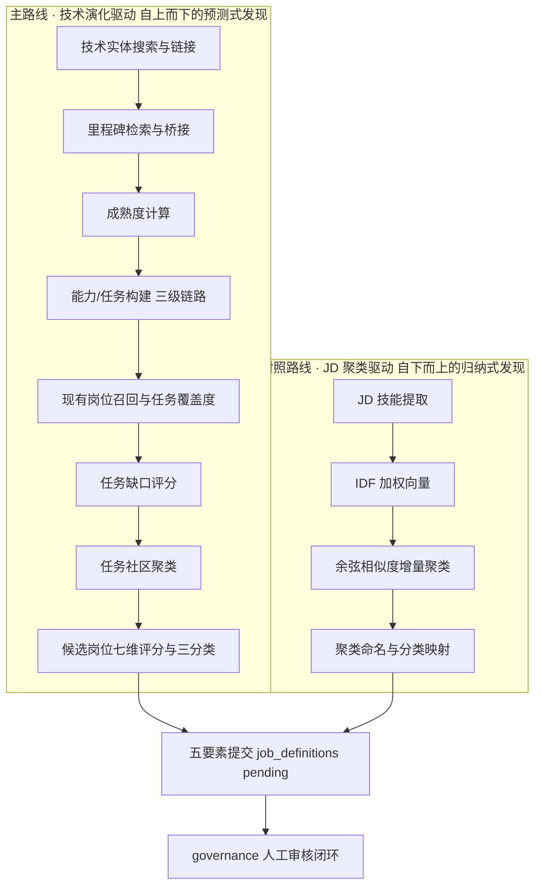

# 岗位发现功能模块说明

> **模块**：新岗位发现（`pipeline/emerging.py` 主路线 + `pipeline/cluster.py` 对照路线）
> **版本**：v1.0 · 2026-08-08（阶段 6 移植落地后）
> **定位**：本文档提取岗位发现的完整流程、算法逻辑与全部计算式，作为开发维护、参数调优与答辩说明的依据

---

## 1. 模块概述：双路线架构

| 路线 | 解决的问题 | 核心实现 | 数据依赖 |
|---|---|---|---|
| **主路线**（技术演化驱动） | "技术 A 的爆发会催生哪些新岗位"——发现存量 JD 中**尚未成型**的萌芽岗位 | `pipeline/emerging.py` + `/api/emerging/*` | technologies（272）/ milestones（460）/ tasks·capabilities·role_titles（45）/ jobs（6,793） |
| **对照路线**（JD 聚类驱动） | 存量市场中已经成型的相似岗位族归纳 | `pipeline/cluster.py` + `/api/clusters` | job_skills 图谱边 + skills 本体 |

---

## 2. 主路线完整流程与计算式

### 2.1 步骤一：技术实体搜索与标准实体链接

对用户查询 \(q\) 与每个技术实体（`technologies` 表，L2/L3 级）计算链接分，归一化规则：仅保留中英文、数字（去符号、小写化）。

\[
score = \begin{cases}
1.00 & q_{norm} = name_{norm}\ \text{（完全同名）}\\
0.94 & q_{norm} \subseteq name_{norm}\ \text{或反向包含}\\
0.86 & q_{norm} \in \text{检索文本（名称+定义+别名前 24 个）}\\
0.72 \times \text{SeqRatio}(q_{norm}, name_{norm}) & \text{其余（编辑距离相似度）}
\end{cases}
\]

- 入选门限：\(score \ge 0.34\)；返回 Top-8，携带 `link_confidence` 供前端展示
- 排序：分数降序 → level → technology_id

### 2.2 步骤二：里程碑检索与桥接

对每条里程碑事件（`milestones` 表，460 条）计算与目标技术的相关度：

\[
relevance = \max(bridge\_score,\ lexical\_score)
\]

- **桥接分**：事件 `technology_links` JSON（由 `MILESTONE_BRIDGE` 类目映射表预置，覆盖 413/460 条）中与目标根编码前缀匹配的最大权重
\[
bridge\_score = \max_{(code, w) \in links,\ root \rightleftarrows code} w
\]
- **词法分**：技术标准名或前 12 个别名归一化后出现于事件文本（名称+描述+类目）则取 \(0.72\)，否则 \(0\)

### 2.3 步骤三：技术成熟度计算（时间衰减饱和模型）

只统计目标日期之前发生的事件。单事件贡献 = 事件类型权重 × 相关度 × 时间衰减：

\[
contribution_i = W_{type_i} \times relevance_i \times e^{-0.11 \times years_i}, \quad years_i = \frac{(t_{target} - t_i)\ \text{天数}}{365.25}
\]

总成熟度采用饱和映射（避免事件数量线性堆高）：

\[
maturity = \min\left(0.98,\ 1 - e^{-0.12 \times \sum_i contribution_i}\right)
\]

**事件类型权重表** `EVENT_WEIGHTS`：

| 事件类型 | 权重 | 事件类型 | 权重 |
|---|---|---|---|
| 企业事件 | 0.92 | 开源发布 | 0.76 |
| 平台/工具发布 | 0.88 | 标准/政策 | 0.72 |
| 产品发布 | 0.84 | 技术突破 | 0.68 |
| 论文发表 | 0.55 | 技术演示 | 0.45 |
| 其他 | 0.35 | 未识别类型 | 0.40 |

成熟度因子（参与后续评分）：

\[
maturity\_factor = \begin{cases} 1.0 & \text{消融配置 no\_maturity（对照组）} \\ \max(0.35,\ maturity) & \text{完整模型（下限保护，避免冷启动技术被完全压制）} \end{cases}
\]

### 2.4 步骤四：能力与任务构建（三级生成链路）

1. **定制任务库优先**：`tasks` 表中该技术根编码有定制任务则直接采用（当前 T1.02 世界模型 6 条、T1.01 VLA 5 条、T4.04 Sim-to-Real 5 条）；能力模板取 `capabilities` 表（无则 fallback）
2. **Provider 动态生成**：无定制库且 `generation_mode ∈ {llm, mock}` 时由 provider 生成任务；**防幻觉硬约束：无 name/group/keywords 任一字段的任务一律过滤**（LLM prompt 强制关键词必须来自传入的 JD 证据文本）；任务组非法时归一到 `model` 组，relevance 截断至 \([0.7, 0.95]\)
3. **兜底模板**：仍为空时用 `{技术}` 占位符渲染的 3 条通用任务（构建数据/开发方法/设计评测）

Provider 三模式：`rule`（仅知识库，origin=library）/ `mock`（确定性桩数据）/ `llm`（真实 DeepSeek；未配置 Key 自动降级为 rule）。

### 2.5 步骤五：现有岗位召回与任务覆盖度

**岗位召回**：统一库全量 JD 按技术名/别名/拆分词（"与、及、和、/、"分隔）归一化匹配，证据分：

\[
evidence\_score = \min(1.0,\ 0.5 + 0.12 \times |\text{命中词数}|)
\]

按证据分降序取前 600 条为相关岗位集合。

**任务证据召回**：任务关键词命中 JD 且岗位证据分达标的 JD 记为任务证据：

\[
\text{证据岗位条件：} keyword \in jd\_text \ \wedge\ evidence\_score \ge 0.45
\]

单条 JD 证据置信度：

\[
conf = \min(0.98,\ 0.55 + 0.08 \times |\text{关键词命中数}| + 0.2 \times evidence\_score)
\]

**覆盖度与跨公司信号**（\(mentions\) = 证据岗位数，\(companies\) = 去重公司数）：

\[
coverage = \min\left(0.88,\ \left(1 - e^{-mentions/8}\right) \times 0.86\right)
\]

\[
cross\_company = \min\left(1.0,\ \frac{|companies|}{7}\right)
\]

### 2.6 步骤六：任务缺口评分

\[
evidence\_strength = \min\left(1.0,\ 0.52 + \min\left(0.24, \frac{|\text{里程碑}|}{120}\right) + \min\left(0.20, \frac{mentions}{35}\right)\right)
\]

\[
\boxed{gap = relevance \times maturity\_factor \times (1 - coverage) \times evidence\_strength \times (0.58 + 0.42 \times cross\_company)}
\]

语义：任务越相关、技术越成熟、现有岗位覆盖越少、证据越充分、越多公司在招 → 缺口越大。

### 2.7 步骤七：候选岗位七维评分与三分类

任务按任务组（data/model/evaluation/planning/deployment）聚为任务社区，每组生成一个候选岗位。岗位名取 `role_titles` 映射（无则规则拼接"{技术}{Group}工程师"）。

**与现有岗位标题重合度**（SequenceMatcher 编辑相似度的最大值，对照前 300 条相关岗位标题）：

\[
max\_overlap = \max_{t \in existing\_titles} \text{SeqRatio}(title_{cand},\ t)
\]

**七维综合评分**（各分量取组内任务均值，满分 100）：

\[
\boxed{score = 100 \times (0.20\,R_{tech} + 0.25\,\overline{gap} + 0.15\,cohesion + 0.10\,\overline{cross} + 0.10\,maturity\_factor + 0.10\,\overline{evidence} + 0.10\,(1 - max\_overlap))}
\]

其中任务内聚度：

\[
cohesion = \min(0.96,\ 0.70 + 0.08 \times |\text{组内任务数}|)
\]

| 分量 | 权重 | 含义 |
|---|---|---|
| technology_relevance | 0.20 | 组内任务相关度均值 |
| task_gap | 0.25 | 组内任务缺口均值（**主分量**） |
| cohesion | 0.15 | 任务集合内聚性 |
| cross_company | 0.10 | 跨公司需求信号均值 |
| maturity | 0.10 | 技术成熟度因子 |
| evidence | 0.10 | 证据强度均值 |
| 1 − existing_overlap | 0.10 | 新颖性（与现有岗位差异） |

**三分类判定**：

\[
job\_type = \begin{cases} \text{已有岗位} & max\_overlap \ge 0.76 \\ \text{岗位演化} & 0.56 \le max\_overlap < 0.76 \\ \text{新兴岗位} & max\_overlap < 0.56 \end{cases}
\]

**时间窗**：\(maturity \ge 0.55\) → "1-3年"，否则 "3-5年"。候选按 score 降序取 Top-K（默认 5）。

### 2.8 证据链结构（防幻觉可溯源）

每个候选携带双源证据，全程可在前端与审核页回溯：

- `evidence.milestones`：Top-3 成熟度贡献事件（名称/日期/来源/描述片段/相关度）
- `evidence.jobs`：每任务前 2 条、合计前 4 条 JD 证据（岗位标题/公司/原文片段/链接/置信度）
- `evidence_path`：面包屑链 技术 → 能力 → 任务 → 候选岗位

### 2.9 审核闭环对接

候选提交（`POST /api/emerging/submit`）→ 五要素写入 `job_definitions`：

- `generation_source='emerging'`、`review_status='pending'`（**未审核不入正式表**）
- 附 `scores_json`（七维分量）与 `evidence_json`（双源证据）
- governance 页 definition 队列展示证据链，approve/reject 裁决留痕 `reviews` 表

---

## 3. 对照路线：JD 聚类发现（算法摘要）

实现：`pipeline/cluster.py`（IDF 加权余弦 + 动态踢出重匹配）。

1. **岗位向量**：每岗位技能词集合（去通用词 30 个停用词），IDF 加权：
\[
idf_k = \log\frac{N}{df_k}, \quad \vec{v}_{j} = \{idf_k\ |\ k \in skills_j\}
\]
2. **相似度**（共享词数 < 1 直接判 0）：
\[
sim(a, b) = \frac{\sum_{k \in a \cap b} v_{a,k} \cdot v_{b,k}}{\|a\| \cdot \|b\|}
\]
3. **增量聚类**：岗位与簇成员平均余弦 \(\ge 0.35\)（`CLUSTER_THRESHOLD`）并入最优簇；簇规模上限 50；低相似度成员动态踢出重匹配（深度上限 3）
4. **命名与分类**：启发式命名（规则）或 LLM 命名（标记待审）；`classify.py` 映射回 L1→L2→L3 技术体系
5. **输出**：1,680 簇 → `/api/clusters`，保留作对照数据源；同样可走"聚类→五要素定义→审核"流程

---

## 4. 接口与数据依赖

### 4.1 REST API（主路线）

| 路由 | 方法 | 说明 |
|---|---|---|
| `/api/emerging/technologies/search?q=` | GET | 技术实体搜索（链接置信度） |
| `/api/emerging/run` | POST | 同步预测：{technologyId, targetDate?, topK, configId: full/no_maturity, generationMode: rule/mock/llm} |
| `/api/emerging/runs` / `/api/emerging/runs/{run_id}` | GET | 运行记录（emerging_runs 表，失败也留痕） |
| `/api/emerging/submit` | POST | 候选 → job_definitions（pending） |

### 4.2 数据表

| 表 | 行数（当前） | 用途 |
|---|---|---|
| technologies | 272 | 技术实体（L2 43 + L3 229，别名聚合自 L4 1,872 词） |
| milestones | 460 | 里程碑（413 条带桥接映射） |
| capabilities / tasks / role_titles | 13 / 19 / 13 | 算法知识层（含 fallback 兜底） |
| emerging_runs | 增长 | 预测运行留痕 |
| job_definitions | 增长 | 五要素定义（两路线共用，review_status 门控） |

导入：`python3 -m pipeline.import_emerging_data`（幂等可重跑）。

---

## 5. 可调参数速查表

| 参数 | 当前值 | 位置 | 影响 |
|---|---|---|---|
| 时间衰减系数 | 0.11/年 | `emerging._maturity` | 越大越重视近期事件 |
| 成熟度饱和系数 | 0.12 | 同上 | 越大成熟度上升越快 |
| 成熟度上限 / 因子下限 | 0.98 / 0.35 | 同上 | 封顶与冷启动保护 |
| 岗位证据达标门限 | 0.45 | 任务证据召回 | 提高则证据更严、mentions 减少 |
| coverage 饱和参数 | 8 条 / 上限 0.86→0.88 | 覆盖度公式 | 覆盖度增长曲线 |
| cross_company 满额公司数 | 7 | 跨公司信号 | 行业扩散判定尺度 |
| 三分类重合度阈值 | 0.76 / 0.56 | 候选评分 | 新兴 vs 演化 vs 已有的边界 |
| 七维权重 | 0.20/0.25/0.15/0.10×4 | 候选评分 | 发现偏好（当前缺口主导） |
| 搜索入选门限 / Top-N | 0.34 / 8 | 实体链接 | 召回宽严 |
| 聚类阈值 / 簇上限 / 踢出深度 | 0.35 / 50 / 3 | `pipeline/config.py` | 对照路线粒度 |

## 6. 验证基线

- 单测 12 例（`tests/test_emerging.py`）：成熟度、防幻觉过滤、降级、持久化、审核闭环、API 旅程；emerging.py 覆盖率 88%
- 真实数据实测（世界模型 T1.02）：成熟度 0.977、召回 47 岗位、里程碑证据 51 条、产出 5 个候选（新兴/演化/已有三分类齐全，双证据链完整）
