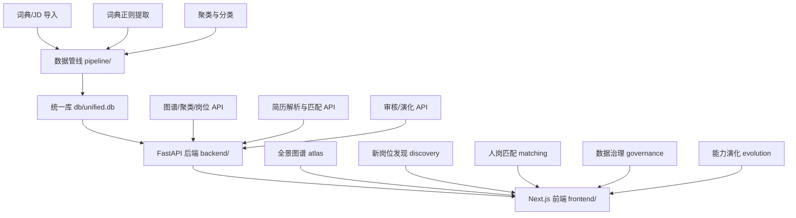

# 当前项目能力范围文档

> **项目**：多源异构数据驱动岗位和能力图谱构建与动态演化分析系统（XH-202621）
> **当前领域聚焦**：人工智能 / 新一代信息技术领域，数据主体为具身智能存量域（T1–T7 七子域），并以 AI/大数据/物联网/智能系统四域词典作为可迁移性验证
> **对照基准**：《需求提取文档.md》（底线 D1–D9 / 完备 C1–C7 / 扩展 E1–E6）
> **数据规模（unified.db）**：岗位 6,793 · 技能词 505 · 图谱边 16,925 · 聚类 1,680 · 简历 175

---

## 一、总体架构现状

- **数据底座**：SQLite 单一事实源（16 张表），技能本体 L1→L2→L3→L4 四级体系，所有模块读写同一 `db/unified.db`
- **后端**：FastAPI 单服务（`backend/api.py`），6 组 REST 路由：图谱/统计、聚类/岗位、简历/匹配、审核、岗位定义、快照演化
- **前端**：Next.js + D3 力导向图，5 个功能页面 + 顶部导航
- **部署**：`docker-compose.yml` + 前后端 Dockerfile + `scripts/start_dev.sh`

---

## 二、底线功能完成情况（D1–D9）

| 编号 | 功能 | 状态 | 实现位置与证据 |
|---|---|---|---|
| D1 | 多源数据采集与导入 | ✅ 已完成 | `pipeline/import_jobs.py`（Excel/CSV，列名别名自动识别，幂等去重 dedup_key）、`pipeline/import_dictionary.py`（词典→四级本体）；存量 6,793 条具身智能 JD |
| D2 | 新岗位发现与定义 | ✅ 已完成（双路线） | **主路线：技术演化驱动**（阶段 6 移植自 embodied-job-evolution-lab）：技术实体链接 → 里程碑成熟度 → 任务缺口 → 候选岗位七维评分，带完整证据链（里程碑 + JD 片段）与新兴/演化/已有三分类，`pipeline/emerging.py` + `/api/emerging/*`；对照路线：JD 聚类（1,680 簇）保留。五要素定义：`backend/evolution.py` + 新兴候选提交入库（pending） |
| D3 | 既有岗位能力动态更新 | ✅ 已完成 | `backend/evolution.py`：快照（snapshots）→ 更新 JD 重提取 → 快照差分（snapshot_diffs），输出新增/删除/修改标注 + 更新说明；前端 `/evolution` 页双 Tab |
| D4 | 全景图谱（技能点粒度 + 技术栈/级别切换） | ✅ 已完成 | `/api/graph` 岗位-技能二部图（approved 边、技能点粒度、Top-8 技能/岗位）；前端 `/atlas` 支持分类（具身七子域配额布局）/级别/技能类型切换 |
| D5 | 简历解析 | ⚠️ 基本完成（缺 Word） | `pipeline/resume_parse.py`：PDF（pypdf）+ 纯文本 → 结构化字段 + 技能提取落本体；**Word(.docx) 格式尚未支持**；准确率 P 90.7% / 文本内 R 100% / F1 95.1%（≥90% 达标） |
| D6 | 人岗匹配与差距分析 | ✅ 已完成 | `backend/matching.py` 四分量混合匹配（技能余弦 0.50 + L1 域 0.20 + Jaccard 0.20 + 头衔 0.10），输出 shared/missing/extra 差距清单；抽样 30 份简历 Top10 命中率 100%（≥90% 达标） |
| D7 | 改进建议与学习路径规划 | ⚠️ 部分完成 | 差距清单含缺失技能与严重度分档（改进建议基础已具备）；**结构化的"学习路径规划"（课程/任务序列）尚未形成独立功能输出** |
| D8 | 幻觉防控 | ✅ 已完成 | `backend/review.py` 三层防线：证据溯源（证据覆盖率 95.3%）+ 置信度门限（≥0.90 且有证据自动放行）+ 未审核不入正式表；前端 `/governance` 审核工作台 |
| D9 | 可验证性与交付物 | ✅ 已完成 | `docs/测试报告.md`：JD 解析 P 95.7%/R 100%/F1 97.8%；77 个单元测试全通过，核心模块覆盖率 80%（≥60% 达标）；JD 真值集 + 样例 JD 满足 ≥100 条；Dockerfile/docker-compose/部署说明齐备；PPT 大纲与演示视频脚本已备 |

**底线功能小结**：9 项中 7 项完成、2 项部分完成（D5 缺 Word 解析、D7 缺结构化学习路径）。全流程闭环（导入→提取→聚类→图谱→匹配→审核→演化）已打通。

---

## 三、完备功能完成情况（C1–C7）

| 编号 | 功能 | 状态 | 说明 |
|---|---|---|---|
| C1 | 数据清洗与交叉验证 | ⚠️ 部分完成 | 幂等去重 ✅；时滞处理 ✅（热力图按 collect_time 窗口过滤活跃岗位，聚类展示 clustered_at 新鲜度）；**JD"抄袭"相似度检测、多平台交叉验证尚未实现** |
| C2 | 幻觉防控工程化闭环 | ✅ 已完成 | 三类审核队列（edge/cluster/definition）+ 裁决留痕 reviews 表 + 审核日志页；"未审核不入正式表"贯穿图谱渲染与岗位定义 |
| C3 | 图谱可视化交互增强 | ✅ 已完成 | D3 力导向布局、节点详情侧栏、多维筛选联动、需求热度/技能类型可视化；具身七子域分层配额（T1:80…T2:7）避免头部垄断；250 岗位节点上限保障流畅渲染 |
| C4 | 匹配诊断体验完善 | ✅ 已完成 | 四分量得分拆解可解释、差距三列展示（已具备/差距/额外优势）、L1 域筛选、简历历史列表；语义分量未启用时透明降级声明 |
| C5 | 新岗位发现流程完善 | ✅ 已完成 | `/discovery` 页已升级为技术驱动发现工作台（技术搜索→实体链接置信度→三模式预测→七维得分卡+证据链面包屑→提交审核）；聚类候选保留为对照数据源 |
| C6 | 能力演化过程管理 | ✅ 已完成 | 快照创建/列表/差分 API + 前端增删改标注展示；JD 更新重提取 `/api/evolution/refresh` |
| C7 | 大模型降级与鲁棒性 | ✅ 已完成 | `pipeline/llm.py` 无 Key 返回 None，聚类命名/岗位定义/简历结构化全链路规则降级且不伪造结果；管线幂等（`--reextract` 增量默认）；扫描件/空文本报错兜底 |

**完备功能小结**：7 项中 6 项完成，C1 的抄袭检测/多源交叉验证为剩余短板。

---

## 四、扩展性功能完成情况（E1–E6）

| 编号 | 功能 | 状态 | 说明 |
|---|---|---|---|
| E1 | 技能需求热力图 | ✅ 已完成 | `/api/heatmap`：T1–T7 具身七子域 L2 技能类目 × 初/中/高级职级的活跃岗位热力，支持 1–365 天窗口 |
| E2 | 技术趋势预警与竞对洞察 | ⚠️ 雏形 | 前端已存在 `atlas/competitor-panel.tsx`、`atlas/tech-warning.tsx` 组件与公司数据（`lib/company-data.json`、具身智能企业融资分类表）；**尚未接入后端真实演化数据形成趋势量化预警** |
| E3 | 语义向量匹配 | ❌ 未启用 | `backend/matching.py` 已预留 bge-small-zh 语义分量设计，当前透明降级不启用（未安装 sentence-transformers） |
| E4 | 岗位任务生成与培养链路 | ✅ 已落地 | 随新兴发现引擎一并移植：定制任务库（T1.02/T1.01/T4.04 等）→ LLM/mock 动态生成（证据关键词防幻觉过滤）→ 兜底模板三级链路，数据表驱动（tasks/capabilities/role_titles 表），见 `pipeline/emerging.py` |
| E5 | 跨领域可迁移性验证 | ✅ 已完成 | AI/BD/IOT/IS 四域词典已建（`pipeline/assets/it_terms.csv`），具身 T1–T7 保留为存量验证集；提取支持 `--l1` 域过滤 |
| E6 | 图谱导出与数据资产化 | ❌ 未完成 | 尚无标准化的"1 新岗位 + 1 既有岗位图谱及数据源（输入输出示例）"导出工具，当前靠文档手工组织 |

---

## 五、量化指标达成总表

| 赛题指标 | 要求 | 实测 | 结论 |
|---|---|---|---|
| JD 解析准确率 | ≥90% | P 95.7% / R 100% / F1 97.8% | ✅ |
| 简历提取准确率 | ≥90% | P 90.7% / 文本内 R 100% / F1 95.1% | ✅ |
| 人岗匹配准确率 | ≥90% | 抽样 30 份 Top10 命中率 100% | ✅ |
| JD 及测试用例 | ≥100 条 | 真值标注集 + 样例 JD 达标 | ✅ |
| 单元测试覆盖率 | ≥60% | 核心模块 80%（77 用例全过） | ✅ |
| 容器化部署 | 需要 | Dockerfile + docker-compose | ✅ |

---

## 六、差距清单与补齐建议（按优先级）

| 优先级 | 缺口 | 归属需求 | 建议方案 |
|---|---|---|---|
| P0 | Word(.docx) 简历解析 | D5 | 引入 python-docx（或 docx2txt）接入 `resume_parse.py`，与 PDF 共用后续提取链路 |
| P0 | 学习路径规划输出 | D7 | 基于差距清单生成"缺失技能 → 学习任务"序列，可复用 E4 任务生成链路（定制库→LLM→兜底模板） |
| P1 | 赛题测试数据导出包 | E6 | 编写导出脚本：选定 1 个新岗位聚类 + 1 个既有岗位，导出图谱 JSON + JD 原文输入 + 定义/差分输出示例 |
| P1 | JD 抄袭/重复度检测 | C1 | 基于 title+jd_text 的 MinHash/ SimHash 相似度标注，辅助去重与噪声识别的演示叙事 |
| P2 | 技术趋势预警数据化 | E2 | 以 snapshots/heatmap 时间序列驱动 tech-warning 组件，输出"上升最快技能 Top-N" |
| P2 | 语义向量匹配启用 | E3 | 安装 sentence-transformers（bge-small-zh），按原设计透明融合语义分量 |

**总体结论**：当前项目在人工智能/具身智能领域已完成赛题全流程闭环，底线功能完成度约 **85%**（9 项中 7 项完整），完备功能完成度约 **90%**，三项核心准确率与覆盖率全部达标；新岗位发现已升级为**技术演化驱动主路线 + 聚类对照**双路线，任务生成链路（E4）同步落地；剩余关键缺口集中在 **Word 简历解析、学习路径规划、测试数据导出包**三项，均为可在短期内补齐的点状功能。

---

## 七、阶段 6 变更记录（2026-08-08，地基与发现引擎移植）

| 提交 | 内容 |
|---|---|
| `bc3dd95` | schema v1.2：新增 technologies/milestones/capabilities/tasks/role_titles/emerging_runs 六表；job_definitions 扩展新兴发现列；存量库幂等补列迁移；.gitignore 修正 schema.sql 入库 |
| `dc45b36` | 技术演化域数据导入：272 技术实体 + 460 里程碑（413 带桥接）+ 知识层 45 条，幂等可重跑 |
| `0be02f7` | 移植新兴岗位发现引擎：`pipeline/emerging.py`（统一库适配器 + 七维评分 + 三模式 Provider）+ `/api/emerging/*` 五路由 + 审核闭环对接 + 12 个单测；真实数据 T1.02/T1.01/T4.04 验证通过 |
| `5492f26` | 前端 `/discovery` 重写为技术驱动发现工作台；governance 审核详情增强证据链展示 |

回归基线：全量 **90** 个单测通过；核心模块总覆盖率 **83%**（emerging.py 88%）。
