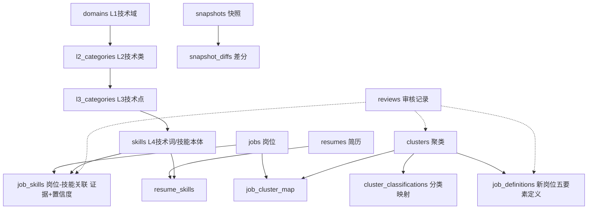

# 统一数据库设计文档（阶段 0 交付物）

> **项目**：多源异构数据驱动岗位和能力图谱构建与动态演化分析系统（XH-202621）
> **版本**：v1.0 · 2026-08-06
> **建表脚本**：`db/schema.sql`（唯一建表入口，禁止各模块自建平行表）
> **数据库**：SQLite（单一事实源），生产文件位于 `db/unified.db`

---

## 1. 设计原则

| 原则 | 落地方式 |
|---|---|
| 单一事实源 | 所有模块（数据管线、图谱 API、匹配引擎、审核页）读写同一 `unified.db`，杜绝平行表 |
| 统一技能本体 | 技能词统一落到 `skills` 表（L4 粒度），通过 L3/L2/L1 三级挂载形成分类树；岗位与简历都只关联 `skill_id` |
| 幂等去重 | `jobs.dedup_key = normalize(title + company + collect_time)`，重复导入自动跳过 |
| 证据与置信度 | `job_skills` 带 `evidence`（JD 原文片段）与 `confidence`，支撑幻觉防控与回溯 |
| 未审核不入正式结果 | 聚类/关联/岗位定义均有 `review_status`，`pending` 状态数据仅供候选区展示 |

## 2. ER 模型

**核心实体关系说明**：

- `skills` 是全系统技能口径的唯一锚点：词典提取、简历解析、匹配、图谱展示全部经由 `skill_id` 关联
- `job_skills` 是图谱的"边"：每条边可回溯 JD 证据（`evidence`），并带置信度与审核状态
- `clusters` + `job_cluster_map` 承载"新岗位发现"；`cluster_classifications` 把聚类映射回 L1→L2→L3 技术体系，支撑图谱"按技术栈切换视图"
- `snapshots`/`snapshot_diffs` 承载"能力动态更新"的增/删/改标注

## 3. 表清单与生命周期

| 表 | 写入方 | 读取方 | 引入阶段 |
|---|---|---|---|
| domains / l2_categories / l3_categories / skills | 管线-词典导入 | 全部模块 | 阶段 1 |
| jobs | 管线-JD 导入 | 全部模块 | 阶段 1 |
| job_skills | 管线-关键词提取 | 图谱/匹配/快照 | 阶段 1 |
| clusters / job_cluster_map / cluster_classifications | 管线-聚类与分类 | 新岗位发现页/岗位定义 | 阶段 1 |
| resumes / resume_skills | 简历解析服务 | 人岗匹配 | 阶段 3 |
| reviews | 审核页 API | 治理面板 | 阶段 4 |
| snapshots / snapshot_diffs | 快照服务 | 能力演化页 | 阶段 5 |
| job_definitions | 新岗位定义服务 | 新岗位发现页 | 阶段 5 |
| pipeline_meta | 管线各步骤 | 数据新鲜度展示 | 阶段 1 |

## 4. 字段映射表（既有项目 → 统一表）

### 4.1 项目二 `project-export/data/jobs.db`（主要移植源）

| 源表.字段 | 目标表.字段 | 转换说明 |
|---|---|---|
| jobs.job_id / title / company / city / region | jobs 同名字段 | 直接映射 |
| jobs.salary_text / salary_min / salary_max / experience / education / headcount / jd_text / source_file / platform / collect_time / link | jobs 同名字段 | 直接映射；新增 `dedup_key` 由 title+company+collect_time 归一化生成 |
| jobs.company_jobs_url | — | 丢弃（公开提交需脱敏） |
| job_keywords.keyword_norm | skills.skill_term | 去重后落本体；`keyword_raw` → `skill_term_raw`；`l4_type` → `l4_type` |
| job_keywords.l1_code / l1_name | domains.l1_code / l1_name | T1–T7 → 新一代信息技术四域重映射（见 4.3） |
| job_keywords.l2_name / l3_name | l2_categories / l3_categories | 按 L1 分组建层级 |
| job_keywords.(job_id, keyword_norm) | job_skills.(job_id, skill_id) | 需 JOIN skills 拿 skill_id；补 `evidence`（从 jd_text 定位）与 `confidence=0.95` |
| clusters.* | clusters 同名 | shared_skills/keywords/representative_titles 由逗号分隔串转 JSON 数组；补 `name_source`、`review_status` |
| job_cluster_map.(cluster_id, job_id) | job_cluster_map | 丢弃冗余 title/cluster_name 列（JOIN 可得） |
| cluster_classifications.* | cluster_classifications | 分布字段保持 JSON 字符串 |
| talents / talent_keywords / capabilities / talent_capabilities | — | 暂不移植（阶段 3 简历数据用 resumes 体系重建） |

### 4.2 项目三 `embodied-ai-job-capability-graph`

| 源资产 | 统一库落点 | 说明 |
|---|---|---|
| 能力本体（六大一级能力 201 节点） | 不移植 | 旧领域本体已被新一代信息技术词典体系替代 |
| `llm_capability_service.py` 的证据定位/置信度字段 | job_skills.evidence / confidence | 机制字段已并入统一 schema |
| 审核流程（candidate → approved） | reviews + 各表 review_status | 阶段 4 实现 |
| 快照差分设计 | snapshots / snapshot_diffs | 阶段 5 按其设计文档实现 |
| `vectorization.py` | 无表结构依赖 | 阶段 3 直接读 skills / job_skills |

### 4.3 L1 编码重映射（具身智能 T1–T7 → 新一代信息技术）

| 统一 l1_code | l1_name | 来源 |
|---|---|---|
| AI | 人工智能 | 新建词典 + 原 T 系中 AI 相关 L2 |
| BD | 大数据 | 新建词典 |
| IOT | 物联网 | 新建词典 |
| IS | 智能系统 | 新建词典 + 原 T 系中系统/控制相关 L2 |
| T1–T7 | 具身智能存量域 | 从存量 jobs.db 移植数据时保留原编码，标记 `domains.l1_name` 为具身智能子域，作为存量验证集 |

> 存量具身智能数据不移植到新 L1 四域，而是保留原 T1–T7 编码作为"管线可迁移性"验证集；新一代信息技术数据使用新词典独立导入。

## 5. 数据契约（接口读写约定）

1. 所有技能展示必须经 `skills.skill_term` 规范口径，禁止直接使用 JD 原文词
2. 图谱只展示 `review_status != 'rejected'` 的 `job_skills` 边；审核页展示全部状态
3. 聚类结果展示需同时携带 `clustered_at`（数据新鲜度）
4. 时间字段统一 UTC ISO8601；金额统一元（INTEGER）
5. JSON 字段（shared_skills / keywords / distributions）统一为 JSON 数组或对象字符串，读取方解析
